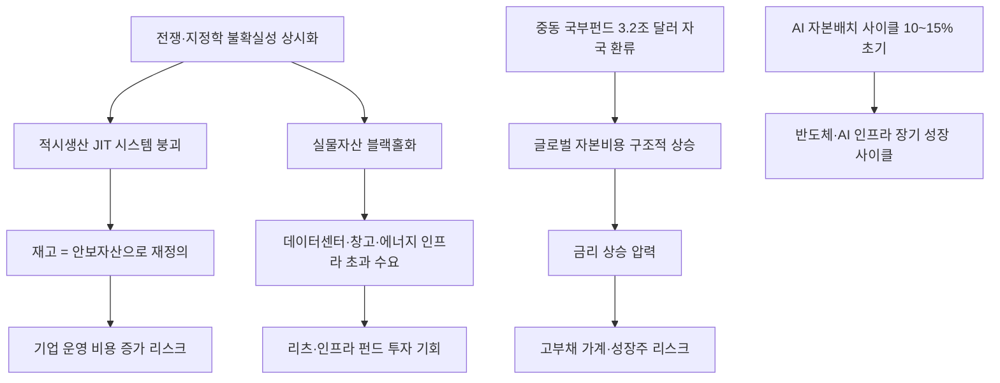

# 투자/지정학 분析: 밀컨 콘퍼런스 — 적시생산 종말, 실물자산 블랙홀, 중동 국부펀드의 방향 전환
## 투자 신호 + 사회적 영향 평가

---

## 📌 기사 기본 정보

- **날짜**: 2026-05-09
- **출처**: 한국일보 (심재현 LA 특파원, 밀컨 글로벌 콘퍼런스 현장)
- **카테고리**: 경제 > 투자 > 지정학/글로벌자본
- **핵심 주제**: 밀컨 글로벌 콘퍼런스에서 블랙스톤·칼라일·모건스탠리의 수장들이 한목소리로 선언한 자본 패러다임 전환의 세 축 분析: ① 1980년대 도요타가 완성한 '적시생산(JIT) 시스템의 종말', ② 창고·에너지시설·데이터센터 등 실물자산의 '블랙홀화', ③ 3.2조 달러 중동 국부펀드의 글로벌 시장 자본 수출에서 자국 인프라 투자로의 방향 전환

**메타데이터**
- 주요 사건: 칼라일 슈워츠 "재고는 이제 낭비가 아닌 안보자산", 블랙스톤 존 그레이 "실물자산이 자본 블랙홀", 모건스탠리 심코위츠 "AI 자본배치는 사이클의 10~15% 초기 단계", 중동 국부펀드 3.2조 달러 자국 내 환류
- 핵심 원인: 전쟁·지정학 불확실성 상시화로 공급망 단절이 기정사실화, 레드라인 붕괴로 절대적 금기선이 무너짐, 에너지·원자재의 전략자산 재분류
- 주요 주체: 블랙스톤(존 그레이 CBO), 칼라일(하비 슈워츠 CEO), 모건스탠리(대니얼 심코위츠 공동대표), 스테이트스트리트(론 오한리 CBO), 사우디 PIF·UAE ADIA·카타르 QIA 등 중동 국부펀드
- 키워드: 적시생산 종말, 실물자산 블랙홀, 중동 국부펀드, 재고 안보자산화, 글로벌 자본비용 상승, Friend-shoring

---

## 🔍 기사를 통한 투자 신호 추출

### 1단계: 핵심 사건 분해

**What (무엇이 일어났는가?)**
- 세계 최대 투자 포럼 밀컨 콘퍼런스에서 칼라일·블랙스톤·모건스탠리·스테이트스트리트의 최고책임자들이 한목소리로 "1990년대 이후 통했던 투자 공식이 끝났다"고 선언했습니다. 핵심은 세 가지입니다. 첫째, 재고 제로를 추구하던 도요타식 적시생산(JIT)이 전쟁·지정학 불확실성 앞에서 붕괴했습니다. 둘째, 창고·에너지시설·데이터센터 같은 실물자산이 자본을 블랙홀처럼 빨아들이고 있습니다. 셋째, 3.2조 달러(약 4,400조 원) 규모의 중동 국부펀드가 글로벌 금융시장 자본 수출에서 자국 인프라 투자로 방향을 틀었습니다.

**When (언제 일어났는가?)**
- 2026-05-09 (밀컨 글로벌 콘퍼런스 5월 4일~6일 발언 종합 보도)

**Why (왜 일어났는가?)**
- 러시아-우크라이나 전쟁과 중동 갈등으로 공급망 단절이 '예외 사건'이 아닌 '상시 위험'으로 전환됐습니다.
- "넘지 말아야 할 레드라인"이 전쟁을 통해 반복적으로 무너지면서 글로벌 질서의 예측 가능성 자체가 붕괴됐습니다.
- 중동 국부펀드의 자국 내 투자 전환은 글로벌 채권·주식 수요 기반을 구조적으로 줄여 자본비용 상승 압력을 가합니다.

**Who (누가 주도하는가?)**
- 새 패러다임 선도: 블랙스톤·칼라일·모건스탠리 등 세계 최대 사모펀드 및 투자은행
- 핵심 변수: 사우디 PIF·UAE ADIA·카타르 QIA 등 3.2조 달러 중동 국부펀드

---

### 2단계: 투자 신호 해석

#### A. **긍정적 신호 (Bullish)**

**① 실물자산 블랙홀 — 물류센터·데이터센터·에너지 인프라 리츠(REITs) 수혜**
- **신호**: 블랙스톤 존 그레이 "창고·에너지시설·데이터센터가 자본을 빨아들이는 블랙홀이 됐다"
- **의미**: 글로벌 공급망 불안 상시화로 물류 인프라(창고·물류센터), AI 인프라(데이터센터), 에너지 인프라에 대한 초과 수요가 장기화되며 관련 실물자산의 가치가 구조적으로 상승
- **투자 기회**: 물류센터·데이터센터 특화 리츠(REITs), 에너지 인프라 펀드, AI 전력망 관련주

**② AI 자본배치 초기 10~15% — 나머지 85~90%가 몰려오는 수혜 섹터**
- **신호**: 모건스탠리 심코위츠 "AI 자본배치는 전체 사이클의 10~15%에 불과한 초기 단계"
- **의미**: AI 인프라 투자 사이클이 이제 겨우 시작됐다는 세계 최대 투자은행의 진단은, 반도체·전력망·데이터센터 관련 기업들이 장기 성장 사이클의 초입에 있음을 의미
- **투자 기회**: [[삼성전자]], [[SK하이닉스]], AI 전력 인프라, 데이터센터 냉각 설비

---

#### B. **위험 신호 (Bearish)**

**① 중동 국부펀드 이탈 — 글로벌 자본비용 구조적 상승**
- **신호**: 3.2조 달러 중동 국부펀드의 글로벌 시장 이탈 및 자국 인프라 투자 전환
- **의미**: 글로벌 채권·주식 시장의 핵심 수요 기반이 줄어들면서 금리가 구조적으로 높아지는 '고자본비용 시대'가 가속화되며, 한국을 포함한 신흥국 국채·주식 시장에 간접 압박이 가해짐
- **투자 리스크**: 장기 국채·신흥국 채권 포트폴리오, 고금리에 취약한 부동산·성장주

**② 적시생산 종말 → 기업 재고 비용 증가와 수익성 압박**
- **신호**: 재고가 이제 '안보자산'으로 재정의되면서 기업들이 의무적으로 재고를 쌓아야 하는 새로운 운영 패러다임
- **의미**: 재고 확충에 따른 운영 비용 증가가 공급망 의존도가 높은 제조업 기업들의 수익성을 압박하며, 특히 얇은 마진으로 운영되는 중소 제조업체에 타격이 집중됨
- **투자 리스크**: 공급망 단절 취약 중소 제조업체, 재고 확충 비용이 큰 식품·화학·소재 업종

---

### 3단계: 섹터별 투자 기회 매트릭스

#### ✅ **높은 기대도 + 낮은 리스크**

**데이터센터·물류 인프라 실물자산 (블랙홀 자산 수혜)**
- 전쟁·지정학 불확실성 상시화와 AI 재산업화 가속이 동시에 작동하면서, 데이터센터와 물류 창고 인프라는 수요가 구조적으로 초과하는 블랙홀 자산으로 자리 잡았습니다. 관련 리츠(REITs) 및 인프라 펀드는 현금 흐름이 안정적이면서도 자산 가치 상승이 기대됩니다.
- **투자 추천도**: ⭐⭐⭐⭐⭐

---

## 💰 구체적 투자 신호 변환

### 신호 1: 새로운 자본주의 운영체제 — '안보·신뢰·실물'로의 자산 배분 재설계

**투자 해석**: 밀컨 콘퍼런스의 핵심 메시지는 "세계가 새로운 자본주의 운영체제로 전환 중"이라는 선언입니다. 투자자는 포트폴리오에서 두 가지 구조적 변화를 반영해야 합니다. 첫째, 실물자산(데이터센터·물류 인프라·에너지 설비) 비중을 전통적 금융자산 대비 의미 있는 수준으로 확대해야 합니다. 둘째, AI 자본배치가 사이클의 10~15%에 불과하다는 진단은 반도체·AI 인프라 관련 투자가 여전히 초기임을 의미하므로, 단기 차익 실현 후 이탈보다 중장기 적립식 비중 확대 전략이 유효합니다. 중동 국부펀드 이탈로 글로벌 자본비용이 구조적으로 높아지는 환경에서는 고금리 취약 성장주 비중을 낮추고 현금 흐름이 안정적인 실물 인프라 자산 비중을 높이는 방향이 합리적입니다.

---

## 🌍 사회적 영향 평가

### A. 긍정적 사회 영향
- **실물 인프라 투자 확대로 사회 기반 시설 현대화**: 데이터센터·전력망·물류 인프라에 대한 대규모 민간 자본 유입은 사회 인프라 현대화를 가속시키고 관련 일자리 창출 효과를 냅니다.
- **에너지 안보 강화 — 자원 취약국의 전략적 대응 촉진**: 원자재가 전략자산으로 재분류되면서 에너지 안보 논의가 국가 정책 어젠다로 격상되어, 한국의 에너지 다변화 전략 수립을 촉진합니다.

### B. 부정적 사회 영향
- **원자재 전략자산화 — 식량·에너지 비용의 구조적 상승과 서민 물가 압박**: 원유·가스·농산물이 전략자산으로 재분류되면서 식량과 에너지 비용이 구조적으로 높아지고, 이는 저소득층과 서민의 실질 구매력을 직접 잠식합니다.
- **중동 국부펀드 이탈로 인한 글로벌 금리 상승 — 가계 부채 부담 증가**: 글로벌 자본비용 상승은 한국 기준금리 및 주택담보대출 금리에 간접 압력을 가하며, 고부채 가계의 이자 부담을 가중시킵니다.

---

## 🎯 결론: 당신의 투자 전략 수립

- **즉시 실행**: 데이터센터·물류 인프라 특화 리츠(REITs) 및 AI 전력 인프라 관련 전력 설비주를 포트폴리오에 단계적으로 편입. 중동 국부펀드 이탈에 따른 금리 상승 시나리오를 감안해 장기 국채 비중은 소폭 축소하고 단기 채권·실물자산으로 전환
- **3개월 후**: AI 자본배치 비율(현재 10~15%)의 다음 단계 가속 여부를 빅테크 CAPEX 발표 및 글로벌 데이터센터 착공 통계로 모니터링. 중동 국부펀드 자국 인프라 투자 확대 속도와 글로벌 자본비용 상승 지표(미국 10년물 금리)를 병행 추적

---

## 📝 Obsidian 연결 구조

