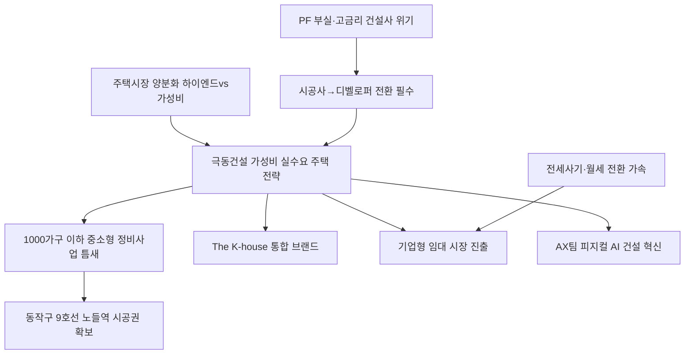

# 건설/디벨로퍼 분析: 극동건설 강경민 대표 — 가성비 주택 디벨로퍼 전환과 기업형 임대 전략
## 투자 신호 + 사회적 영향 평가

---

## 📌 기사 기본 정보

- **날짜**: 2026-05-10
- **출처**: 한국경제 (배규민 기자) — 강경민 극동건설 대표 인터뷰
- **카테고리**: 경제 > 건설 > 주택/디벨로퍼
- **핵심 주제**: 1946년 창립 80주년의 중견 건설사 극동건설이 하이엔드 고급 주택 경쟁을 포기하고 '가성비 실거주 주택'과 기업형 임대로 승부하는 '건설업 2.0' 실험 선언. 대형사 출신 강경민 대표가 AX팀(AI 전환) 신설, 디벨로퍼 전환, 브랜드 재편, 2030년 건축 매출 1조원 비전을 제시

**메타데이터**
- 주요 사건: 서울 동작구 극동강변아파트 소규모 재건축 시공권 확보(9호선 노들역 초역세권), 'The K-house' 통합 브랜드 2027년 출시 예정, AX팀(인공지능 전환팀) 신설
- 핵심 원인: 하이엔드 중심 시장 양분화, 대형사들의 틈새 방치로 중소형 정비사업(1,000가구 이하) 공백, 전세사기 이후 월세 전환 가속으로 기업형 임대 시장 기회 부상
- 주요 주체: 극동건설(강경민 대표), 남광토건·금광기업(그룹사), 실수요 중저가 주택 수요층
- 키워드: 가성비 주택, 디벨로퍼 전환, 기업형 임대, AX, 피지컬 AI, 모듈러 건축, PF

---

## 🔍 기사를 통한 투자 신호 추출

### 1단계: 핵심 사건 분해

**What (무엇이 일어났는가?)**
- 극동건설 강경민 대표가 고급 마감재와 과도한 설계를 걷어낸 '가성비 주택'을 핵심 전략으로 채택하고, 대형사가 집중하는 대단지 대신 1,000가구 이하 중소형 정비사업 틈새를 공략하겠다고 선언했습니다. 동시에 시공사에서 디벨로퍼로의 전환, AX팀 신설을 통한 피지컬 AI 도입, 기업형 임대 시장 진출을 병행 추진합니다.

**When (언제 일어났는가?)**
- 2026-05-10 (PF 부실·고금리·공사비 급등으로 중견 건설사 줄도산이 이어지는 시장 구조 전환 직전 시점)

**Why (왜 일어났는가?)**
- 10억 원대 아파트 투자 목적 구매 시대가 저무는 반면, 실거주 가성비 수요가 빠르게 성장하면서 중간 가격대 주택 공급 공백이 발생했습니다.
- PF 환경 경직으로 사업을 발주받아 시공하는 방식의 수익 구조가 한계에 달해, 직접 사업을 기획하는 디벨로퍼 전환이 생존의 필수 조건이 됐습니다.
- 전세사기 사태 이후 세입자들의 월세 전환이 가속화되면서, 개인임대인이 90%를 차지하는 임대 시장에서 기업형 임대의 공백이 커졌습니다.

**Who (누가 주도하는가?)**
- 전환 주도: 현대산업개발 아이파크 출신 강경민 대표 (대형사 노하우를 중견사에 이식하는 경영 실험)
- 핵심 수요: 합리적 가격의 실거주 주택을 원하는 무주택 실수요자, 안정적 임대를 원하는 세입자

---

### 2단계: 투자 신호 해석

#### A. **긍정적 신호 (Bullish)**

**① 중소형 정비사업 틈새시장 — 대형사 진입 회피 구간**
- **신호**: 대형사들이 대단지 재개발·재건축에 집중하는 사이 1,000가구 이하 소규모 정비사업이 무주공산 상태. 서울 동작구 극동강변아파트 9호선 노들역 초역세권 시공권 확보가 실증
- **의미**: 경쟁 강도가 낮은 틈새에서 가성비 브랜드 포지셔닝이 성공할 경우 마진 확보가 대단지 수주보다 유리할 수 있음
- **투자 기회**: 소규모 정비사업 집중 중견 건설사, 모듈러·건식공법 특화 건자재 업체

**② 기업형 임대 시장 진입 — 구조적 수요 성장**
- **신호**: 현재 국내 임대시장의 90%가 개인임대인인 상태에서 전세사기 이후 세입자들의 안정적 기업형 임대 선호가 빠르게 확산
- **의미**: 기업이 대규모 임대 물량을 공급하는 미국식 리츠(REITs) 모델이 한국에서 본격적으로 성숙할 가능성이 높으며, 선도 진입자가 시장 선점 가능
- **투자 기회**: 기업형 임대주택 운영 특화 리츠(REITs), 임대 관리 플랫폼

---

#### B. **위험 신호 (Bearish)**

**① PF 환경 미개선 — 디벨로퍼 전환의 자금 조달 장벽**
- **신호**: 현재 고금리·PF 부실 환경에서 중견 건설사가 직접 사업을 기획하고 리스크를 짊어지는 디벨로퍼 전환은 자금 조달 비용이 대형사 대비 크게 높음
- **의미**: PF 환경이 풀리지 않으면 디벨로퍼 전환 전략의 실행 속도가 심각하게 지연되며, 사업 리스크가 확대될 수 있음
- **투자 리스크**: 자금력이 취약한 중견 건설사 전반, PF 차환 리스크 잔존 기업

**② 가성비 주택의 소비자 수용성 — 브랜드 신뢰의 벽**
- **신호**: 고급 마감재를 없앤 가성비 주택이 소비자에게 '저급 아파트'로 인식될 경우 분양 실패 리스크
- **의미**: 국내 소비자들의 아파트에 대한 '브랜드 프리미엄' 집착이 강해, 가성비 정책이 가격보다 입지와 브랜드 신뢰를 우선시하는 시장에서 설득력을 확보하기 어려울 수 있음
- **투자 리스크**: 가성비 주택 분양 실패 시 사업 손실로 인한 중견 건설사 재무 악화

---

### 3단계: 섹터별 투자 기회 매트릭스

#### ✅ **높은 기대도 + 낮은 리스크**

**모듈러·건식공법 건자재 특화 업체 (AI 생산성 혁신 수혜)**
- 극동건설이 AX팀 신설로 피지컬 AI 도입을 본격화하고 건식공법·모듈러 건축을 핵심으로 삼는다면, 관련 건자재·공정 자동화 기술을 공급하는 업체들이 초기 공급망 파트너로 수혜를 받을 수 있습니다.
- **투자 추천도**: ⭐⭐⭐⭐

---

## 💰 구체적 투자 신호 변환

### 신호 1: '시공사 → 디벨로퍼' 패러다임 전환 — 건설업 2.0의 실험

**투자 해석**: 강경민 대표의 전략은 중견 건설사 생존 공식의 새로운 모델입니다. 그러나 투자자는 이 전략이 PF 환경 회복, 실수요자의 가성비 주택 수용성, 기업형 임대 정책 지원이라는 세 가지 조건이 동시에 충족될 때만 성과를 낼 수 있음을 인식해야 합니다. 단기적으로는 중견 건설사보다 이 혁신 모델의 핵심 도구를 공급하는 모듈러 건축 자재사, AI 건설 자동화 솔루션 기업, 기업형 임대 리츠(REITs)에 더 안전한 투자 기회가 존재합니다.

---

## 🌍 사회적 영향 평가

### A. 긍정적 사회 영향
- **무주택 실수요자의 내집 마련 문턱 완화**: 고급화 경쟁에서 소외된 합리적 가격 주택 공급이 늘어나면 중저소득 실수요 계층의 주거 접근성이 개선됩니다.
- **전세사기 피해 계층의 안정적 대안**: 기업형 임대 확대는 개인임대인 의존형 임대 시장의 불안정성을 낮추고, 전세사기 피해 우려가 있는 서민들에게 안전한 주거 대안을 제공합니다.

### B. 부정적 사회 영향
- **가성비 주택의 품질 하락 리스크**: '불필요한 마감재 제거'가 기준 이하의 품질로 이어질 경우, 결국 저소득 실수요자들이 품질 문제의 직접 피해자가 될 수 있습니다.
- **중견 건설사 디벨로퍼 실패 시 PF 부채 위험**: PF 구조로 사업을 진행하다 분양 실패가 겹치면 협력사·하청업체 연쇄 부도 위험이 있습니다.

---

## 🎯 결론: 당신의 투자 전략 수립

- **즉시 실행**: 기업형 임대주택 운영 특화 리츠(REITs) 및 AI 건설 자동화 솔루션 업체를 중장기 포트폴리오 후보로 스크리닝. 극동건설 및 동일 전략을 취하는 중견 건설사의 PF 차환 리스크 모니터링
- **3개월 후**: PF 금리 환경 개선 여부, 국토부의 기업형 임대 지원 정책 발표 타이밍을 모니터링하며 건설 섹터 투자 진입 시점 재검토

---

## 📝 Obsidian 연결 구조

