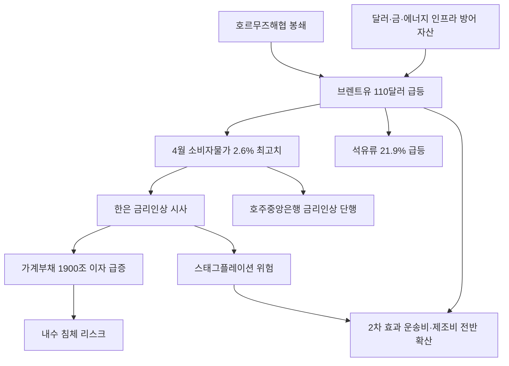

# 물가/통화정책 분析: 유가 쇼크가 밀어올린 소비자물가 2.6% — 한은 4년 만의 금리 인상 초읽기
## 투자 신호 + 사회적 영향 평가

---

## 📌 기사 기본 정보

- **날짜**: 2026-05-10
- **출처**: 한국경제신문 (김원 기자, 김경희 기자)
- **카테고리**: 경제 > 물가·통화정책
- **핵심 주제**: 중동전쟁으로 인한 국제유가 급등(브렌트유 110달러)이 4월 소비자물가를 2.6%(1년 9개월 만의 최고)까지 끌어올렸고, 석유류 21.9% 급등이 전체 물가를 0.84%포인트 견인. 5월부터 물가 3% 진입 가능성과 함께 한국은행의 4년 만의 금리 인상 전환이 현실화되는 국면 분析

**메타데이터**
- 주요 사건: 4월 CPI 2.6%(2024년 7월 이후 최고), 석유류 21.9% 급등(경유 30.8%, 휘발유 21.1%), 호주중앙은행(RBA) 금리 인상 단행, 한은 유상대 부총재 금리 인상 시사 발언
- 핵심 원인: 호르무즈해협 봉쇄(미-이란 군사 충돌), 브렌트유 배럴당 110달러 고착화, 글로벌 비축유 완충 한계 도달, 미 연준 고금리 장기화
- 주요 주체: 한국은행(긴축 전환 임박), 미국 연준(Fed), 호주중앙은행(RBA), 이란·미국(지정학 리스크 원천)
- 키워드: 소비자물가(CPI), 브렌트유, 호르무즈해협, 근원물가, 점도표, 매파적 동결, 비축유, 수입 인플레이션

---

## 🔍 기사를 통한 투자 신호 추출

### 1단계: 핵심 사건 분해

**What (무엇이 일어났는가?)**
- 4월 소비자물가지수가 전년 대비 2.6% 상승하며 1년 9개월 만의 최고치를 기록했습니다. 석유류만 따로 보면 21.9% 급등했으며, 이 단일 요인이 전체 물가를 0.84%포인트 끌어올렸습니다. FT는 5월 말을 유가 상승의 임계점으로 지목하며 브렌트유 130~140달러 가능성을 경고했고, 한은 유상대 부총재가 "금리 인하를 멈추고 인상을 고민할 때"라고 공개 발언하며 4년 만의 긴축 전환 가능성을 시사했습니다.

**When (언제 일어났는가?)**
- 2026-05-10 (호주중앙은행(RBA) 금리 인상 단행, 미국 30년물 국채 금리 연 5% 재돌파 시점)

**Why (왜 일어났는가?)**
- 미-이란 군사 충돌로 촉발된 호르무즈해협 봉쇄로 전 세계 원유 해상 운송의 20%가 차질을 빚으며 유가가 급등했습니다.
- 전쟁 장기화로 각국 비축유와 원유 재고라는 완충 장치가 한계에 달했습니다.
- 수입 인플레이션이 석유류 직접 충격(1차 효과)에서 운송비·제조비·서비스 가격 전반(2차 효과)으로 확산 중입니다.

**Who (누가 주도하는가?)**
- 물가 압박 주체: 이란(호르무즈 봉쇄 위협), 글로벌 투기 자본(원유 선물 매수)
- 정책 대응 주체: 한국은행, 미국 연준, 호주·노르웨이 중앙은행

---

### 2단계: 투자 신호 해석

#### A. **긍정적 신호 (Bullish)**

**① 에너지 수출국 및 원유 관련 자산의 가격 강세**
- **신호**: 브렌트유 110달러 고착화 및 FT의 130~140달러 경고
- **의미**: 정유사·에너지 인프라 기업들의 영업이익 극대화 국면. 달러화 강세 및 실물 금(Gold)의 대체 안전자산 수혜도 동반
- **투자 기회**: 원유·LNG 관련 에너지주, 달러 표시 자산, 실물 금(Gold) ETF

**② 한국 수출 대기업의 원화 약세 환차익**
- **신호**: 금리 인상 압박으로 원화 약세 지속 가능성
- **의미**: 달러 결제 비중이 높은 반도체·조선·방산 대형 수출주의 원화 환산 실적 극대화
- **투자 기회**: [[삼성전자]], [[SK하이닉스]], 한국 조선·방산 대형주

---

#### B. **위험 신호 (Bearish)**

**① 금리 인상 → 가계 부채 이자 급증 → 내수 침체**
- **신호**: 4월 CPI 2.6%, 5~6월 3% 진입 가능성 → 한은 금리 인상 불가피
- **의미**: 한국 가계 부채 1,900조 원에 금리 인상이 가해지면 이자 부담 폭증. 내수 소비 위축 및 부동산 시장 재냉각 시나리오
- **투자 리스크**: 내수 소비재·유통·부동산 섹터, 변동금리 대출 비중 높은 가계

**② '잘못된 처방'의 딜레마 — 공급 충격에 수요 억제로 대응**
- **신호**: 유가가 공급 충격에서 비롯된 이상 금리 인상이 물가를 잡는 효과는 제한적
- **의미**: 한은이 호르무즈 봉쇄라는 공급 충격에 수요를 죽이는 금리 인상으로 대응하면, 물가는 잡히지 않으면서 경기 침체만 불러오는 '스태그플레이션' 위험
- **투자 리스크**: 고PER 성장주, 금리 민감 부동산·건설 섹터, 고부채 기업

---

### 3단계: 섹터별 투자 기회 매트릭스

#### ✅ **높은 기대도 + 낮은 리스크**

**달러 자산·실물 금·에너지 인프라 (수입 인플레이션 방어 자산)**
- 호르무즈 봉쇄가 단기 해소되지 않는 한 유가 고착화와 달러 강세 기조가 지속됩니다. 달러 MMF, 실물 금, 에너지 인프라(LNG·원전) 관련 자산이 방어적 헷지 역할을 수행합니다.
- **투자 추천도**: ⭐⭐⭐⭐⭐

---

## 💰 구체적 투자 신호 변환

### 신호 1: 공급 충격 기반 인플레이션의 2차 효과 확산 — 포트폴리오 방어 재설계

**투자 해석**: 이번 물가 급등의 핵심은 호르무즈 봉쇄라는 공급 충격이 석유류 직접 충격(1차)을 넘어 운송비·제조비·서비스 가격 전반(2차 효과)으로 번지는 국면입니다. 한은의 금리 인상이 현실화되면 성장주와 부동산은 이중 압박을 받습니다. 투자자는 즉시 원화 표시 자산 중 변동금리 취약 자산(부동산·건설·내수 소비재)의 비중을 낮추고, 달러 자산·실물 금·에너지 인프라로 포트폴리오를 방어적으로 재편해야 합니다. 5월 28일 금융통화위원회 점도표가 금리 인상 시점의 결정적 선행 신호가 됩니다.

---

## 🌍 사회적 영향 평가

### A. 긍정적 사회 영향
- **에너지 전환 투자 가속화의 역설적 기회**: 유가 급등은 태양광·풍력·원전 등 재생에너지 투자의 경제성을 높여 에너지 안보 논의를 국가 정책 최우선 과제로 격상시킵니다.
- **달러 자산 투자 인식 확산**: 원화 약세 국면에서 일반 대중의 달러 자산·해외 투자 인식이 개선되며 개인 금융 포트폴리오 다양화의 계기가 됩니다.

### B. 부정적 사회 영향
- **서민 경제의 이중 압박**: 유가 상승으로 교통비·난방비·식품가격이 오르고, 금리 인상까지 더해지면 빚이 많은 저소득 가구와 자영업자가 가장 크게 타격을 입는 구조적 불평등이 심화됩니다.
- **취약 계층의 에너지 빈곤 심화**: 에너지 비용 급등은 경제적 취약 계층의 기본적 생활 수준을 직접 잠식합니다.

---

## 🎯 결론: 당신의 투자 전략 수립

- **즉시 실행**: 원화 자산 비중 축소 후 달러 MMF 및 원-달러 환노출형 국채 ETF로 통화 헷지 완료. 실물 금 비중 5~10% 편입 검토
- **3개월 후**: 5월 28일 한은 금통위 점도표(금리 인상 의견 위원 수) 확인 → 인상 확정 시 부동산·건설·내수 소비재 비중을 추가 축소하고 에너지 인프라·방산주 비중 확대 검토

---

## 📝 Obsidian 연결 구조

