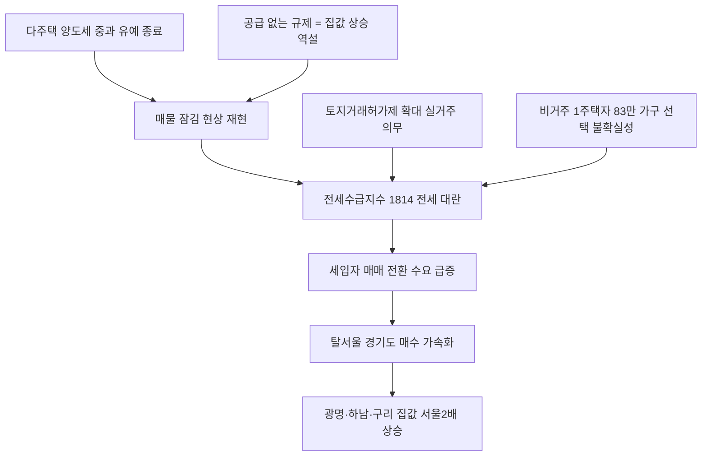

# 부동산/세제 분析: 다주택 양도세 중과 부활 — 전세난·탈서울·수도권 집값 동반 상승
## 투자 신호 + 사회적 영향 평가

---

## 📌 기사 기본 정보

- **날짜**: 2026-05-10
- **출처**: 중앙일보 (백민정 기자, 김준영 기자)
- **카테고리**: 경제 > 부동산 > 주택시장/세제
- **핵심 주제**: 다주택자 양도세 중과 유예가 5월 9일 종료되자 전문가 70%가 수도권 집값 추가 상승을 예측했고, 전세 시장은 전문가 전원이 "오를 일만 남았다"고 경고. 매물 잠김 → 전세난 심화 → 탈서울 매매 전환의 연쇄 고리와 서울 전세수급지수 1814(2020~21년 전세 대란 수준)의 공급 위기 분析

**메타데이터**
- 주요 사건: 다주택 양도세 중과 유예 5월 9일 종료, 서울 아파트 전세수급지수 1814 기록, 경기도 매수자 중 서울 거주자 비중 15.5%(전년 12.6%에서 급증), 광명시 서울 거주자 매수 비율 42.4% 최고
- 핵심 원인: 중과 부활로 다주택자 매도 세금 폭탄 → 매물 잠김, 토지거래허가제 확대로 전세 공급 이중 감소, 민간 정비사업 억제로 공급 절벽
- 주요 주체: 다주택자(매도 회피), 비거주 1주택자 83만 가구(임대 공급의 핵심 변수), 서울 외곽 이주 실수요자, 정부(정책 설계자)
- 키워드: 양도세 중과, 전세수급지수, 토지거래허가제, 비거주 1주택자, 탈서울, 키맞추기, 장기보유특별공제

---

## 🔍 기사를 통한 투자 신호 추출

### 1단계: 핵심 사건 분해

**What (무엇이 일어났는가?)**
- 다주택자 양도세 중과 유예가 5월 9일 종료되면서 다주택자들이 세금 폭탄을 피해 매물을 거두어들이는 '매물 잠김' 현상이 재현됐습니다. 서울 전세수급지수가 1814까지 치솟았고(0~200 범위에서 100 초과 = 공급 부족), 경기도 아파트 매수자 4만 4,405명 중 15.5%(6,862명)가 서울 거주자로 '탈서울' 흐름이 가속화됐습니다. 광명시(42.4%)·하남시(37.6%)·구리시(37.3%) 등 서울 접경 지역의 집값 상승률이 서울 평균(2.7%)의 2배를 기록했습니다.

**When (언제 일어났는가?)**
- 2026-05-10 (양도세 중과 유예 종료 직후, 전세 이사철과 맞물린 시점)

**Why (왜 일어났는가?)**
- 중과세 부활로 다주택자가 팔수록 세금이 과도하게 부과되어 차라리 보유하며 버티는 선택을 합니다.
- 토지거래허가제 구역 확대로 실거주 의무가 강화되어 전세를 놓는 것이 원천 금지되는 매물이 급증했습니다.
- 민간 정비사업 억제로 신규 주택 공급 자체가 감소하면서 전세 매물이 이중으로 줄었습니다.

**Who (누가 주도하는가?)**
- 매물 잠금 주체: 세금 폭탄을 피해 매도를 미루는 다주택자
- 시장 이동 주체: 서울 전세·월세 부담을 피해 경기도 매매로 이동하는 실수요자

---

### 2단계: 투자 신호 해석

#### A. **긍정적 신호 (Bullish)**

**① 서울 접경 경기도 집값 — 탈서울 실수요 지속 유입**
- **신호**: 서울 거주자의 경기도 매수 비중 15.5% → 광명(5.4%)·구리(5.2%)·하남(4.7%) 집값 상승률이 서울 평균의 2배
- **의미**: 서울 전세난이 지속되는 한 경기도 접경 지역으로의 매수 이전 흐름은 구조적으로 유지됨
- **투자 기회**: 광명·하남·구리·성남 수정구 등 서울 접경 경기도 중저가 아파트 실물 자산

**② 중저가 아파트 '키맞추기' 상승 파급**
- **신호**: 고가 아파트에서 시작된 상승이 10억~15억 원대 중저가 아파트로 파급 진행 중
- **의미**: 전세난이 매매 전환 수요를 자극하면서 서울 중저가 지역의 가격 지지력이 강화되는 순환 구조
- **투자 기회**: 서울 외곽 중저가 권역(강서·노원·성북 등) 10억 원 이하 아파트

---

#### B. **위험 신호 (Bearish)**

**① 공급 없는 정책 규제 → 전세난·집값 악순환의 구조적 지속**
- **신호**: 다주택자 압박 → 매물 잠김 → 전세 공급 감소 → 집값 상승의 역설적 연쇄 반응
- **의미**: 정책이 매물을 억누를수록 공급 부족이 심화되어 집값과 전셋값 동반 상승 압력이 구조적으로 유지됨
- **투자 리스크**: 전세난 해소 없이 금리 인상까지 겹치면 내수 소비 위축 및 부동산 시장 과열·냉각의 급격한 전환 위험

**② 비거주 1주택자 83만 가구의 선택 불확실성**
- **신호**: 서울 주택 273만 가구 중 비거주 1주택자 약 83만 가구 — 이들이 실입주로 전환 시 기존 임차인 퇴거 대란 가능성
- **의미**: 정책 불확실성에 반응하는 83만 가구의 집합적 선택이 2026년 하반기 전세 시장을 결정하는 최대 변수
- **투자 리스크**: 비거주 1주택자 규제 강화 추가 시 임대 공급 급감 → 전셋값 추가 폭등 시나리오

---

### 3단계: 섹터별 투자 기회 매트릭스

#### ✅ **높은 기대도 + 낮은 리스크**

**서울 접경 경기도 실수요 매수 (탈서울 구조적 수요 수혜)**
- 서울 전세난이 지속되는 한 광명·하남·구리 등 서울 접경 경기도 아파트의 실수요 기반 가격 지지가 유지됩니다. 다만 금리 인상 시나리오에서는 매수 여력이 약화될 수 있어 금리 동향 병행 모니터링이 필요합니다.
- **투자 추천도**: ⭐⭐⭐⭐

---

## 💰 구체적 투자 신호 변환

### 신호 1: 세제 강화가 만드는 역설 — 공급 억제가 집값을 올리는 메커니즘

**투자 해석**: 다주택자를 압박하는 세제 강화가 오히려 임대 공급을 줄여 전세난을 심화시키고, 이것이 매매 수요 전환으로 이어져 집값을 올리는 역설은 구조적으로 반복됩니다. 투자자는 이 역설을 이용해 전세수급지수가 극단적으로 높아지는 시점을 서울 접경 경기도 중저가 아파트의 매수 타이밍으로 활용할 수 있습니다. 단, 금리 인상 현실화 시점과의 충돌을 반드시 시나리오에 반영해야 합니다.

---

## 🌍 사회적 영향 평가

### A. 긍정적 사회 영향
- **공급 확대 논의 촉발**: 전세난 심화가 민간 정비사업 활성화 및 세제 합리화(보유세 상향·양도세 인하) 논의를 가속시켜 장기적인 공급 구조 개선의 계기를 마련할 수 있습니다.

### B. 부정적 사회 영향
- **주거 불안이 낳는 공간적 계급 분화**: 서울 접근성이 자산 보유 여부로 결정되면서, 신혼부부·청년 계층이 전세난에 밀려 경기도 외곽으로 이동하고, 이 수요가 경기도 집값을 또 올리는 악순환이 반복됩니다.
- **저출산과의 연결 고리**: 주거 불안정은 청년층의 만혼과 저출산을 직접 가속시키는 망국적 구조로 이어집니다.

---

## 🎯 결론: 당신의 투자 전략 수립

- **즉시 실행**: 서울 전세수급지수 및 경기도 접경 지역(광명·하남·구리) 아파트 거래량·호가 동향 주 단위 모니터링. 한은 금리 인상 결정 전까지 서울 접경 경기도 중저가 아파트 매수 검토 포지션 유지
- **3개월 후**: 5월 28일 한은 금통위 결정(금리 인상 여부) 확인 후 부동산 투자 포지션 재조정. 비거주 1주택자 규제 추가 발표 여부를 전세 시장 공급 변수로 지속 추적

---

## 📝 Obsidian 연결 구조

