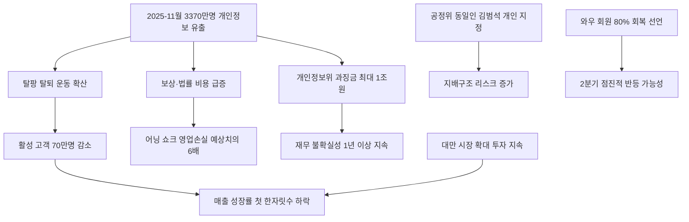

# 유통/이커머스 분析: 쿠팡 개인정보 유출 후폭풍 — 4년 3개월 만의 분기 최대 적자 3,897억
## 투자 신호 + 사회적 영향 평가

---

## 📌 기사 기본 정보

- **날짜**: 2026-05-10
- **출처**: 한국경제신문 (임선영 기자)
- **카테고리**: 경제 > 유통·이커머스
- **핵심 주제**: 2025년 11월 3,370만 명 개인정보 유출 사태의 직격탄을 맞은 쿠팡이 2026년 1분기 3,897억 원 순손실(4년 3개월 만의 최대 분기 적자)을 기록. 영업손실이 블룸버그 예상치의 6배에 달하는 어닝 쇼크 발생. 최대 1조 원 과징금 예상, 공정거래위원회의 동일인 변경(법인→김범석 의장 개인) 결정까지 복합 위기 분析

**메타데이터**
- 주요 사건: 2026년 1분기 순손실 2억 6,600만 달러(3,897억 원), 영업손실 2억 4,200만 달러(전년 동기 흑자 대비 완전 전환), 활성 고객 70만 명 감소(2,390만 명), 공정위 동일인 김범석 개인 지정
- 핵심 원인: 2025년 11월 고객 3,370만 명 개인정보 유출 → 탈팡(쿠팡 탈퇴) 확산, 보상 비용·법률 비용·대만 투자 비용 3중 지출 동시 집중
- 주요 주체: 쿠팡(김범석 의장), 개인정보보호위원회(과징금 부과 주체), 공정거래위원회, 미국 공화당(한국 디지털 기업 차별 문제 제기)
- 키워드: 어닝 쇼크, 탈팡, 와우 멤버십, 동일인 제도, 과징금, 프로덕트 커머스, 탈팡

---

## 🔍 기사를 통한 투자 신호 추출

### 1단계: 핵심 사건 분해

**What (무엇이 일어났는가?)**
- 쿠팡의 2026년 1분기 영업손실이 2억 4,200만 달러로 집계되며 블룸버그 예상치(3,927만 달러)의 6배를 기록하는 어닝 쇼크가 발생했습니다. 1분기 순손실은 3,897억 원으로 2021년 4분기 이후 최대이며, 활성 고객 수는 70만 명 감소한 2,390만 명입니다. 매출은 85억 달러로 전년 대비 8% 증가했지만 상장 이후 처음으로 한 자릿수 성장률로 떨어졌습니다.

**When (언제 일어났는가?)**
- 2026-05-10 (2025년 11월 개인정보 유출 사태 후 6개월, 1분기 실적 발표 시점)

**Why (왜 일어났는가?)**
- 개인정보 유출 보상 비용, 법률 대응 비용, 대만 시장 확대 투자 비용이 한꺼번에 집중됐습니다.
- 탈팡 현상으로 활성 고객 수가 감소하며 핵심 수익원인 와우 멤버십의 이탈이 발생했습니다.
- 공정위의 김범석 의장 개인 동일인 지정으로 한국 재벌 규제 틀 안에 포함되면서 지배구조 리스크까지 추가됐습니다.

**Who (누가 주도하는가?)**
- 손실 주체: 쿠팡 (개인정보 유출 후폭풍)
- 규제 압박: 개인정보보호위원회(최대 1조 원 과징금), 공정거래위원회(동일인 변경)
- 외교 변수: 미국 공화당 의원들의 한국 정부 차별 문제 제기

---

### 2단계: 투자 신호 해석

#### A. **긍정적 신호 (Bullish)**

**① 와우 멤버십 80% 회복 선언 — 플랫폼 독과점 저력**
- **신호**: 김범석 의장이 4월 말 기준 와우 회원 80% 회복을 공식 발표
- **의미**: 경쟁사(SSG닷컴·컬리) 대비 최대 10배 이상의 활성 고객 규모라는 로켓배송 인프라 독점력이 이탈 고객의 재유입을 견인하고 있음
- **투자 기회**: 쿠팡(CPNG) 주가 단기 과매도 구간을 재진입 포인트로 활용 검토

**② 대만 시장 확대 — 국내 리스크를 해외 성장으로 분산**
- **신호**: 대만 시장 확대 투자 지속 선언으로 국내 리스크를 해외 성장으로 분산하는 포트폴리오 전략 추진
- **의미**: 대만 사업이 손익분기점을 넘기 시작하면 구조적 성장 재개 시그널로 해석 가능
- **투자 기회**: 쿠팡 대만 진출 수혜 로컬 물류 파트너사, 한국 이커머스 인프라 기술 수출 업체

---

#### B. **위험 신호 (Bearish)**

**① 최대 1조 원 과징금 — 재무 불확실성 장기화**
- **신호**: 개인정보보호위원회의 쿠팡 과징금 최대 1조 원 예상, 2분기에도 확정 여부 불확실
- **의미**: 1조 원 과징금 현실화 시 재무 불확실성이 최소 1년 이상 지속되며 투자자 신뢰 회복에 심각한 장애
- **투자 리스크**: 쿠팡(CPNG) 주가 변동성 확대, 한국 이커머스 규제 강화에 따른 플랫폼 섹터 전반 밸류에이션 압박

**② 이탈 고객 20%의 구조적 이탈 가능성**
- **신호**: 와우 멤버십 회복이 80%에서 멈춘 나머지 20%가 구조적 이탈인지 일시적 이탈인지 미확인
- **의미**: 20%가 대체 플랫폼(네이버 쇼핑·SSG닷컴)으로 구조적으로 이동했다면 장기 매출 성장률 회복이 어려워짐
- **투자 리스크**: 쿠팡의 2분기 활성 고객 수 동향이 투자 판단의 핵심 변수

---

### 3단계: 섹터별 투자 기회 매트릭스

#### ⚠️ **중간 기대도 + 높은 리스크**

**쿠팡(CPNG) 단기 반등 포지션**
- 1분기 손실의 상당 부분이 일회성(보상·법률 비용)이고 와우 멤버십 80% 회복이 사실이라면 2분기부터 점진적 반등 가능성이 있습니다. 그러나 과징금 확정 전까지 재무 불확실성이 상당하므로 소규모 분할 매수가 적절합니다.
- **투자 추천도**: ⭐⭐⭐ (과징금 결과 확인 후 재평가)

---

## 💰 구체적 투자 신호 변환

### 신호 1: 개인정보 유출 리스크의 실제 재무 비용 — 플랫폼 기업의 규제 리스크 재정의

**투자 해석**: 쿠팡의 어닝 쇼크는 개인정보 유출이라는 사건이 활성 고객 감소, 보상 비용, 법률 비용, 과징금, 지배구조 리스크라는 5중 타격으로 증폭될 수 있음을 실증한 교과서적 사례입니다. 플랫폼 기업에 투자할 때 개인정보 보호 역량과 규제 대응 능력이 사업 펀더멘털의 핵심 요소임을 반드시 밸류에이션에 반영해야 합니다. 단기 투자자는 과징금 확정 결과를 기다린 후 쿠팡의 2분기 활성 고객 수 동향을 확인하고 진입 시점을 결정하는 것을 권고합니다.

---

## 🌍 사회적 영향 평가

### A. 긍정적 사회 영향
- **개인정보보호 의식의 소비자 권리화**: 3,370만 명의 개인정보 유출에 소비자들이 집단적 탈퇴(탈팡)로 대응한 사례는 개인정보가 플랫폼 선택의 핵심 기준으로 자리잡는 사회적 전환점입니다.
- **플랫폼 독과점 견제 선례 형성**: 최대 1조 원 과징금 가능성과 동일인 지정은 디지털 플랫폼 독과점에 대한 실질적 규제 강도를 높이는 선례가 됩니다.

### B. 부정적 사회 영향
- **미-한 외교 갈등 변수로 인한 규제 불확실성**: 미국 공화당의 한국 차별 문제 제기가 쿠팡 규제 강도에 영향을 미칠 경우, 외교 압력으로 국내 소비자 보호 법 집행이 타협되는 선례를 만들 수 있습니다.
- **이커머스 독과점 붕괴 시 서비스 공백**: 쿠팡의 로켓배송에 의존하는 1인 가구·고령층 소비자들의 서비스 접근성이 급격히 약화될 가능성이 있습니다.

---

## 🎯 결론: 당신의 투자 전략 수립

- **즉시 실행**: 쿠팡(CPNG) 과징금 확정 결과(2분기 발표 예상)와 2분기 활성 고객 수 동향을 관찰 포인트로 설정. 과징금 확정 전까지 대규모 신규 진입 자제
- **3개월 후**: 2분기 실적 발표(7월~8월 예상) 시 활성 고객 수 회복이 95% 이상으로 확인되면 분할 매수 검토. 과징금 1조 원 확정 시 주가 추가 조정 구간에서 단계적 매수

---

## 📝 Obsidian 연결 구조

