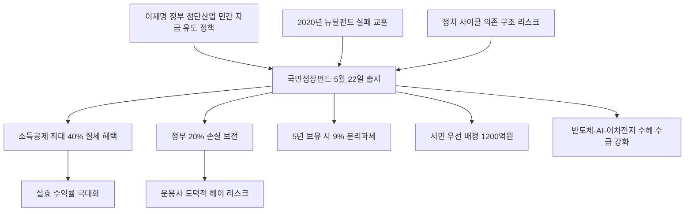

# 투자/금융정책 분析: 국민성장펀드 — 소득공제 40%·손실 20% 정부 보전·첨단산업 투자
## 투자 신호 + 사회적 영향 평가

---

## 📌 기사 기본 정보

- **날짜**: 2026-05-10
- **출처**: 연합뉴스 (김선미 기자)
- **카테고리**: 경제 > 투자·금융정책
- **핵심 주제**: 정부가 반도체·AI 등 12개 첨단전략산업에 국민 자금을 모아 투자하는 국민성장펀드를 5월 22일 출시. 최대 40% 소득공제·정부 20% 손실 보전·5년 이상 배당 9% 분리과세라는 파격적 혜택. 총 모집 6,000억 원, 서민 우선 배정(근로소득 5,000만 원 이하 2주 우선 가입)

**메타데이터**
- 주요 사건: 5월 22일~6월 11일 25개 은행·증권사 창구 및 온라인 판매, 총 모집 6,000억 원, 기준 수익률 연 6% 제시, 서민 우선 배정 1,200억 원(~6월 4일)
- 핵심 원인: 반도체·AI·이차전지·수소·바이오 등 12개 첨단전략산업에 민간 자금 대규모 유입 필요, 뉴딜펀드 실패 교훈 반영(모펀드-자펀드 다양화 설계)
- 주요 주체: 금융위원회(설계), 모펀드 운용사, 개인 투자자(서민 우선 배정 및 일반 투자자)
- 키워드: 소득공제, 분리과세, 모펀드-자펀드, 도덕적 해이, 손실 보전, 뉴딜펀드, 첨단전략산업, 성과보수

---

## 🔍 기사를 통한 투자 신호 추출

### 1단계: 핵심 사건 분해

**What (무엇이 일어났는가?)**
- 정부가 5월 22일 국민성장펀드를 출시합니다. 연간 1억 원, 5년간 최대 2억 원까지 투자 가능하며 3년 이상 유지 시 최대 1,800만 원까지 10~40% 소득공제를 제공합니다. 원금 손실 시 정부 재정 1,200억 원으로 20%까지 우선 보전하고, 5년 이상 보유 시 9% 분리과세(일반 금융소득 세율 15.4%보다 낮음)를 적용합니다. 5년 누적 수익률 30% 초과 시 운용사에 성과보수를 지급합니다.

**When (언제 일어났는가?)**
- 2026-05-10 (중동전쟁발 유가 충격·물가 상승·금리 인상 우려가 동시에 조성되는 거시환경 불확실성 시점에 출시)

**Why (왜 일어났는가?)**
- 반도체·AI 등 국가 핵심 첨단산업에 대규모 민간 자금을 유입시켜 국가 경쟁력을 키우는 산업 정책 목적입니다.
- 동시에 서민 우선 배정을 통해 첨단산업 성장의 과실을 소득 하위 계층도 나눠 갖게 하는 분배 목적을 병행합니다.
- 과거 뉴딜펀드 실패(2020년)를 교훈 삼아 포트폴리오를 다양화한 모펀드-자펀드 구조로 설계했습니다.

**Who (누가 주도하는가?)**
- 설계 주체: 금융위원회
- 수혜 대상: 소득공제 혜택을 누리는 고소득 납세자, 서민 우선 배정 혜택을 받는 근로소득 5,000만 원 이하 계층

---

### 2단계: 투자 신호 해석

#### A. **긍정적 신호 (Bullish)**

**① 소득공제 40% — 절세 효과만으로도 실효 수익 확보**
- **신호**: 최대 40% 소득공제 + 5년 이상 보유 시 9% 분리과세 (일반 금융소득 15.4% 대비 낮음)
- **의미**: 세전 수익률이 낮더라도 소득공제로 확보하는 절세 효과가 실효 수익률을 크게 높여줌. 고소득 납세자일수록 절세 혜택이 극대화됨
- **투자 기회**: 소득공제 혜택을 최대화할 수 있는 고소득 직장인·자영업자의 절세 포트폴리오 필수 편입 상품

**② 반도체·AI 첨단산업 수혜주 추가 수급 확보**
- **신호**: 6,000억 원 공모 자금의 12개 첨단전략산업 집중 투자로 관련 종목 수급 강화
- **의미**: 국민성장펀드가 집중 투자하는 반도체·AI·이차전지 관련 코스피·코스닥 종목들의 기관 매수 여력이 추가로 유입됨
- **투자 기회**: [[삼성전자]], [[SK하이닉스]], 이차전지·수소·바이오 관련 첨단산업주

---

#### B. **위험 신호 (Bearish)**

**① 도덕적 해이 — 정부 20% 손실 보전의 역설**
- **신호**: 손실 20%를 정부(세금)가 메워주는 구조에서 운용사의 과도한 위험 투자 가능성
- **의미**: 운용사 입장에서 20% 이내 손실은 정부가 부담하므로 도덕적 해이(Moral Hazard)가 발생하여 무리한 투자를 감수할 인센티브가 생김. 성과보수(30% 초과 수익)가 이를 일부 상쇄하지만 완전한 해결책은 아님
- **투자 리스크**: 운용사의 부실 투자로 발생한 손실을 납세자 전체가 부담하는 역진적 재분배 위험

**② 뉴딜펀드의 실패 반복 가능성**
- **신호**: 2020년 뉴딜펀드 역시 유사한 손실 보전 구조로 출시되었으나 운용 실적이 기대에 미치지 못함
- **의미**: 정권 교체 시 운용 방향이 흔들릴 수 있는 정치 사이클 연동 리스크가 상존하며, 12개 첨단전략산업이라는 범주가 너무 넓어 핵심 집중력이 없을 가능성
- **투자 리스크**: 기준 수익률 연 6% 미달 시 투자자 신뢰 붕괴 및 조기 환매 압박

---

### 3단계: 섹터별 투자 기회 매트릭스

#### ✅ **높은 기대도 + 낮은 리스크 (절세 관점)**

**소득공제 활용 목적의 서민 우선 배정 가입 (6월 4일까지)**
- 절세 효과만으로도 은행 예금 수익률(3~4%)을 상회하는 실효 수익을 기대할 수 있습니다. 특히 서민 우선 배정 기간(~6월 4일) 내 가입 시 1,200억 원 한도 내에서 우선권을 확보할 수 있습니다.
- **투자 추천도**: ⭐⭐⭐⭐ (절세 목적 한정)

---

## 💰 구체적 투자 신호 변환

### 신호 1: 산업 정책형 투자 상품의 절세 활용 전략

**투자 해석**: 국민성장펀드의 핵심 매력은 소득공제 40%라는 파격적 절세 혜택입니다. 연봉 7,000만 원 직장인이 1,800만 원 한도 투자 시 최대 약 600~700만 원의 세금 절감 효과가 발생합니다. 단, 투자자는 이 상품을 '반도체·AI 성장에 대한 순수 투자'가 아니라 '절세 효과를 통해 실효 수익을 높이는 금융 상품'으로 포지셔닝해야 합니다. 운용사의 도덕적 해이 리스크와 정치 사이클 의존 구조적 취약성을 감안하여 가입 한도 내에서 분산 투자하는 것을 권고합니다.

---

## 🌍 사회적 영향 평가

### A. 긍정적 사회 영향
- **서민의 첨단산업 성장 과실 접근**: 서민 우선 배정으로 소득 하위 계층도 반도체·AI 성장 수익을 나눠 가질 기회를 얻습니다.
- **국가 첨단산업 경쟁력 강화**: 6,000억 원의 민간 자금이 첨단전략산업에 유입되면 기업 자금 조달 비용이 낮아지고 투자 여력이 확대됩니다.

### B. 부정적 사회 영향
- **역진적 재분배 구조**: 손실 20%를 세금으로 보전하는 구조는 투자하지 않은 국민이 투자한 국민의 손실을 지원하는 역진적 재분배 문제를 내포합니다.
- **고소득자 절세 편중**: 소득공제 혜택은 과세 구간이 높을수록 절세 효과가 커지는 구조이므로, 서민보다 고소득 자산가에게 더 큰 혜택이 돌아가는 아이러니가 발생합니다.

---

## 🎯 결론: 당신의 투자 전략 수립

- **즉시 실행**: 서민 우선 배정 기간(~6월 4일) 내 근로소득 5,000만 원 이하에 해당하면 우선 가입 검토. 고소득 납세자는 소득공제 40% 절세 혜택을 최대화하도록 투자 한도(1,800만 원) 내 가입
- **3개월 후**: 운용사의 1분기 투자 내역 및 포트폴리오 구성 확인. 반도체·AI 첨단산업주 동향과 연계하여 펀드 편입 종목의 성과 모니터링

---

## 📝 Obsidian 연결 구조

