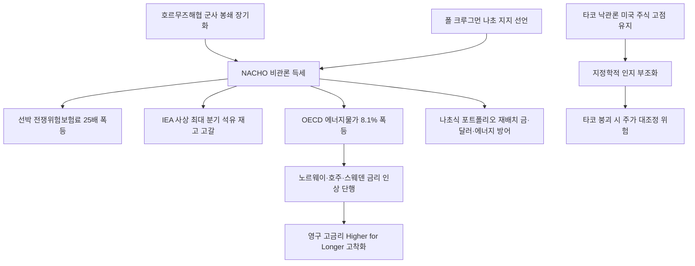

# 거시/통화정책 분析: 월가 타코 vs 나초 트레이드 — 호르무즈 봉쇄·유가 인플레·금리 인상
## 투자 신호 + 사회적 영향 평가

---

## 📌 기사 기본 정보

- **날짜**: 2026-05-11
- **출처**: 한국경제신문 (김원 기자)
- **카테고리**: 경제 > 거시경제·통화정책
- **핵심 주제**: 뉴욕 월가를 지배하는 두 거래 전략의 충돌 분析. 'TACO(Trump Always Chickens Out·단기 봉합 낙관론)'에서 'NACHO(Not A Chance Hormuz Opens·영구 봉쇄 비관론)'로의 급속한 전환. 선박 전쟁위험보험료 25배 폭등(0.1%→2.5%), OECD 에너지 물가 한 달 만에 8.6%포인트 급등(1971년 이후 3위), 전 세계 중앙은행의 영구 고금리(Higher for Longer) 진입 분析

**메타데이터**
- 주요 사건: 선박 전쟁위험보험료(AWRP) 0.1%→2.5%(25배 폭등), OECD 에너지 물가 8.1%(한 달 만에 8.6%포인트 급등), 글로벌 석유 재고 하루 480만 배럴씩 고갈(IEA 사상 최대 분기 고갈), 노르웨이·호주 금리 인상 단행
- 핵심 원인: 호르무즈해협 군사 봉쇄 장기화, 이란 혁명수비대 비대칭 해양 전략, 레드라인 붕괴로 국제 질서 예측 불가능성 극대화
- 주요 주체: 월가 트레이더(타코↔나초 전환), 노벨경제학상 폴 크루그먼(나초 지지), 노르웨이·호주·스웨덴 중앙은행(긴축 전환), 미국 연준(Fed·매파적 동결)
- 키워드: TACO 트레이드, NACHO 트레이드, 전쟁위험보험료(AWRP), Higher for Longer, 1971년 닉슨 쇼크, 지정학적 인지 부조화

---

## 🔍 기사를 통한 투자 신호 추출

### 1단계: 핵심 사건 분해

**What (무엇이 일어났는가?)**
- 뉴욕 월가에서 '트럼프가 결국 전쟁을 봉합할 것'이라는 TACO 낙관론에서 '호르무즈해협이 조기 개방될 가능성은 제로'라는 NACHO 비관론으로의 급속한 전환이 발생했습니다. 선박 전쟁위험보험료(AWRP)가 선체 가치의 0.1%에서 2.5%로 25배 폭등했고, OECD 회원국 3월 에너지 물가가 전월 대비 8.6%포인트 수직 상승(1971년 닉슨 쇼크 이후 역대 3위)했습니다. 그러나 미국 주식시장은 여전히 사상 최고치 부근에서 TACO식 랠리를 유지하며 '자산 인지 부조화' 상태를 연출 중입니다.

**When (언제 일어났는가?)**
- 2026-05-11 (노르웨이·호주·스웨덴 중앙은행 긴축 단행, IEA 사상 최대 분기 석유 재고 고갈 확인 시점)

**Why (왜 일어났는가?)**
- 호르무즈해협 군사 봉쇄가 이란 혁명수비대의 기뢰 매설 및 중·러 연대라는 물리적 장벽으로 단기 해소가 불가능함이 확인됐습니다.
- 글로벌 석유 재고 완충 장치가 IEA 역사상 최대 속도로 소진되면서 에너지 공급망의 실물 한계가 드러났습니다.
- 전 세계 중앙은행들이 에너지 인플레이션 압박에 의해 영구 고금리(Higher for Longer) 긴축 대열로 강제 진입하고 있습니다.

**Who (누가 주도하는가?)**
- 나초 비관론 확산: 실물 원유·선박·보험·채권 트레이더들 (공급망 현장의 차가운 현실 반영)
- 타코 낙관론 유지: 미국 주식 트레이더들 (금융의 시각으로 정치적 해결을 기대)

---

### 2단계: 투자 신호 해석

#### A. **긍정적 신호 (Bullish)**

**① 에너지 안보 자산 — 원유·LNG·원전 관련 자산의 구조적 강세**
- **신호**: 브렌트유 100달러 고착화, 석유 전략 비축 사재기 경쟁 가속화
- **의미**: 에너지 공급 안보가 국가 최우선 과제로 격상되면서 원유·LNG·원전 관련 자산의 가격 지지력이 구조적으로 강화됨
- **투자 기회**: 원유 ETF, LNG 관련 에너지주, 한국 원전 수출 관련주, 실물 금(Gold)

**② 방산·해양 안보 섹터 수혜**
- **신호**: 전쟁위험보험료 2.5% 폭등 = 선박 100척 중 2.5척의 완전 손실을 보험이 정당화하는 수준의 실제 위험
- **의미**: 해양 안보, 방산, 드론·기뢰 탐지 기술 관련 기업들의 수요 폭발적 증가
- **투자 기회**: 한국 방산 대형주, 해양 안보 기술 스타트업

---

#### B. **위험 신호 (Bearish)**

**① 타코식 미국 주식시장의 대조정 가능성**
- **신호**: 실물 시장(원유·채권·보험)은 NACHO 비관론을 완전 반영했으나 미국 주식 시장만 여전히 사상 최고치 유지
- **의미**: 주식시장이 뒤늦게 '나초'의 현실을 인식하는 순간 급격한 밸류에이션 대조정이 발생할 위험. 2000년 닷컴 버블이나 2022년 긴축 충격과 유사한 패턴
- **투자 리스크**: 고PER 기술주·성장주 포트폴리오, 금리 인상 시 채권 보유 포지션

**② 영구 고금리(Higher for Longer) 고착화 — 가계·기업 부채 부담**
- **신호**: 노르웨이·호주·스웨덴에 이어 ECB·BOJ마저 추가 긴축 시사, 미 연준 금리 인하 기대 완전 소멸
- **의미**: 글로벌 저금리 시대의 영구적 종말로 고부채 가계와 한계 기업의 이자 부담이 폭증하며 실물 경기 침체 위험 확대
- **투자 리스크**: 변동금리 부동산, 레버리지 기반 성장주, 신흥국 달러 채무 기업

---

### 3단계: 섹터별 투자 기회 매트릭스

#### ✅ **높은 기대도 + 낮은 리스크**

**실물 안전자산 (금·달러·에너지 인프라) — 나초식 포트폴리오**
- NACHO 비관론이 현실화되는 구조에서 실물 금(Gold), 달러 현금성 자산, 에너지 인프라(원전·LNG)는 가장 확실한 방어 자산입니다. 주식 비중은 방산·에너지 중심으로 재편하고 고PER 기술주 비중을 축소하는 '나초식 포트폴리오 재배치'가 필요합니다.
- **투자 추천도**: ⭐⭐⭐⭐⭐

---

## 💰 구체적 투자 신호 변환

### 신호 1: 지정학적 인지 부조화의 해소 시점을 대비한 포트폴리오 나초화

**투자 해석**: 월가 주식 트레이더들이 마지막까지 붙들고 있는 TACO 낙관론이 붕괴되는 순간은 연준의 금리 인상 시그널 또는 이란의 추가 군사 행동이 촉매가 될 것입니다. 그 이전까지는 두 시장(주식의 TACO vs 실물의 NACHO)이 공존하는 비정상 상태가 지속됩니다. 한국 투자자는 즉시 포트폴리오의 '나초화(Nachoization)'를 시작해야 합니다. 구체적으로는 ① 달러 자산·실물 금 비중 확대, ② 원유 연동 에너지 자산 편입, ③ 유가 연동 원자재 헷지 포지션 최대화, ④ 고금리 장기화에 취약한 부동산·건설·내수 소비재 비중 축소를 즉시 실행해야 합니다.

---

## 🌍 사회적 영향 평가

### A. 긍정적 사회 영향
- **에너지 전환 투자 가속의 역설적 기회**: 유가 충격은 재생에너지·원전 전환 필요성을 각국 정책의 최우선 순위로 끌어올려 에너지 안보 논의와 투자를 가속시킵니다.
- **실물 자산과 인프라 투자의 재부상**: 나초식 현실 인식이 확산되면 데이터센터·물류 창고·에너지 시설 등 실물 인프라에 대한 사회적 투자 수요가 증가합니다.

### B. 부정적 사회 영향
- **에너지 빈곤층의 직접 피격**: OECD 에너지 물가 8.1% 급등은 난방비와 교통비를 직접 상승시켜 저소득층 서민의 실질 소득을 가장 크게 잠식합니다.
- **영구 고금리 고착화의 가계 부채 압박**: 한국 가계 부채 1,900조 원에 금리 인상이 가해지면 서민 가계의 이자 부담이 폭증하는 이중 압박이 현실화됩니다.

---

## 🎯 결론: 당신의 투자 전략 수립

- **즉시 실행**: 포트폴리오의 나초화 착수. 달러 MMF 비중 40% 이상 유지, 실물 금(Gold) 5~10% 편입, 유가 연동 에너지주 일부 편입. 고PER 성장주·내수 부동산 비중 축소
- **3개월 후**: 미-이란 전쟁 종전 협상 동향(TACO→NACHO 전환의 역방향 가능성), 연준 금리 인상 시그널 여부를 모니터링하며 주식 비중 조정 타이밍 재검토

---

## 📝 Obsidian 연결 구조

