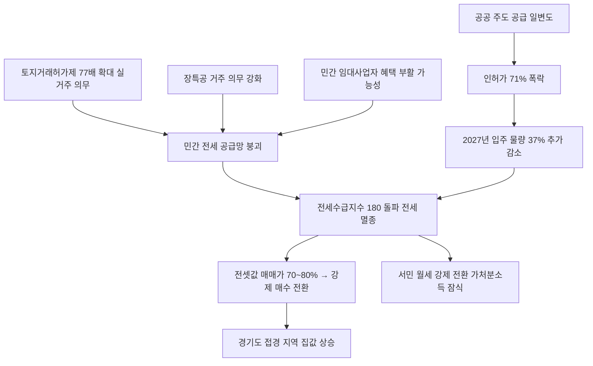

# 부동산/주거정책 분析: 전세 대란 — 공급 절벽·규제 왜곡·토지거래허가제·장기보유특별공제
## 투자 신호 + 사회적 영향 평가

---

## 📌 기사 기본 정보

- **날짜**: 2026-05-11
- **출처**: 중앙일보 (주정완 논설위원)
- **카테고리**: 경제 > 부동산 > 임대차시장/주거정책
- **핵심 주제**: 5,300가구 대단지에서 전세 매물이 단 3건인 '전세 멸종' 사태 발생. 서울 전세수급지수가 180을 돌파하며 임대차 2법 충격 이후 최악 수준. 다주택자 악마화 규제(토지거래허가제 77배 확대·장특공 거주 의무 강화)로 민간 임대 공급망이 붕괴되고 공공 주도 공급만으로는 한계에 직면한 구조적 위기 분析

**메타데이터**
- 주요 사건: 서울 전세수급지수 180 돌파(2020년 12월 이후 최악), 1분기 서울 주택 준공 30% 급감·인허가 62% 축소(아파트 71% 폭락), 내년 서울 아파트 입주 예정 37% 추가 감소(1만 7,197가구)
- 핵심 원인: 토지거래허가제 구역 77배 광역 지정(전 구역 실거주 의무), 장기보유특별공제 거주 의무 강화로 기존 다주택자 전세 공급 이탈, 민간 정비사업 억제 및 공공 주도 일변도
- 주요 주체: 다주택자·비거주 1주택자(민간 전·월세 80% 공급), 국토교통부(공공 주도 정책), 세입자(전세 대란 피해 당사자)
- 키워드: 전세수급지수, 토지거래허가제, 임대차 2법, 장기보유특별공제, 공급 절벽, 전세 멸종, 월세화

---

## 🔍 기사를 통한 투자 신호 추출

### 1단계: 핵심 사건 분해

**What (무엇이 일어났는가?)**
- 강북 최대 규모인 미아동 SK북한산시티(5,300여 가구)에서 국민 평형(전용 84㎡) 전세 매물이 단 3건에 불과한 '전세 멸종' 사태가 발생했습니다. 서울 전세수급지수가 180을 돌파하며 임대차 2법 충격이 가장 심했던 2020년 12월 이후 5년 5개월 만에 최악을 기록했습니다. 1분기 서울 주택 인허가가 62% 축소(아파트 71% 폭락)되면서 3~5년 뒤 공급 절벽이 예고되고, 전셋값이 매매가의 70~80%까지 치솟으면서 강제 매수 전환 수요가 확산 중입니다.

**When (언제 일어났는가?)**
- 2026-05-11 (다주택 양도세 중과 부활 직후, 토지거래허가제 확대 시행 중)

**Why (왜 일어났는가?)**
- 토지거래허가제 구역 아파트는 '2년 실거주 의무'로 인해 전세를 놓는 것이 원천 금지됩니다.
- 장기보유특별공제 거주 요건 강화로 기존 다주택자들이 전세를 거두고 실입주로 전환하면서 전세 공급망이 붕괴됐습니다.
- 민간 정비사업 억제와 공공 주도 일변도의 공급 정책이 신규 주택 공급 자체를 막았습니다.

**Who (누가 주도하는가?)**
- 피해 당사자: 전세를 구하지 못해 월세 강제 전환 또는 경기도 외곽으로 이동 중인 서민 세입자
- 정책 책임자: 국토교통부(공공 주도 공급에만 의존하는 공급 패러다임 고수)
- 시장 변수: 민간 전·월세의 80%를 공급하는 다주택자·비거주 1주택자의 선택

---

### 2단계: 투자 신호 해석

#### A. **긍정적 신호 (Bullish)**

**① 전셋값 매매가 근접 → 강제 실수요 매수 전환**
- **신호**: 전셋값이 매매가의 70~80% 선까지 상승하면서 "차라리 집을 사자"는 강제 매수 전환 수요 확산
- **의미**: 전세 대란이 서울 외곽 및 경기도 접경 지역의 중저가 아파트 매수 수요로 전환되면서 해당 지역 집값 상승 압력 지속
- **투자 기회**: 서울 접경 경기도 아파트, 서울 외곽 중저가 아파트 실물 자산

**② 기업형 임대 시장의 구조적 성장 기회**
- **신호**: 현재 국내 임대시장의 90%가 개인임대인인 상태에서 공공만으로는 전세 대란 해소 불가능
- **의미**: 정책 전환(등록 임대사업자 혜택 부활, 기업형 임대 지원 강화)이 이루어질 경우 기업형 임대 사업자의 시장 진입 기회 확대
- **투자 기회**: 기업형 임대주택 리츠(REITs), 임대 관리 플랫폼, 중소형 정비사업 특화 건설사

---

#### B. **위험 신호 (Bearish)**

**① 전세의 월세화 고착 — 서민 가처분소득 잠식**
- **신호**: 2027년까지 서울 아파트 입주 물량이 구조적으로 마를 전망. 전세 보증금 폭등 지속 불가피
- **의미**: 서민들이 매달 가계 가처분소득을 갉아먹는 반전세·월세로 강제 이동하며 내수 소비 위축 및 저축률 하락으로 이어짐
- **투자 리스크**: 내수 소비재·외식·엔터테인먼트 업종 전반, 가계 실질 소득 감소에 민감한 생활 밀착형 기업

**② 공급 정책 미전환 시 2027년 공급 절벽 심화**
- **신호**: 1분기 인허가 71% 폭락으로 3~5년 뒤 입주 물량 급감 예고
- **의미**: 민간 정비사업 활성화 및 세제 합리화 없이 정책이 현 기조를 유지하면 2027~2028년 전세 대란 극한 상황 도래 가능
- **투자 리스크**: 중소형 건설사 도산 리스크, 신규 분양 시장 침체 장기화

---

### 3단계: 섹터별 투자 기회 매트릭스

#### ✅ **높은 기대도 + 낮은 리스크**

**기업형 임대 리츠(REITs) 및 서울 접경 경기도 실물 자산**
- 전세 대란이 구조적으로 지속되는 한 기업형 임대 수요와 서울 접경 경기도 중저가 아파트의 실수요 기반 가격 지지는 유지됩니다. 정책 전환(등록 임대사업자 혜택 부활) 발표 시 기업형 임대 관련 주가 급등 가능성이 있습니다.
- **투자 추천도**: ⭐⭐⭐⭐

---

## 💰 구체적 투자 신호 변환

### 신호 1: 반시장적 공급 억제 → 전세 대란 → 강제 매수 전환의 구조적 반복

**투자 해석**: 이 기사는 서울 전세 대란이 단순한 수급 불균형이 아니라 '반시장적 공급 억제 정책'이 만든 구조적 실패임을 실증합니다. 투자자는 이 구조적 반복(규제 강화 → 공급 감소 → 전세난 → 강제 매수 전환 → 외곽 집값 상승)을 이용하여 서울 접경 경기도 중저가 아파트의 매수 포인트를 잡을 수 있습니다. 동시에 기업형 임대 사업자 지원 정책이 발표되는 시점을 관련 리츠·임대 관리 플랫폼의 선매수 기회로 활용하는 전략을 검토해야 합니다.

---

## 🌍 사회적 영향 평가

### A. 긍정적 사회 영향
- **정책 실패의 역설적 개혁 동력**: 전세 대란이 극한에 달할수록 민간 임대 활성화와 세제 합리화라는 근본적 정책 전환 압력이 커져 장기적 공급 구조 개선의 촉매가 될 수 있습니다.

### B. 부정적 사회 영향
- **주거 불안이 낳는 사회 붕괴**: 청년층과 신혼부부가 전세를 구하지 못해 경기도 외곽으로 밀리면서, 직장과 주거의 분리로 인한 통근 고통, 육아·교육 인프라 접근성 저하, 저출산 심화라는 망국적 연쇄 반응이 가속됩니다.
- **임차인 권리의 역설적 침해**: 세입자를 보호하기 위한 토지거래허가제와 장특공 규제가 오히려 전세 매물을 씨 말리면서 세입자의 선택권과 주거 안정성을 더 크게 훼손하는 역설이 발생합니다.

---

## 🎯 결론: 당신의 투자 전략 수립

- **즉시 실행**: 서울 전세수급지수 및 국토부의 민간 임대 정책 전환 발표 모니터링. 기업형 임대 리츠 및 서울 접경 경기도 중저가 아파트 실물 매수 포지션 검토 유지
- **3개월 후**: 국토부의 등록 임대사업자 혜택 부활 또는 민간 정비사업 활성화 정책 발표 여부 확인. 인허가 물량 회복 신호 포착 시 중장기 건설·부동산 투자 재진입 검토

---

## 📝 Obsidian 연결 구조

