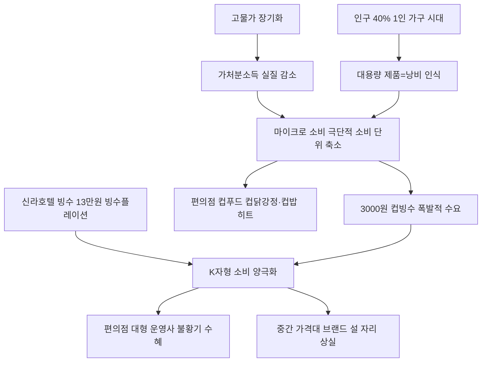

# 소비/유통트렌드 분析: 미니식품·고물가·1인가구 마이크로소비 — 빙수플레이션의 역설
## 투자 신호 + 사회적 영향 평가

---

## 📌 기사 기본 정보

- **날짜**: 2026-05-11
- **출처**: 중앙일보 (임선영 기자)
- **카테고리**: 경제 > 소비·유통트렌드
- **핵심 주제**: 극심한 고물가와 1인 가구 급증이 맞물려 소비 단위를 최대한 잘게 쪼개는 '마이크로 소비(Micro Consumption)' 트렌드가 식품·유통 업계를 재편. 신라호텔 애플망고빙수 13만 원 '빙수플레이션'과 편의점 3,000원 컵빙수의 폭발적 양극화, CU의 컵닭강정·GS25의 냉장컵밥 등 소용량 컵푸드의 전성시대 분析

**메타데이터**
- 주요 사건: 신라호텔 애플망고빙수 13만 원(전년 대비 2만 원 폭등), 메가MGC·빽다방·이디야·스타벅스 3,000~4,000원대 컵빙수 출시 경쟁, CU 컵닭강정·컵떡볶이·GS25 냉장컵밥·즉석컵국 1,500~5,000원 선 히트
- 핵심 원인: 고물가 장기화로 가처분소득 감소, 인구 10명 중 4명이 1인 가구인 구조, 남겨서 버리는 것에 대한 소비자 심리적 부담
- 주요 주체: 프랜차이즈 카페(컵빙수), 편의점 업계(컵푸드), 1인 가구 소비자, 식품 제조업체(소포장 전략)
- 키워드: 마이크로 소비, 빙수플레이션, 쉬링크플레이션, 1인 가구, K자형 소비 양극화, 소확행, 스낵컬처형 소비

---

## 🔍 기사를 통한 투자 신호 추출

### 1단계: 핵심 사건 분해

**What (무엇이 일어났는가?)**
- 고물가와 1인 가구 확산이 맞물려 대용량 소비를 거부하고 필요한 만큼만 소량으로 소비하는 '마이크로 소비' 트렌드가 식품·유통 업계를 장악했습니다. 신라호텔 빙수 13만 원이라는 '빙수플레이션'과 카페·편의점의 3,000원 컵빙수·컵푸드가 동시에 폭발하며 'K자형 소비 양극화'가 가장 선명하게 드러난 현장입니다.

**When (언제 일어났는가?)**
- 2026-05-11 (고물가 장기화, 1인 가구 전체의 40% 돌파 시점, 여름 빙수 시즌 개막)

**Why (왜 일어났는가?)**
- 인건비·원자재·물류비 폭등으로 프리미엄 제품 가격이 급등하는 반면, 가처분소득이 실질적으로 감소한 중하류층 소비자들은 지출 금액 자체를 물리적으로 통제하는 '소비 단위 축소' 전략을 취합니다.
- 인구 10명 중 4명이 1인 가구인 현실에서 다인가구 중심의 대용량 제품이 '낭비'로 인식됩니다.

**Who (누가 주도하는가?)**
- 마이크로 소비 주체: 가처분소득이 줄어든 중하류 1인 가구
- 시장 적응자: 컵빙수·컵푸드로 소비 단위를 쪼갠 편의점·프랜차이즈 카페

---

### 2단계: 투자 신호 해석

#### A. **긍정적 신호 (Bullish)**

**① 편의점 소용량 컵푸드 — 불황기 최고 수혜 채널**
- **신호**: CU 컵닭강정·컵떡볶이, GS25 냉장컵밥·즉석컵국이 1,500~5,000원 선에서 폭발적 판매
- **의미**: 불황기에 편의점이 외식 대체 채널로 기능하며 객단가 하락에도 방문 빈도 증가로 매출 방어. 소포장 기획 역량이 강한 편의점이 신성장 엔진 확보
- **투자 기회**: BGF리테일(CU), GS리테일(GS25) 등 국내 대형 편의점 운영사

**② 소포장·소용량 식품 제조업체의 마진 혁신**
- **신호**: 원가 인상 압박 속에서 가격 인상 대신 소용량 리패키징(마이크로 패키징)으로 전환하는 식품업체 증가
- **의미**: 소포장 라인업을 선점한 식품업체는 가격 저항 없이 단위당 마진을 높이는 혁신적 수익 구조 확보 가능
- **투자 기회**: 1인 가구 맞춤 소포장 라인업을 보유한 CJ제일제당, 오리온, 농심 등 식품 대형주

---

#### B. **위험 신호 (Bearish)**

**① 중간 가격대 브랜드의 소멸 — 중간층의 붕괴**
- **신호**: 13만 원 신라호텔 빙수(프리미엄)와 3,000원 컵빙수(초저가)로 양극화되는 소비 구조에서 5,000~1만 원대 중간 가격대 디저트·외식 업체들이 설 자리를 잃어감
- **의미**: K자형 소비 양극화가 심화되면 중간 포지셔닝 브랜드는 고가도 저가도 아닌 '어정쩡한 가격'으로 이탈 가속. 중간 가격대에 머무는 외식·카페 프랜차이즈의 수익성 압박
- **투자 리스크**: 중간 가격대 외식 프랜차이즈, 일반 카페 브랜드

**② 마이크로 소비 구조 고착화 — 내수 소비 총량 감소**
- **신호**: 소비 단위가 쪼개지면 총 소비 금액(객단가)이 줄어들어 내수 경기 체력이 약해짐
- **의미**: 마이크로 소비가 일상화될수록 개별 기업의 매출 총량이 줄어드는 내수 위축의 구조적 신호. 고물가+금리 인상이 겹치면 소비 수축 가속화
- **투자 리스크**: 내수 소비에 의존하는 식품·음료·외식 업종 전반의 이익 마진 압박

---

### 3단계: 섹터별 투자 기회 매트릭스

#### ✅ **높은 기대도 + 낮은 리스크**

**편의점 대형 운영사 (불황기 최강 방어 채널)**
- 고물가 불황기에 편의점은 외식과 대형마트를 대체하는 생존 소비의 허브로 기능합니다. 소용량 컵푸드·컵빙수 등 1인 가구 맞춤 라인업이 강화될수록 경쟁사 대비 차별화된 성장 동력을 확보합니다.
- **투자 추천도**: ⭐⭐⭐⭐⭐

---

## 💰 구체적 투자 신호 변환

### 신호 1: 소비의 K자형 파편화 — 포지셔닝이 살고 죽는 시대

**투자 해석**: '빙수플레이션'과 '컵빙수 3,000원'의 동시 흥행은 소비 시장이 초고가 경험 소비와 초저가 생존 소비로 완전히 양분되었음을 선언하는 가장 선명한 신호입니다. 투자자는 이 양극화 트렌드에서 명확한 수혜주를 선별해야 합니다. 초저가 소용량 채널에서는 편의점 운영사(BGF리테일, GS리테일), 초고가 프리미엄 경험 채널에서는 호텔·리조트·프리미엄 F&B 브랜드가 수혜를 받습니다. 가장 위험한 포지션은 그 중간에 머무는 애매한 가격대의 브랜드입니다.

---

## 🌍 사회적 영향 평가

### A. 긍정적 사회 영향
- **소비자 주권 강화와 합리적 소비 문화 확산**: 마이크로 소비 트렌드는 소비자가 불필요한 지출을 줄이고 실질적 필요에만 집중하는 합리주의적 소비 문화를 강화합니다.
- **소포장 기술 혁신으로 식품 폐기율 감소**: 1인용 소포장 식품 확산이 남겨서 버리는 음식물 쓰레기를 줄이는 친환경 효과를 냅니다.

### B. 부정적 사회 영향
- **소비 무기력증과 청년 세대의 꿈 포기**: 3,000원 컵빙수조차 고민하며 소비를 쪼개야 하는 청년 세대가 주거·결혼·출산이라는 더 큰 소비를 포기하는 구조적 악순환으로 연결됩니다.
- **골목 상권 영세 외식업자 직격**: 편의점의 컵푸드가 외식 대체재로 자리 잡을수록 소규모 자영업 음식점들의 매출이 잠식됩니다.

---

## 🎯 결론: 당신의 투자 전략 수립

- **즉시 실행**: BGF리테일(CU)·GS리테일(GS25) 등 편의점 대형 운영사를 내수 방어주 포트폴리오에 편입 검토. 소포장 1인 가구 맞춤 라인업이 강화된 CJ제일제당·오리온 등 식품 대형주 실적 모니터링
- **3개월 후**: 2분기 편의점 컵푸드 카테고리 매출 성장률 데이터를 확인하여 마이크로 소비 트렌드의 지속성 검증. 중간 가격대 외식 프랜차이즈의 영업이익 마진 동향으로 양극화 심화 속도 가늠

---

## 📝 Obsidian 연결 구조

