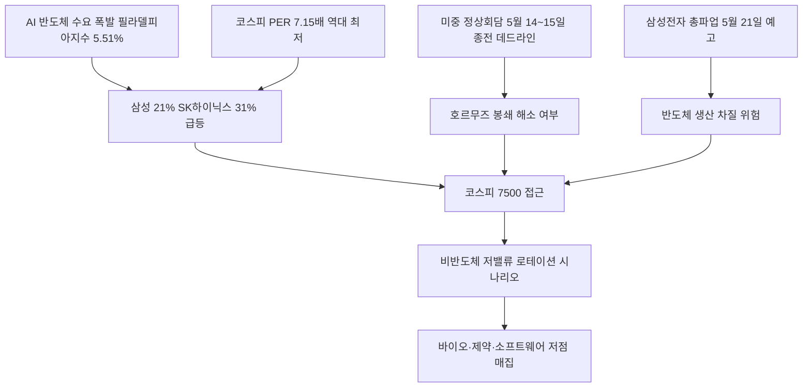

# 증시/거시 분析: 코스피 7500 돌파 — 반도체 랠리·미중 정상회담·이란 종전협상·노사분규 줄타기
## 투자 신호 + 사회적 영향 평가

---

## 📌 기사 기본 정보

- **날짜**: 2026-05-11
- **출처**: 한국경제신문 (5월 8~11일 보도)
- **카테고리**: 경제 > 증시·거시경제
- **핵심 주제**: 코스피가 7,500선에 접근하는 강세 속에서 삼성전자(+21.77%)·SK하이닉스(+31.10%)가 반도체 랠리를 주도. 미중 정상회담(5월 14~15일)이 종전 데드라인으로 시장에 인식되며, 호르무즈 봉쇄 지속 시 '공급·에너지 이중 목맥' 시나리오. 삼성전자 5월 21일 총파업 예고로 추가 변동성 경고 분析

**메타데이터**
- 주요 사건: 삼성전자 한 달간 21.77% 급등·SK하이닉스 31.10% 급등, 필라델피아반도체지수 5.51% 상승, 양대 증시 합산 시총 6,360조 원(서울 아파트 전체 시총 3,000조 원의 2배), 삼성전자 5월 21일 총파업 예고
- 핵심 원인: AI 반도체 수요 폭발(필라델피아 반도체지수 5.51%), 코스피 선행 PER 7.15배 역대 최저 저평가, 미중 정상회담 종전 기대감
- 주요 주체: 삼성전자·SK하이닉스(반도체 빅2), 글로벌 하이퍼스케일러(AI 칩 수요 주도), 삼성전자 최대노조(총파업 예고), 미-중·이란(지정학 변수)
- 키워드: 코스피 7500, 반도체 랠리, 필라델피아반도체지수, 칩플레이션, 미중 정상회담, 호르무즈 봉쇄, 노사분규, 코리아 디스카운트

---

## 🔍 기사를 통한 투자 신호 추출

### 1단계: 핵심 사건 분해

**What (무엇이 일어났는가?)**
- 코스피가 7,500선에 접근하며 삼성전자(+21.77%)와 SK하이닉스(+31.10%)가 한 달간 급등했습니다. 코스피 시가총액의 46%를 차지하는 반도체 빅2의 폭등이 지수를 견인하는 구조입니다. 양대 증시 합산 시총이 6,360조 원을 넘어 서울 아파트 전체 시총(3,000조 원)의 2배를 돌파했습니다. 그러나 삼성전자 최대노조가 5월 21일 총파업을 예고하고, 미중 정상회담(5월 14~15일)이 호르무즈 봉쇄 해소의 '종전 데드라인'으로 시장에 인식되며 이중 변수가 대기 중입니다.

**When (언제 일어났는가?)**
- 2026-05-11 (미중 정상회담 3~4일 전, 삼성전자 총파업 예고 10일 전)

**Why (왜 일어났는가?)**
- 전 세계 AI 인프라 투자가 폭발하면서 메모리 반도체(HBM·DRAM) 수요가 공급을 초과하는 칩플레이션 현상이 지속됩니다.
- 코스피 PER 7.15배가 역대 최저 저평가 수준으로 확인되며 글로벌 기관 자금의 저평가 재평가 매수가 이어집니다.
- 상법 개정·코리아 디스카운트 해소 정책과 반도체 실적 모멘텀의 동시 작동으로 복합 상승 에너지가 축적됐습니다.

**Who (누가 주도하는가?)**
- 매수 주도: 외국인·기관(반도체 저평가 재평가 매수)
- 핵심 리스크 변수: 삼성전자 노조(총파업), 미-이란(호르무즈 봉쇄 지속 여부)

---

### 2단계: 투자 신호 해석

#### A. **긍정적 신호 (Bullish)**

**① 반도체 빅2 PER 저평가 → 글로벌 재평가 수혜 지속**
- **신호**: 코스피 12개월 선행 PER 7.15배(코로나 저점 7.52배보다 낮음), 미국 나스닥 PER의 1/4 수준
- **의미**: AI·반도체 이익 급증으로 기업 실적이 글로벌 수준으로 올라선 반면 주가는 여전히 저평가 상태. PER 정상화만으로도 추가 상승 여력 상당함
- **투자 기회**: [[삼성전자]], [[SK하이닉스]] 중장기 비중 유지, PER 8~9배 목표 구간(코스피 7,730~8,700) 달성까지 보유

**② 비반도체 소프트웨어·제약·바이오 저밸류 매집 기회**
- **신호**: DB증권 이경민 연구원 "소프트웨어, 제약·바이오의 밸류에이션이 역사적 저점"
- **의미**: 반도체 독주 랠리에서 소외된 저밸류 업종으로 로테이션 자금이 이동하는 시점이 다음 코스피 도약의 신호탄
- **투자 기회**: 바이오 헬스케어, AI 소프트웨어 플랫폼, 피지컬 AI 관련 로봇·자율주행 부품주

---

#### B. **위험 신호 (Bearish)**

**① 삼성전자 총파업 — 반도체 공급망 차질 리스크**
- **신호**: 초기업노동조합 삼성전자지부가 5월 21일 총파업 예고. 영업이익의 15%를 성과급 재원으로 요구하는 데 회사가 불응 중
- **의미**: 파업이 현실화되면 HBM·DRAM 생산 차질이 발생하여 글로벌 AI 공급망에 충격을 주고 외국인 매도 압박이 증가할 수 있음
- **투자 리스크**: 삼성전자 주가 단기 급락, 협력사·소부장 업체 동반 타격

**② 미중 정상회담 '실망' 시나리오 — 지정학 불확실성 재확대**
- **신호**: 호라이즌인베스트먼츠 CIO 래드너 "시장은 미중 정상회담을 종전 데드라인으로 본다"
- **의미**: 회담에서 호르무즈 봉쇄 해소 합의 실패 시 유가 급등·투자심리 위축이 동시에 닥쳐 코스피가 6,500~7,000선까지 조정 가능
- **투자 리스크**: 외국인 자금 이탈, 수출 대형주 전반의 단기 급락 위험

---

### 3단계: 섹터별 투자 기회 매트릭스

#### ✅ **높은 기대도 + 낮은 리스크**

**반도체 빅2 (PER 저평가 + AI 수요 구조적 성장)**
- PER 7.15배의 역사적 저평가와 AI 반도체 수요 사이클이 결합된 현재 구간은 중장기 비중 유지가 유효합니다. 다만 삼성전자 파업 및 미중 정상회담 결과라는 이벤트 리스크에 대비한 소규모 헷지 포지션 설정을 권고합니다.
- **투자 추천도**: ⭐⭐⭐⭐⭐

---

## 💰 구체적 투자 신호 변환

### 신호 1: 반도체 독주 랠리에서 비반도체 로테이션으로의 전환 포인트

**투자 해석**: 코스피 7,500 돌파는 삼성전자·SK하이닉스 양대 종목이 지수의 46%를 견인하는 집중 구조에서 발생한 랠리입니다. 이는 강력하지만 동시에 취약합니다. 다음 코스피 도약의 핵심 조건은 반도체 온기가 소프트웨어·제약·바이오 등 비반도체 저밸류 업종으로 확산되는 것입니다. 미중 정상회담 이후 지정학 불확실성이 해소되고 삼성전자 파업 리스크가 봉합되는 시점을 비반도체 저밸류주 매집의 최적 타이밍으로 포착하는 전략이 유효합니다.

---

## 🌍 사회적 영향 평가

### A. 긍정적 사회 영향
- **개인 자산 증가 및 국민연금 수익률 향상**: 코스피 7,500 돌파는 수천만 소액주주와 국민연금 포트폴리오의 자산 가치를 직접 높입니다.
- **한국 반도체 산업의 글로벌 지위 강화**: 필라델피아반도체지수와 코스피 반도체주의 동반 강세는 한국이 글로벌 AI 공급망의 핵심 파트너로 자리매김하는 증거입니다.

### B. 부정적 사회 영향
- **반도체 성과급 분쟁과 내부 불평등**: 삼성전자 노조의 성과급 요구는 반도체 호황의 과실이 내부 직원들에게 충분히 분배되지 않는 구조적 불평등을 드러냅니다.
- **칩플레이션의 소비자 부담**: 반도체 가격 급등이 스마트폰·자동차·노트북 등 완성품 가격 상승으로 이어져 저소득층의 기술 접근성을 약화시킵니다.

---

## 🎯 결론: 당신의 투자 전략 수립

- **즉시 실행**: [[삼성전자]]·[[SK하이닉스]] 중심의 반도체 포지션 유지. 삼성전자 파업 예고(5월 21일) 전후 변동성 대비 소규모 매도 헷지 설정
- **3개월 후**: 미중 정상회담(5월 14~15일) 결과 확인 → 호르무즈 봉쇄 해소 합의 시 비반도체 저밸류주(바이오·소프트웨어) 분할 매수 진입. 파업 해소 후 삼성전자 재반등 구간 추가 매수 타이밍 포착

---

## 📝 Obsidian 연결 구조

