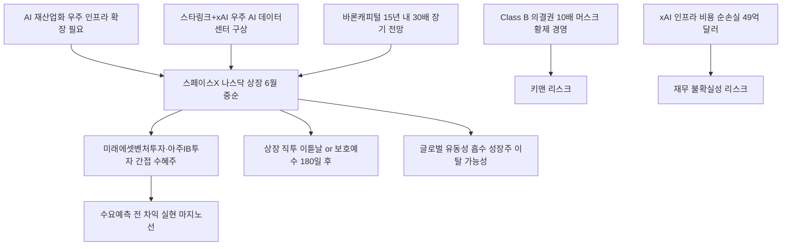

# 테크/우주산업 분析: 스페이스X 나스닥 상장 카운트다운 — 넥스트 엔비디아 간접투자 및 직투 전략
## 투자 신호 + 사회적 영향 평가

---

## 📌 기사 기본 정보

- **날짜**: 2026-05-11
- **출처**: 더중앙플러스 머니랩 (김민중·이가람 기자)
- **카테고리**: 경제 > 테크·우주산업
- **핵심 주제**: 이르면 2026년 6월 중순 스페이스X(SpaceX)의 나스닥 상장이 예정되며 글로벌 자본시장의 최대 이벤트로 부상. 몸값 1조 7,500억 달러(약 2,563조 원)로 역대 최대 IPO 가능성. 스페이스X 지분 보유 국내 창투사(미래에셋벤처투자·아주IB투자)를 통한 간접투자 전략과 상장 직투 타이밍 전략 분析

**메타데이터**
- 주요 사건: 스페이스X 나스닥 상장 이르면 6월 중순 예정, 몸값 1조 7,500억 달러(7조 5,000억 달러 목표시 역대 최대), 지난해 매출 186억 달러 vs 순손실 49억 4,000만 달러(xAI 인프라 비용 반영), 바론캐피털 회장 "15년 내 30배 성장" 전망
- 핵심 원인: AI 재산업화 사이클에서 우주 인프라(스타링크·xAI 결합)가 지상 데이터센터의 전력·냉각 한계를 우주 환경으로 극복하는 새 패러다임 선도
- 주요 주체: 스페이스X(일론 머스크), 미래에셋벤처투자·아주IB투자(국내 간접 수혜주), xAI(머스크의 AI 기업)
- 키워드: 스페이스X IPO, 나스닥 상장, 스타링크, xAI, Class B 의결권, 보호예수, 키맨 리스크, 우주 AI 데이터센터

---

## 🔍 기사를 통한 투자 신호 추출

### 1단계: 핵심 사건 분해

**What (무엇이 일어났는가?)**
- 스페이스X가 이르면 2026년 6월 중순 나스닥 상장을 준비 중이며, 최초 목표 시총은 1조 7,500억 달러(약 2,563조 원)로 역대 최대 IPO가 될 수 있습니다. 스페이스X 지분을 보유한 미래에셋벤처투자와 아주IB투자의 주가가 연초 대비 4배 이상 급등했습니다. 투자설명서(S-1)에는 머스크 등 내부자 보유 Class B 주식에 일반 주주 대비 10배 의결권 부여, 화성 도시 건설 성공 시 최대 2억 주 무상 부여라는 파격 보상 구조가 담겼습니다.

**When (언제 일어났는가?)**
- 2026-05-11 (5월 말 수요예측 개시 예상, 6월 중순 상장 목표 시점)

**Why (왜 일어났는가?)**
- AI 재산업화 사이클에서 지상 데이터센터의 전력·냉각 한계를 우주 공간에서 극복하는 스타링크+xAI 결합이 미래 플랫폼 지배 구조의 새 패러다임으로 부상했습니다.
- 글로벌 우주 산업 시장이 2023년 6,300억 달러에서 2035년 1조 7,900억 달러로 성장하는 수조 달러 규모의 메가 사이클이 확인됐습니다.

**Who (누가 주도하는가?)**
- 수혜 주체: 스페이스X 지분 보유 국내 창투사(미래에셋벤처투자·아주IB투자), 직투를 노리는 전 세계 개인·기관 투자자
- 리스크 변수: 일론 머스크 1인 집중 의결권(키맨 리스크), xAI 인프라 투자 비용 지속

---

### 2단계: 투자 신호 해석

#### A. **긍정적 신호 (Bullish)**

**① 국내 간접 수혜주 — 수요예측 전까지 2차 랠리 가능성**
- **신호**: 미래에셋벤처투자·아주IB투자가 연초 대비 4배 이상 급등했으나 수요예측 전까지 추가 랠리 가능성 존재
- **의미**: 스페이스X 본주 직접 매수가 불가능한 국내 투자자들에게 지분을 간접 보유한 창투사가 유일한 선행 투자 채널
- **투자 기회**: 미래에셋벤처투자, 아주IB투자 (수요예측 시작 전 차익 실현 기한 명심)

**② 스타링크·xAI 융합 — 우주 AI 플랫폼의 장기 성장 사이클**
- **신호**: 바론캐피털 "15년 내 30배 성장" 전망, 2035년 글로벌 우주 산업 1조 7,900억 달러
- **의미**: AI 재산업화가 지상을 넘어 우주 인프라로 확장되는 10~20년 메가트렌드. 스타링크의 위성망과 xAI의 지능이 결합한 우주 AI 데이터센터 구상이 현실화될 경우 엔비디아급 자본 독점 가능성
- **투자 기회**: 스페이스X 상장 후 보호예수(180일) 해제 구간에서 장기 직투 포지션 구축

---

#### B. **위험 신호 (Bearish)**

**① xAI 인프라 비용으로 인한 손실 구조 — 재무 불확실성**
- **신호**: 매출 186억 달러에도 순손실 49억 4,000만 달러(xAI 인프라 비용 반영)
- **의미**: 고금리 장기화(미 국채 금리 5%) 환경에서 110조 원대 자금 조달로 인한 이자 부담과 xAI 인프라 투자 지속이 재무 불확실성을 가중시킴
- **투자 리스크**: IPO 이후 단기 주가 고평가 구간에서 기관 차익 실현 매물 폭탄 위험

**② 머스크 1인 의결권 독점 — 키맨 리스크**
- **신호**: Class B 주식 의결권이 일반 주주의 10배. 화성 도시 성공 시 2억 주 무상 부여(주주 가치 희석)
- **의미**: 머스크의 예측 불가능한 돌출 행동(트위터 인수, 정치 발언 등)이 기업 가치에 직접 영향을 주는 구조적 키맨 리스크
- **투자 리스크**: 머스크 개인 이슈 발생 시 스페이스X 주가 급락 변동성 확대

---

### 3단계: 섹터별 투자 기회 매트릭스

#### ⚠️ **중간 기대도 + 높은 리스크 (단기 직투)**

**IPO 당일 직접 투자**
- 상장 당일 극심한 변동성과 고점 매수 위험이 큽니다. 공격적 투자자는 상장 이튿날 초기 가격 안정 후 진입하고, 보수적 투자자는 보호예수(180일) 해제 이후 조정 구간에서 분할 매수를 권고합니다.
- **투자 추천도**: ⭐⭐⭐ (타이밍 전략 필수)

---

## 💰 구체적 투자 신호 변환

### 신호 1: 스페이스X IPO — 간접투자 vs 직투 타이밍 전략의 2트랙 설계

**투자 해석**: 스페이스X IPO 전략은 두 단계로 나눠야 합니다. 1단계: 5월 말 수요예측 시작 전까지 간접 수혜주(미래에셋벤처투자·아주IB투자)를 보유하되 수요예측 시작 시점을 차익 실현 마지노선으로 설정합니다. 2단계: 직투를 원한다면 상장 당일의 투기적 거품을 피해 이튿날 진입하거나, 보호예수 해제(상장 180일 이후) 구간의 조정을 장기 매집 포인트로 활용합니다. 한국의 해외 주식 양도소득세(연간 250만 원 초과 22%)를 감안하여 장기 보유를 통한 과세 이연 전략이 실효 수익률을 높이는 핵심입니다.

---

## 🌍 사회적 영향 평가

### A. 긍정적 사회 영향
- **인류 경제 영토의 지구 외 확장**: 스페이스X 상장은 우주 인프라에 민간 자본을 대규모로 유입시켜 스타링크 기반의 글로벌 인터넷 접근성 확대와 우주 산업 생태계 성장을 촉진합니다.
- **한국 벤처 생태계의 글로벌 유니콘 투자 역량 증명**: 미래에셋벤처투자·아주IB투자가 스페이스X 지분을 선점한 사례는 한국 모험자본이 글로벌 초성장 기업 발굴 역량을 갖추었음을 증명합니다.

### B. 부정적 사회 영향
- **메가 IPO의 글로벌 유동성 흡수**: 110조 원대 IPO 자금 조달이 성장주 시장의 유동성을 대거 흡수하면서 기존 빅테크(MAGA)에서 자금이 이탈하여 신흥국 주식 시장에 간접 충격을 줄 수 있습니다.
- **머스크 황제 경영의 민주적 견제 부재**: Class B 의결권 독점이 소액 주주의 기업 거버넌스 참여를 원천 차단하는 구조적 민주주의 결함을 내포합니다.

---

## 🎯 결론: 당신의 투자 전략 수립

- **즉시 실행**: 미래에셋벤처투자·아주IB투자 보유 투자자는 수요예측 시작(5월 말 예상) 전을 차익 실현 타이밍으로 설정. 직투 대기자는 상장 일정 확정 후 보호예수 해제(180일 이후) 구간 포지션 계획 수립
- **3개월 후**: 스페이스X 상장 후 보호예수 해제 전 주가 안정 구간 모니터링. xAI 인프라 투자 비용이 구조적으로 줄어드는 사업 전환 시점을 장기 투자 판단 기준으로 활용

---

## 📝 Obsidian 연결 구조

