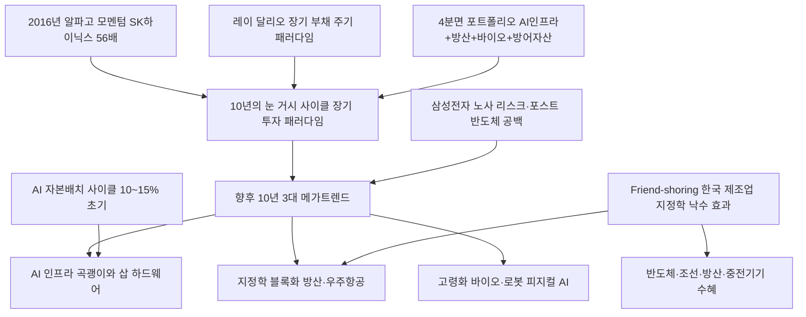

# 거시투자/사이클 분析: 김한진 10년의 눈 — 글로벌 패권·AI 인프라·제조강국
## 투자 신호 + 사회적 영향 평가

---

## 📌 기사 기본 정보

- **날짜**: 2026-05-11
- **출처**: 중앙일보 (김한진의 마켓 나우, 삼프로TV 이코노미스트)
- **카테고리**: 경제 > 투자·거시경제·증시 사이클
- **핵심 주제**: '10년의 눈'으로 거시 사이클을 읽으라는 김한진 이코노미스트의 장기 투자 메시지. 2016년 알파고 모멘텀에 나스닥 투자 시 5배, M7 빅테크 18.5배, SK하이닉스 56배. 향후 10년을 지배할 세 가지 구조: ① AI 인프라 '곡괭이와 삽' ② 지정학 블록화·방산·우주항공 ③ 고령화·바이오·로봇. 한국의 제조업 포트폴리오가 미국 중국 견제 낙수 효과의 최대 수혜국임을 분析

**메타데이터**
- 주요 사건: 2016년 알파고 이후 10년 수익률 실증(나스닥 5배·M7 18.5배·삼성 11.5배·SK하이닉스 56배), 레이 달리오의 '장기 부채 주기' 패러다임, 한국 반도체·조선·방산·전력 기기의 Friend-shoring 수혜 진단
- 핵심 원인: 단기 투자 소음에 매몰된 근시안적 개인 투자자와 대비되는 레이 달리오식 10년 사이클 인식, 미·중 패권 전쟁에 따른 블록화로 한국 제조업 지정학적 낙수 효과
- 주요 주체: 김한진 이코노미스트, 레이 달리오(브리지워터), 한국 반도체·방산·조선·중전기기 제조업
- 키워드: 곡괭이와 삽 전략, 10년 사이클, 레이 달리오, Friend-shoring, 피지컬 AI, 지정학 블록화, 치킨 게임, 언런(Unlearn)

---

## 🔍 기사를 통한 투자 신호 추출

### 1단계: 핵심 사건 분해

**What (무엇이 일어났는가?)**
- 김한진 이코노미스트가 '10년의 눈'으로 거시 메가트렌드를 읽는 장기 투자 패러다임을 제시했습니다. 2016년 알파고 시점에 AI를 믿고 SK하이닉스를 샀다면 56배, M7을 샀다면 18.5배의 수익이 가능했다는 실증 데이터와 함께, 향후 10년을 지배할 세 가지 구조(①AI 인프라 하드웨어 ②지정학 블록화 방산·우주항공 ③고령화 바이오·로봇)를 제시했습니다. 한국은 반도체·조선·방산·전력 기기라는 완결형 하드웨어 포트폴리오를 갖춘 지구상 유일한 Friend-shoring 최우선 수혜국으로 진단됐습니다.

**When (언제 일어났는가?)**
- 2026-05-11 (코스피 7,500 접근, AI 재산업화 사이클 초기 10~15% 진입 확인 시점)

**Why (왜 일어났는가?)**
- 대부분의 투자자가 단기 밸류에이션 등락과 시장 소음에 매몰되어 10년 단위의 거대 구조 변화를 놓치는 근시안적 패턴을 반복합니다.
- 미·중 패권 전쟁으로 글로벌 공급망이 블록화되면서 안보·신뢰를 기반으로 한 제조업 재배치(Friend-shoring)가 한국에 구조적 낙수 효과를 안겨주고 있습니다.

**Who (누가 주도하는가?)**
- 패러다임 제시: 김한진(레이 달리오 방법론을 한국 시장에 적용), 브리지워터(장기 사이클론)
- 수혜 주체: 한국 반도체·방산·조선·중전기기 제조 대기업

---

### 2단계: 투자 신호 해석

#### A. **긍정적 신호 (Bullish)**

**① 'AI 곡괭이와 삽' — 하드웨어 인프라의 확정성 투자**
- **신호**: AI 치킨 게임에서 승자 소프트웨어의 성패는 불확실하나, 이를 구현하는 전력망·기판·HBM 반도체·광케이블 수요는 100% 확정적 성장
- **의미**: AI 재산업화 사이클이 현재 10~15% 초기에 불과하다면, AI 인프라 하드웨어(전력 설비·반도체 소부장·광네트워크)는 향후 10년간 독과점 수요 사이클을 누릴 구조
- **투자 기회**: [[삼성전자]], [[SK하이닉스]], HBM 소부장 업체, 전력 설비 빅3(현대일렉트릭·HD현대에너지솔루션·효성중공업), AI 광케이블 업체

**② 한국의 Friend-shoring 지정학 프리미엄 — 10년 낙수 효과**
- **신호**: 미국의 중국 견제 속에서 반도체·방산·조선·전력 기기의 완결형 포트폴리오를 갖춘 나라는 지구상 한국 외에 사실상 없음
- **의미**: 서방 진영이 중국 대체 공급망을 구축하는 10년 사이클에서 한국은 자연스러운 최우선 파트너로 자본 유입 프리미엄을 누림
- **투자 기회**: 한국 방위산업 대형주(한화에어로스페이스·LIG넥스원·한국항공우주), 한국 조선 빅3(HD현대중공업·삼성중공업·한화오션), 중전기기 업체

---

#### B. **위험 신호 (Bearish)**

**① 삼성전자 노사 리스크와 포스트 반도체 엔진 부재**
- **신호**: 삼성전자 총파업 예고와 함께 반도체 이후의 성장 동력이 아직 구체화되지 않음
- **의미**: 한국 경제의 반도체 쏠림 구조에서 삼성 파업이 장기화되거나 반도체 수요 사이클이 꺾이면 K자형 양극화가 심화될 위험
- **투자 리스크**: 단일 산업 집중에 따른 포트폴리오 리스크, 삼성전자 주가 급락 시 코스피 전체 타격

**② 관료주의적 R&D 병목 — 내부 성공 관성의 함정**
- **신호**: 국가 R&D 거버넌스의 관료주의적 병목 현상이 한국 기업의 장기 경쟁력을 갉아먹는 '끓는 물 속의 개구리' 위험
- **의미**: 미국의 Friend-shoring 낙수 효과에 안주하다 내부 혁신을 게을리하면 10년 후 한국 제조업의 경쟁력이 무너지는 시나리오
- **투자 리스크**: R&D 투자 효율이 낮고 관료적 의사결정 구조를 가진 대기업·공공 연구기관

---

### 3단계: 섹터별 투자 기회 매트릭스

#### ✅ **높은 기대도 + 낮은 리스크**

**AI 인프라 하드웨어 + 방산·조선·중전기기 (10년 확정성 베팅)**
- AI 재산업화가 10~15% 초기에 불과하다면 나머지 85~90%의 자본 유입을 받을 하드웨어 인프라는 10년 장기 성장 사이클의 초입에 서 있습니다. 여기에 Friend-shoring 지정학 프리미엄이 더해지는 방산·조선·중전기기는 외부 환경의 지지를 받는 이중 강점 포지션입니다.
- **투자 추천도**: ⭐⭐⭐⭐⭐

---

## 💰 구체적 투자 신호 변환

### 신호 1: '10년의 눈'으로 재설계하는 포트폴리오 — 곡괭이와 삽 + 지정학 프리미엄

**투자 해석**: 김한진 이코노미스트의 메시지는 단기 시장 소음(파업, 유가 급등, 정치 불확실성)에 흔들리지 말고 10년 단위의 구조 변화를 포트폴리오의 좌표로 삼으라는 것입니다. 실행 전략은 다음과 같습니다. ① AI 인프라 하드웨어(전력 설비·반도체 소부장·광케이블)를 '확정성 핵심 자산'으로 비중 30~40% 유지, ② 방산·조선을 '지정학 프리미엄 자산'으로 15~20% 편입, ③ 바이오·로봇을 '고령화 사이클 성장 자산'으로 10% 분산 편입, ④ 달러·실물 금을 '거시 불확실성 방어 자산'으로 15~20% 유지하는 4분면 포트폴리오를 구축합니다.

---

## 🌍 사회적 영향 평가

### A. 긍정적 사회 영향
- **한국 제조업 부활이 가져올 일자리 창출**: Friend-shoring 수혜로 방산·조선·중전기기 분야의 첨단 제조업이 부활하면 고부가가치 제조업 일자리가 창출되어 K자형 양극화 완화에 기여합니다.
- **AI+바이오 융합이 고령화 문제 해결**: 피지컬 AI와 바이오 헬스케어의 결합이 고령화 사회의 의료비 부담을 줄이고 노인 자립도를 높이는 사회 인프라 혁신을 가속시킵니다.

### B. 부정적 사회 영향
- **AI 치킨 게임의 패자 — 소프트웨어 개발자·지식 노동자 도태**: AI가 소프트웨어를 자동화할수록 전통적인 코딩·지식 서비스 직군의 고용 불안이 심화되며, 하드웨어 제조와의 소득 격차가 벌어집니다.
- **지정학 블록화의 비용은 소비자가 부담**: Friend-shoring 기반의 비효율적 공급망은 글로벌 최저 비용 구조보다 비싼 제품 가격으로 귀결되어 최종 소비자(서민)가 그 비용을 부담합니다.

---

## 🎯 결론: 당신의 투자 전략 수립

- **즉시 실행**: 포트폴리오를 AI 인프라 하드웨어(전력 설비·소부장) 30%, 방산·조선 15~20%, 바이오·로봇 10%, 달러·금 방어 자산 15~20%의 4분면으로 재편. 단기 시장 소음(파업·유가·정치)에 의한 매도 충동을 10년 사이클 관점에서 억제
- **3개월 후**: AI 인프라 자본배치 비율(현재 10~15%)의 다음 단계 가속 여부를 글로벌 CAPEX 발표 데이터로 모니터링. 한국 방산 수출 계약 발표를 Friend-shoring 프리미엄의 현실화 지표로 추적

---

## 📝 Obsidian 연결 구조

