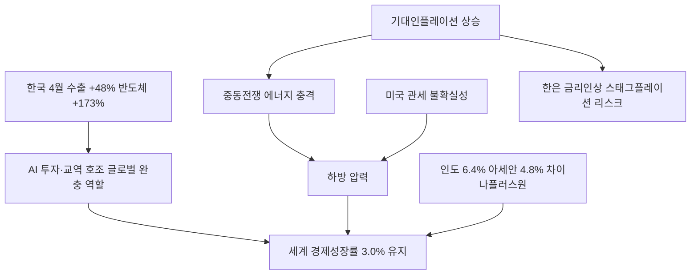

# 거시경제 분析: KIEP 세계경제성장률 — AI 호조·중동 에너지·관세 불확실성의 충돌
## 투자 신호 + 사회적 영향 평가

---

## 📌 기사 기본 정보

- **날짜**: 2026-05-13
- **출처**: 국내 신문 (세종=김온유 기자)
- **카테고리**: 경제 > 거시경제
- **핵심 주제**: 국책연구원 KIEP가 2026년 세계 경제성장률 전망치를 3.0%로 유지. AI 교역·투자 호조가 중동전쟁발 에너지 충격과 관세 불확실성의 하방 압력을 상쇄하는 구조 분析. 한국의 4월 수출 반도체 +173.5%·컴퓨터 +515.8%라는 AI 수혜 수치 확인

**메타데이터**
- 주요 사건: KIEP 세계 경제성장률 3.0% 유지(미국 +0.4%p 상향 2.0%, 유로 지역 -0.2%p 하향 0.9%), 한국 4월 수출 +48.0%(반도체 +173.5%, 컴퓨터 +515.8%), KDI "기대인플레이션 상승 우려" 경고
- 핵심 원인: AI 투자·교역 호조가 하방 완충 역할, 중동전쟁발 에너지 가격 상승, 미국발 관세 불확실성 지속
- 주요 주체: KIEP(대외경제정책연구원), KDI(한국개발연구원), 미국 빅테크(AI 인프라 투자 주도)
- 키워드: 세계 경제성장률 3.0%, AI 완충 효과, 기대인플레이션, HBM, 차이나 플러스 원, 하방위험

---

## 🔍 기사를 통한 투자 신호 추출

### 1단계: 핵심 사건 분해

**What (무엇이 일어났는가?)**
- KIEP가 2026년 세계 경제성장률 전망치를 3.0%로 유지했습니다. 미국은 AI 투자 집중 덕분에 2.0%로 0.4%p 상향됐고, 유로 지역은 에너지 이중 충격(러시아·중동)으로 0.9%로 0.2%p 하향됐습니다. 한국은 4월 수출이 +48.0% 급증하며 반도체(+173.5%)와 컴퓨터(+515.8%)가 AI 수요 폭발을 증거했습니다.

**When (언제 일어났는가?)**
- 2026-05-13 (중동전쟁 호르무즈 봉쇄 지속, AI 빅테크 1분기 호실적 발표 이후)

**Why (왜 일어났는가?)**
- AI 투자 호조가 중동전쟁·관세 불확실성이라는 하방 요인을 상쇄하며 3.0% 성장을 지탱했습니다. IMF 기준 3% 미만은 사실상 글로벌 침체에 준하는 수준으로, AI 엔진이 없었다면 더 낮았을 전망입니다.

**Who (누가 주도하는가?)**
- 성장 주도: 미국 빅테크(AI 인프라 투자), 인도·아세안(차이나 플러스 원 수혜)
- 하방 압박: 이란(호르무즈 봉쇄), 미국 관세 정책 불확실성

---

### 2단계: 투자 신호 해석

#### A. **긍정적 신호 (Bullish)**

**① 한국 4월 수출 AI 수혜 — 반도체·컴퓨터 수출 폭발**
- **신호**: 반도체 +173.5%, 컴퓨터 +515.8% (HBM·AI 가속기 수요 집중)
- **의미**: AI 재산업화 사이클에서 한국이 핵심 공급자 지위를 확고히 유지. 반도체 슈퍼사이클이 수출 통계로 확인됨
- **투자 기회**: [[삼성전자]], [[SK하이닉스]], HBM 소부장 업체, AI 서버 관련 기판·전력 설비주

**② 인도·아세안 6%대 성장 — 차이나 플러스 원 수혜 지속**
- **신호**: 인도 6.4%, 아세안 5국 4.8% 성장률 유지
- **의미**: 미중 갈등 속 공급망 다변화(Friend-shoring) 흐름이 인도·아세안으로의 제조업 이전을 가속. 이 지역에 진출한 한국 기업의 현지 공장 수혜
- **투자 기회**: 베트남·인도 등 아세안 진출 한국 제조 기업, 글로벌 물류·공급망 관련주

---

#### B. **위험 신호 (Bearish)**

**① AI 투자 사이클 둔화 시 세계 성장률 급락 취약성**
- **신호**: 세계 성장률 3.0%가 AI 투자 호조에 과도하게 의존하는 구조
- **의미**: AI 수요 사이클이 꺾이는 시점(2027~2028년 예상 고점 논란)에 글로벌 성장률이 2%대로 급락하면서 한국 반도체 수출도 동반 부진할 위험
- **투자 리스크**: AI 반도체 의존도가 높은 한국 수출 구조 전반

**② 기대인플레이션 상승 → 한은 금리 인상 → 내수 침체**
- **신호**: KDI "기대인플레이션도 상승하고 있다" 경고. 원유 수입 비용 증가 → 소비자물가 상승 → 기대인플레이션 악순환
- **의미**: 유가 상승이 물가 기대를 높이고, 한은이 금리 인상에 나서면 내수 소비 위축과 부동산 냉각이 동시에 발생하는 스태그플레이션 위험
- **투자 리스크**: 내수 소비재·부동산·건설 섹터, 가계 부채 취약 계층

---

### 3단계: 섹터별 투자 기회 매트릭스

#### ✅ **높은 기대도 + 낮은 리스크**

**AI 반도체·HBM 공급사 (세계 성장의 유일한 완충 엔진)**
- AI 투자 호조가 유일하게 세계 경제 3.0%를 지탱하는 구조에서, 이 수요를 직접 공급하는 한국 반도체 빅2는 글로벌 성장 흐름의 핵심 수혜자 지위를 유지합니다.
- **투자 추천도**: ⭐⭐⭐⭐⭐

---

## 💰 구체적 투자 신호 변환

### 신호 1: 'AI가 다른 모든 충격을 상쇄할 수 있는가' — 투자 판단의 분기점

**투자 해석**: KIEP 보고서의 핵심 메시지는 'AI 투자 호조 없이는 세계 경제가 3%를 유지할 수 없었다'는 것입니다. 투자자는 이 구조를 이해하고 포트폴리오의 AI 인프라 하드웨어(반도체·전력 설비·광케이블) 비중을 유지해야 합니다. 동시에 호르무즈 봉쇄가 해소되지 않는 한 에너지 관련 방어 자산(달러·실물 금)을 헷지로 병행하는 '이중 전략'이 유효합니다.

---

## 🌍 사회적 영향 평가

### A. 긍정적 사회 영향
- **AI 수혜 직접 연결 — 한국 수출 급증**: 반도체·컴퓨터 수출 폭발은 삼성·SK하이닉스 협력사·소부장 기업 전반의 고용과 임금 상승으로 연결되어 제조업 종사자 소득 개선에 기여합니다.

### B. 부정적 사회 영향
- **기대인플레이션 상승의 서민 이중 압박**: 에너지 가격 상승이 물가를 올리고 금리까지 오르면, 빚이 많은 저소득 가구와 자영업자가 가장 먼저, 가장 크게 타격을 받는 구조적 불평등이 심화됩니다.

---

## 🎯 결론: 당신의 투자 전략 수립

- **즉시 실행**: AI 인프라 하드웨어(반도체·HBM 소부장) 비중 유지. 달러 자산·실물 금으로 에너지 충격 헷지 병행
- **3개월 후**: 2분기 KIEP 세계 경제성장률 업데이트 및 한국 수출 동향 확인. AI 투자 사이클 지속 여부를 빅테크 CAPEX 발표로 모니터링

---

## 📝 Obsidian 연결 구조

