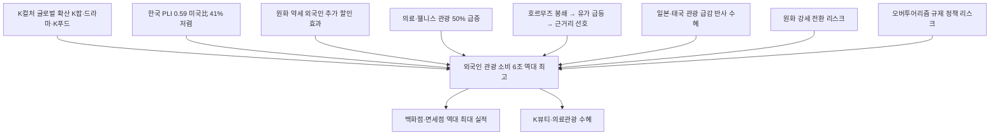

# 관광/소비 분析: 외국인 관광객 소비 6조 역대 최고 — K컬처·물가경쟁력·인바운드 붐
## 투자 신호 + 사회적 영향 평가

---

## 📌 기사 기본 정보

- **날짜**: 2026-05-13
- **출처**: 국내 신문 (오진영 기자, 한국관광데이터랩·야놀자리서치 취재)
- **카테고리**: 경제 > 관광·소비
- **핵심 주제**: 1~4월 외국인 관광객 소비 6조 997억 원으로 역대 최고치 기록(전년 동기 4조 9,745억 원 대비 22.6% 급증). 중동전쟁으로 일본·태국 등 아시아 경쟁국 관광이 위축되는 가운데 한국만 역주행. K컬처·원화 약세·의료관광 3중 호재가 상대적 물가 경쟁력(PLI 0.59)과 결합한 구조 분析

**메타데이터**
- 주요 사건: 1~4월 외국인 관광 소비 6조 997억 원(역대 최고), 일본 중국인 관광객 -56%·중동 관광객 -30% 감소, 태국 관광지 예약 30~40% 급감, 의료관광 문의 전년比 50% 이상 증가
- 핵심 원인: 한국 PLI 0.59(미국 대비 59% 물가 수준), 원화 약세의 외국인 추가 할인 효과, K컬처(드라마·K팝·K푸드) 글로벌 수요, 의료·웰니스 관광 폭발
- 주요 주체: 외국인 관광객(중국·대만·동남아·서구), K콘텐츠 산업, 유통·호텔·의료 서비스업
- 키워드: 인바운드, PLI, 관광수지, 의료관광, 오버투어리즘, 원화 약세

---

## 🔍 기사를 통한 투자 신호 추출

### 1단계: 핵심 사건 분해

**What (무엇이 일어났는가?)**
- 2026년 1~4월 외국인 관광객의 국내 소비액이 6조 997억 원으로 역대 최고치를 기록했습니다. 이는 전년 동기(4조 9,745억 원) 대비 22.6% 급증한 수치입니다. 동기간 일본은 중국인 관광객이 56%, 태국은 주요 관광지 예약이 30~40% 급감했습니다. 한국 국내 여행도 동시에 성장해 4월 기준 국내 관광객 수 10억 390만 명(+5.2%), 소비 52조 704억 원(+5.1%)을 기록했습니다.

**When (언제 일어났는가?)**
- 2026-05-13 (중동전쟁 호르무즈 봉쇄로 장거리 항공 비용 상승, 글로벌 관광 수요 재편 시점)

**Why (왜 일어났는가?)**
- 한국은 PLI 0.59로 미국 대비 41%나 저렴한 물가 수준을 유지하며, 원화 약세까지 겹쳐 외국인에게 이중 할인 효과를 제공합니다.
- K컬처의 글로벌 확산이 한국을 방문 목적지로 만들었고, 의료·웰니스 관광 수요가 1인당 소비액을 끌어올렸습니다.
- 호르무즈 봉쇄로 유가 급등 → 장거리 항공 비용 상승 → 근거리 한국 여행 선호도 증가의 구조적 전환이 발생했습니다.

**Who (누가 주도하는가?)**
- 방문 주체: 중국·대만·동남아·서구 외국인 관광객 (의료·웰니스 수요 급증)
- 수혜 업종: 유통(신세계·롯데·현대백화점), 호텔·숙박, 의료·뷰티 서비스, 항공

---

### 2단계: 투자 신호 해석

#### A. **긍정적 신호 (Bullish)**

**① 백화점·면세점 — 외국인 소비 직접 수혜**
- **신호**: 신세계 본점 외국인 고객 매출 +140%, 백화점 전체 외국인 매출 2배. 신세계 1분기 역대 최대 실적
- **의미**: 외국인 관광 소비 6조 원의 직접 수혜처인 백화점·면세점의 구조적 성장 흐름 확인
- **투자 기회**: 신세계(백화점·DFS), 롯데(백화점·면세점), 현대백화점, 호텔신라

**② 의료관광 — 1인당 고소비 수요의 폭발적 성장**
- **신호**: 의료관광 문의 전년 대비 50% 이상 증가, 체험형 콘텐츠 수요 급증
- **의미**: 단순 쇼핑·관광보다 1인당 소비액이 훨씬 큰 의료·웰니스 관광의 구조적 성장이 총 소비액을 끌어올리는 핵심 동인으로 자리 잡음
- **투자 기회**: 의료관광 특화 병원·클리닉 운영사, K뷰티 기업(코스맥스·한국콜마), 의료관광 중개 플랫폼

---

#### B. **위험 신호 (Bearish)**

**① 원화 강세 전환 시 상대적 물가 경쟁력 약화**
- **신호**: 현재 외국인 관광 호황의 핵심 변수 중 하나가 원화 약세에 따른 추가 할인 효과
- **의미**: 한은 금리 인상으로 원화 강세가 전환되거나 경쟁국(일본·태국)의 통화가 동반 약세가 되면 한국의 상대적 물가 우위가 희석되며 방문객 증가세가 꺾일 수 있음
- **투자 리스크**: 면세점·백화점의 외국인 매출 비중이 높은 업체

**② 오버투어리즘 — 정책 리스크와 수용 한계**
- **신호**: 홍대·명동·경복궁 주변 주거지 불편 심화, 젠트리피케이션 우려 증가
- **의미**: 관광지 집중이 주민 생활 불편과 임대료 폭등으로 이어지면 정부의 규제 개입 리스크와 함께 한국 관광 브랜드의 질적 하락을 초래할 수 있음
- **투자 리스크**: 서울 핵심 관광 상권 인근 소상공인, 오버투어리즘 규제 정책에 민감한 숙박·플랫폼 업체

---

### 3단계: 섹터별 투자 기회 매트릭스

#### ✅ **높은 기대도 + 낮은 리스크**

**백화점 빅3·의료·K뷰티 (K컬처+물가경쟁력 구조적 수혜)**
- 글로벌 관광 재편(중동전쟁 → 근거리 한국 선호)과 K컬처의 장기 확산이 맞물린 구조적 트렌드입니다. 중국 관광객이 아직 완전 회복되지 않은 상태에서 이미 역대 최고치를 기록했다는 것은 추가 성장 여력이 상당함을 의미합니다.
- **투자 추천도**: ⭐⭐⭐⭐⭐

---

## 💰 구체적 투자 신호 변환

### 신호 1: 인바운드 관광의 소프트파워 경제화 — '싼 나라'에서 '가치 있는 나라'로

**투자 해석**: 한국 인바운드 관광의 현재 호황은 단순 가격 경쟁력에서 비롯된 것이 아니라 K컬처·의료관광·인프라라는 구조적 매력과 원화 약세·지정학적 관광 재편이 결합된 복합 현상입니다. 투자자는 이 흐름을 백화점·면세점·K뷰티·의료관광 관련 종목에서 구체적 매수 기회로 포착해야 합니다. 특히 의료관광 수요의 50% 증가는 의료·웰니스 서비스업의 구조적 성장 신호입니다. 단, 원화 강세 전환 시나리오와 오버투어리즘 규제 리스크를 분기별로 모니터링해야 합니다.

---

## 🌍 사회적 영향 평가

### A. 긍정적 사회 영향
- **소상공인·자영업자 실질 소득 개선**: 외국인 소비 6조 원은 호텔·음식점·쇼핑·운송 등 다양한 업종의 소상공인 매출로 직접 연결됩니다.
- **의료관광 수익으로 의료 인프라 투자 선순환**: 의료관광 수익이 병원 시설 투자와 의료 인력 양성에 재투자되면 국내 의료 수준 향상으로 이어집니다.

### B. 부정적 사회 영향
- **오버투어리즘의 주거 침해와 젠트리피케이션**: 관광객 집중이 서울 핵심 지역 임대료를 끌어올리면서 원주민과 소상공인이 밀려나는 현상이 심화됩니다.

---

## 🎯 결론: 당신의 투자 전략 수립

- **즉시 실행**: 신세계·롯데·현대백화점 등 외국인 소비 직접 수혜 유통주 비중 유지. K뷰티(코스맥스·한국콜마) 및 의료관광 관련 클리닉·병원 운영사 스크리닝
- **3개월 후**: 중국 관광객 회복 속도 및 원화 환율 동향 모니터링. 중국 관광객이 코로나 이전 수준으로 회복되는 시점을 관광·유통 섹터 추가 매수 타이밍으로 설정

---

## 📝 Obsidian 연결 구조

