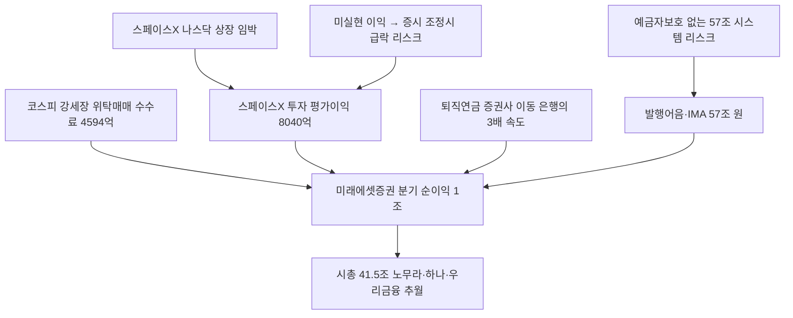

# 금융/증권 분析: 미래에셋증권 분기순익 1조 돌파 — 증권사 급성장·은행 왕좌 도전·IMA·퇴직연금
## 투자 신호 + 사회적 영향 평가

---

## 📌 기사 기본 정보

- **날짜**: 2026-05-13
- **출처**: 중앙일보 (박유미·장서윤 기자)
- **카테고리**: 경제 > 금융·증권
- **핵심 주제**: 미래에셋증권이 2026년 1분기 분기 순이익 1조 19억 원을 기록하며 국내 증권사 최초로 분기 1조 원 클럽에 가입. 시가총액 41.5조 원으로 하나·우리금융을 제치고 금융권 4위, 노무라홀딩스(36조 원)까지 역전. 퇴직연금 증권사 유입이 은행 유입의 3배 속도로 진행 중

**메타데이터**
- 주요 사건: 미래에셋 1Q 순이익 1조 19억 원(+288% YoY), 영업이익 1조 3,750억 원(+297%), 스페이스X 투자 평가이익 8,040억 원, 시총 41.5조 원(노무라 36조 원 역전), 증권업 퇴직연금 분기 +10조 1,771억 원 vs 은행 +3조 5,625억 원
- 핵심 원인: 코스피 호황(위탁매매 수수료 4,594억), 스페이스X 등 해외 혁신기업 투자 평가이익 폭발, 발행어음·IMA(57조 원) 및 퇴직연금 급증
- 주요 주체: 미래에셋증권(박현주 회장), 한국투자증권·키움증권·삼성증권(동반 호실적), 은행업권(퇴직연금 고객 이탈)
- 키워드: 발행어음, IMA, 모험자본, 퇴직연금 DC형 전환, 스페이스X 평가이익, 노무라 역전, 은행 왕좌 도전

---

## 🔍 기사를 통한 투자 신호 추출

### 1단계: 핵심 사건 분해

**What (무엇이 일어났는가?)**
- 미래에셋증권이 1분기 분기 순이익 1조 19억 원을 기록하며 국내 증권사 최초로 분기 1조 원 클럽에 가입했습니다. 시총 41.5조 원으로 하나·우리금융을 제치고 노무라홀딩스(36조 원)까지 역전했습니다. 퇴직연금 증권업권 분기 유입이 10.2조 원으로 은행(3.6조 원)의 약 3배에 달합니다. 7개 증권사의 발행어음·IMA 조달액은 57.2조 원에 달합니다.

**When (언제 일어났는가?)**
- 2026-05-13 (코스피 7,500~8,000 강세장, 스페이스X IPO 임박 시점)

**Why (왜 일어났는가?)**
- 코스피 강세장으로 위탁매매 수수료가 폭발했습니다.
- 스페이스X 등 해외 혁신기업 투자 평가이익(8,040억 원)이 순이익의 상당 부분을 차지했습니다.
- 퇴직연금의 증권사 이동과 발행어음·IMA 급성장이 안정적 수신 기반을 제공했습니다.

**Who (누가 주도하는가?)**
- 실적 주도: 미래에셋증권(분기 1조), 한국투자증권(8,519억), 키움증권(4,774억), 삼성증권(4,509억)
- 이탈 압박: 은행업권(퇴직연금 고객이 증권사로 이탈)

---

### 2단계: 투자 신호 해석

#### A. **긍정적 신호 (Bullish)**

**① 퇴직연금의 구조적 증권사 이동 — 지속 가능한 성장 엔진**
- **신호**: 증권업 퇴직연금 분기 유입 +10.2조 원(은행의 2.8배 속도), 141조 원 적립금
- **의미**: DC형 퇴직연금 전환 트렌드가 가속화되면서 수익률이 높은 증권사로의 구조적 이동이 지속. 이는 시장 호황과 무관하게 지속되는 안정적 성장 동력
- **투자 기회**: 미래에셋증권, 한국투자증권, 키움증권, 삼성증권 등 퇴직연금 자산 확대 수혜 대형 증권사

**② 스페이스X IPO — 추가 평가이익 실현 임박**
- **신호**: 스페이스X 투자 평가이익 8,040억 원(1분기 기준), 2분기 중 나스닥 상장 예정
- **의미**: IPO 실현 시 미실현 평가이익이 실현이익으로 전환되며 2분기 추가 순이익 개선 기대. 스페이스X 상장이 실현되면 미래에셋의 글로벌 혁신기업 투자 능력이 추가로 부각
- **투자 기회**: 미래에셋증권(CPNG 보유한 미래에셋벤처투자 연계), 아주IB투자

---

#### B. **위험 신호 (Bearish)**

**① 미실현 이익 의존 — 증시 조정 시 실적 급락 취약성**
- **신호**: 1분기 순이익 1조 중 스페이스X 평가이익 8,040억 원이 미실현 이익(장부 가치 변동)
- **의미**: 코스피 급락 또는 스페이스X 상장 지연·밸류에이션 하락 시 평가손실로 전환되며 2분기 실적이 급격히 악화될 수 있음
- **투자 리스크**: 미래에셋증권 주가의 스페이스X 밸류에이션 의존도 과다

**② 발행어음·IMA 57조 원 — 예금자보호 없는 시스템 리스크**
- **신호**: 7개 증권사 발행어음·IMA 합계 57.2조 원으로 빠르게 팽창
- **의미**: 예금자보호법 적용을 받지 않는 57조 원이 증시 급락 시 대규모 환매 요청(펀드런) 위험에 노출. 금융 취약층이 은행 예금과 구별하지 못하고 가입한 경우 피해 집중
- **투자 리스크**: 증권사 발행어음·IMA 관련 시스템 리스크, 금융당국의 규제 강화 가능성

---

### 3단계: 섹터별 투자 기회 매트릭스

#### ✅ **높은 기대도 + 낮은 리스크**

**대형 증권사 (퇴직연금 이동 + 시장 성장 구조적 수혜)**
- 퇴직연금의 증권사 이동은 시장 사이클과 관계없이 지속되는 구조적 트렌드입니다. 코스피 강세장이 지속되는 환경에서 대형 증권사의 위탁매매·IB 수익도 병행 성장합니다.
- **투자 추천도**: ⭐⭐⭐⭐

---

## 💰 구체적 투자 신호 변환

### 신호 1: 증권사의 은행 왕좌 도전 — 구조적 변화의 시작인가, 호황 착시인가

**투자 해석**: 미래에셋증권의 분기 1조 순이익은 혁신적 성과이지만, 그 절반 이상이 미실현 평가이익(스페이스X 8,040억)임을 인식해야 합니다. 진정한 구조적 도약 여부는 ① 스페이스X IPO 이후 재투자 전략, ② 퇴직연금 적립금의 지속 유입, ③ 글로벌 IB(M&A·채권 주관) 경쟁력 확보로 판단해야 합니다. 단기 투자자는 스페이스X 상장 이후 평가이익 실현 시점에 차익 실현을 고려하고, 장기 투자자는 퇴직연금 이동 트렌드를 구조적 성장 동력으로 보고 보유를 유지하는 전략이 적절합니다.

---

## 🌍 사회적 영향 평가

### A. 긍정적 사회 영향
- **퇴직연금 수익률 경쟁 → 개인 노후 자산 개선**: 증권사와 은행의 퇴직연금 경쟁이 수익률을 높이면서 근로자들의 노후 적립금이 실질적으로 늘어납니다.
- **모험자본 공급 확대**: 대형 증권사 5개사가 3년간 모험자본 15.2조 원 공급을 약속했습니다. 스타트업·벤처기업 생태계가 활성화될 수 있습니다.

### B. 부정적 사회 영향
- **발행어음·IMA의 예금자보호 사각지대**: 금융 취약 계층이 은행 예금과 혼동하여 57조 원 규모의 비보호 상품에 자금을 맡겼다가 시장 충격 시 집중 피해를 입을 수 있습니다.

---

## 🎯 결론: 당신의 투자 전략 수립

- **즉시 실행**: 미래에셋증권·한국투자증권 등 대형 증권사 보유 유지. 스페이스X IPO 실현 시점(2026년 2분기 예상)을 평가이익 실현 차익 매도 타이밍으로 설정
- **3개월 후**: 2분기 실적 발표(7~8월) 시 퇴직연금 적립금 증가 속도와 스페이스X 상장 후 재투자 전략을 확인하여 장기 보유 지속 여부 판단

---

## 📝 Obsidian 연결 구조

