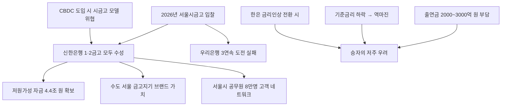

# 금융/기관영업 분析: 신한은행 서울시금고 51조 수성 — 우리은행 탈환 실패·출연금·승자의 저주
## 투자 신호 + 사회적 영향 평가

---

## 📌 기사 기본 정보

- **날짜**: 2026-05-13
- **출처**: 국내 신문 (박소연·정세진 기자)
- **카테고리**: 경제 > 금융·기관영업
- **핵심 주제**: 신한은행이 51조 4,778억 원 규모 서울시금고 1·2금고를 모두 수성(2018년 최초 수주 이후 3연속). 우리은행의 104년 독점을 깬 이후 세 번째 도전에서도 실패. 2,000~3,000억 원대 출연금 부담과 기준금리 하락에 따른 역마진 우려로 '승자의 저주' 논란

**메타데이터**
- 주요 사건: 신한은행 서울시금고 1·2금고 모두 수성, 연평균 잔액 4조 3,705억 원, 우리은행 2018·2022·2026년 연속 도전 실패, 출연금(협력사업비) 추정 2,000~3,000억 원
- 핵심 원인: 현 금고지기 프리미엄, 신한은행 8년간 안정적 운영 실적, 디지털 금융 역량 차별화
- 주요 주체: 신한은행(수성), 우리은행(3연속 도전 실패), 서울시(발주처), KB국민·하나은행(잠재 경쟁자)
- 키워드: 시금고, 출연금, 승자의 저주, 저원가성 자금, 역마진, 기관영업, CBDC

---

## 🔍 기사를 통한 투자 신호 추출

### 1단계: 핵심 사건 분해

**What (무엇이 일어났는가?)**
- 신한은행이 51조 원 규모 서울시금고 1·2금고를 모두 수성했습니다. 2018년 104년 독점을 지켜온 우리은행을 꺾은 이후 3연속 입찰 승리입니다. 연평균 잔액 4조 3,705억 원의 저원가성 자금을 확보하고, 서울시 공무원 및 산하기관 고객 네트워크를 유지하는 효과를 얻었습니다. 다만 2,000~3,000억 원대 출연금(협력사업비) 부담과 기준금리 하락에 따른 운용 수익 압박이 '승자의 저주' 논란을 만들고 있습니다.

**When (언제 일어났는가?)**
- 2026-05-13 (2022년 입찰 이후 4년 주기, 기준금리 인상 전환 논의와 맞물린 시점)

**Why (왜 일어났는가?)**
- 현 금고지기 프리미엄(8년간 안정적 운영 실적·행정 연속성), 금리·협력사업비 조건, 디지털 금융 역량이 심사의 핵심 변별 요소로 작용했습니다.
- 우리은행은 104년 독점 상실 이후 강한 탈환 의지를 보였으나 결정적 격차를 만들어내지 못했습니다.

**Who (누가 주도하는가?)**
- 수혜자: 신한은행(저원가성 자금 4.4조 원, 공무원 고객 네트워크, 브랜드 가치)
- 패자: 우리은행(104년 독점 이후 3연속 도전 실패, 기관영업 전략 재검토 필요)

---

### 2단계: 투자 신호 해석

#### A. **긍정적 신호 (Bullish)**

**① 신한은행 — 연평균 4.4조 저원가성 자금 확보 및 부대 영업 수익**
- **신호**: 서울시금고 연평균 잔액 4조 3,705억 원, 공무원 급여 통장·대출·카드 연계 영업 확보
- **의미**: 저금리로 조달한 4조 원대 자금을 대출·투자에 활용하는 수익 외에 서울시 공무원 약 8만 명의 급여 통장·금융 서비스 연계 영업이 부수 수익을 창출
- **투자 기회**: 신한금융지주(신한은행 모회사)의 안정적 기관 영업 기반 강화 수혜

**② 기준금리 인상 전환 시나리오 — 역마진 우려 해소**
- **신호**: 한은 금리 인상 시사(유가 충격 대응)로 기준금리 상승 전환 가능성
- **의미**: 금리가 오를수록 시금고 자금 운용 수익이 개선되어 협력사업비 부담을 상쇄할 수 있음. 역마진 우려가 해소되면 '승자의 저주' 논란도 완화
- **투자 기회**: 금리 인상 환경에서 저원가성 수신 기반이 강한 신한·KB국민 등 대형 은행주

---

#### B. **위험 신호 (Bearish)**

**① 출연금 2,000~3,000억 원 — 기준금리 하락 지속 시 역마진 심화**
- **신호**: 협력사업비 수천억 원 약정 + 기준금리 하락 환경이 중첩
- **의미**: 시금고 자금 운용 수익이 협력사업비 원가에 미치지 못하면 실질적으로 적자 사업. 4년 계약 기간 동안 금리 환경이 변수
- **투자 리스크**: 신한은행의 시금고 사업 수익성 압박 → 기관영업 전략 신뢰도 영향

**② CBDC 도입 시 시금고 비즈니스 모델 위협**
- **신호**: 중앙은행 디지털화폐(CBDC) 상용화 논의가 진행될 경우 공공 재정 관리 방식 자체가 재편될 가능성
- **의미**: 미래 '디지털 시금고'가 시중은행이 아닌 중앙은행 CBDC 시스템으로 처리되면 현재의 시금고 비즈니스 모델이 구조적으로 위협받을 수 있음
- **투자 리스크**: 장기 관점에서 기관영업 의존도가 높은 은행의 비즈니스 모델 변화

---

### 3단계: 섹터별 투자 기회 매트릭스

#### ⚠️ **중간 기대도 + 중간 리스크**

**신한금융지주 (시금고 수성 + 금리 인상 환경 수혜 기대)**
- 시금고 수성으로 안정적 기관 영업 기반을 유지하는 한편, 금리 인상 전환 환경에서 저원가성 수신 기반이 강한 신한은행의 수익성이 개선됩니다. 다만 출연금 부담과 역마진 우려는 단기 수익성 압박 요인입니다.
- **투자 추천도**: ⭐⭐⭐

---

## 💰 구체적 투자 신호 변환

### 신호 1: 서울시금고 비즈니스 — 브랜드 자산과 수익성 사이의 균형

**투자 해석**: 서울시금고 수성은 신한은행에게 '수도 서울의 금고지기'라는 브랜드 가치와 4조 원대 저원가성 자금 확보라는 두 가지 실질적 혜택을 안겨줍니다. 그러나 수천억 원의 출연금 부담과 금리 환경에 따른 운용 수익 변동이 순수 재무 수익성을 압박합니다. 투자자는 신한은행의 시금고 사업을 '브랜드 유지 비용'으로 이해하고, 기준금리 인상 전환 여부를 역마진 해소의 핵심 변수로 모니터링해야 합니다.

---

## 🌍 사회적 영향 평가

### A. 긍정적 사회 영향
- **서울시 재정 관리 행정 연속성 유지**: 51조 원 서울시 예산이 8년간 관리해온 은행에 지속적으로 맡겨지면서 행정 서비스의 연속성이 유지됩니다.

### B. 부정적 사회 영향
- **출연금 경쟁의 소비자 전가 우려**: 수천억 원의 출연금을 은행이 시금고 입찰 비용으로 쓰면, 결국 다른 대출 이자나 수수료로 일반 금융소비자에게 전가될 수 있습니다.

---

## 🎯 결론: 당신의 투자 전략 수립

- **즉시 실행**: 신한금융지주의 시금고 수성 효과와 금리 인상 전환 여부를 연계하여 은행주 포지션 유지 검토. 5월 28일 금통위 결정이 신한은행 시금고 사업 수익성의 핵심 변수
- **3개월 후**: 4년 계약 기간 중 기준금리 평균 수준 예측 및 협력사업비 집행 구조 확인 후 신한금융지주의 기관영업 수익성 재평가

---

## 📝 Obsidian 연결 구조

