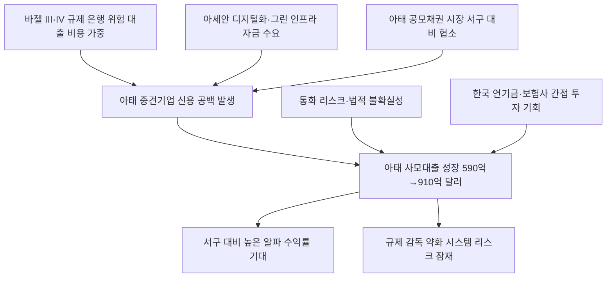

# 금융/대체투자 分析: 아태 사모대출 성장 — 뉴욕·런던에서 아시아로, 직접대출이 신용 공백을 메운다
## 투자 신호 + 사회적 영향 평가

---

## 📌 기사 기본 정보

- **날짜**: 2026-05-13
- **출처**: 중앙일보, 히란 와니가세케라 (IFM인베스터스 아시아·태평양 지역 대출부문 공동대표) 칼럼
- **카테고리**: 경제 > 금융·대체투자
- **핵심 주제**: 바젤 III·IV 규제로 아시아 은행들이 중견기업·특수금융 대출을 줄이며 생긴 신용 공백을 아태 사모대출(Private Credit)이 빠르게 메우고 있음. 2024년 590억 달러 → 2027년 910억 달러 성장 전망. 아세안 디지털 전환·그린 인프라 투자 수요가 핵심 성장 동인

**메타데이터**
- 주요 사건: 아태 사모대출 시장 2024년 590억 달러 → 2027년 910억 달러 전망(15년간 약 4배 성장), 바젤 III·IV로 아시아 은행 중견기업 대출 위축, IMF "아태 지역이 향후 수십 년 글로벌 성장의 핵심 동력"
- 핵심 원인: 바젤 III·IV 규제로 은행의 자기자본 부담 가중 → 중견기업·특수금융 대출 위축, 아세안 디지털화·그린 인프라 투자 수요 폭발, 아시아 공모 채권시장 규모 서구 대비 협소
- 주요 주체: IFM인베스터스(아태 대출 전문 기관), 아세안 중견기업(자금 수요), 글로벌 연기금·보험사(LP 투자자)
- 키워드: 사모대출, Private Credit, 바젤 III·IV, 신용 공백, LP/GP, 직접대출, 특수금융, 아세안

---

## 🔍 기사를 통한 투자 신호 추출

### 1단계: 핵심 사건 분해

**What (무엇이 일어났는가?)**
- 아태 지역 사모대출(Private Credit) 시장이 2024년 590억 달러에서 2027년 910억 달러로 성장할 전망입니다. 바젤 III·IV로 은행들이 중견기업·특수금융 대출을 줄이면서 생긴 신용 공백을 사모대출이 채우는 구조입니다. 아태 지역의 은행 의존도가 미국·유럽보다 훨씬 높아 이 공백이 더 크게 벌어집니다.

**When (언제 일어났는가?)**
- 2026-05-13 (밀컨 콘퍼런스에서 실물·대체자산 선호 선언 이후, 아태 AI·인프라 투자 붐 진행 중)

**Why (왜 일어났는가?)**
- 바젤 III·IV가 은행의 위험 자산 보유 비용을 높이면서 중견기업 대출에서 은행이 발을 빼게 됐습니다.
- 아세안의 디지털 전환과 그린 인프라에 필요한 대규모 복잡 자금이 은행·공모 시장의 능력을 초과합니다.

**Who (누가 주도하는가?)**
- 공급 주도: IFM인베스터스 등 글로벌 사모대출 운용사(GP)
- 자금 제공: 글로벌 연기금·보험사 등 기관투자자(LP)
- 수요 주체: 아세안 중견기업, 인프라·디지털 프로젝트

---

### 2단계: 투자 신호 해석

#### A. **긍정적 신호 (Bullish)**

**① 아태 사모대출 — 글로벌 성장에서 소외된 고수익 대체투자 기회**
- **신호**: 2027년 910억 달러 전망, 서구 대비 초기 단계로 경쟁 강도 낮음
- **의미**: 서구 사모대출이 성숙 단계에서 수익률 압박을 받는 반면, 아태 사모대출은 초기 성장 단계에서 높은 알파(초과 수익)를 기대할 수 있음
- **투자 기회**: 아태 사모대출 전문 GP(운용사)에 LP로 참여하는 한국 국민연금·교직원공제회 등 기관투자자, 관련 대체투자 펀드

**② 한국 기업의 아세안 진출 자금 조달 다변화**
- **신호**: 은행 외 대안 자금 조달 채널로 사모대출이 부상
- **의미**: 아세안에 진출하는 한국 기업들이 현지 은행 대출 한계를 사모대출로 보완하는 방식이 확산되면, 사모대출 운용사의 한국 기업 관련 딜 참여가 증가
- **투자 기회**: 아태 사모대출 GP와 파트너십을 맺은 한국 금융사

---

#### B. **위험 신호 (Bearish)**

**① 규제 감독 사각지대 — 시스템 리스크 잠재**
- **신호**: 사모대출은 공모 채권 대비 정보 공개 의무 약하고 규제 감독 느슨
- **의미**: 시장이 급성장할수록 유동성 불일치(장기 대출 vs 단기 자금 조달) 위험이 커지며, 2026년 3월 "월가 사모대출 펀드런 위기" 우려처럼 시스템 리스크가 잠재
- **투자 리스크**: 아태 사모대출 펀드에 과도하게 집중된 연기금의 유동성 위험

**② 통화 리스크·법적 불확실성 — 아태 시장의 구조적 한계**
- **신호**: 아시아 각국의 서로 다른 통화·법률 환경이 운용 비용과 회수 위험을 증가시킴
- **의미**: 원화-현지 통화 환헤지 비용이 수익률을 잠식하고, 동남아 계약 이행 리스크가 실제 회수율에 영향을 미침
- **투자 리스크**: 환헤지 비용 미반영 수익률 목표 제시 사모대출 펀드

---

### 3단계: 섹터별 투자 기회 매트릭스

#### ✅ **높은 기대도 + 낮은 리스크 (간접 투자 방식)**

**아태 사모대출 검증된 GP 통한 간접 투자 (한국 기관투자자용)**
- IFM인베스터스처럼 현지화 전략을 갖춘 검증된 GP를 통한 간접 투자는 직접 투자의 통화·법적 리스크를 낮추면서 아태 성장 프리미엄을 누릴 수 있습니다.
- **투자 추천도**: ⭐⭐⭐⭐

---

## 💰 구체적 투자 신호 변환

### 신호 1: 은행에서 사모대출로의 자금 이동 — 한국 기관투자자의 포지셔닝 전략

**투자 해석**: 아태 사모대출은 한국 국민연금·교직원공제회·보험사들이 현재 포트폴리오에서 과소 배분하고 있는 영역입니다. 글로벌 GDP 40%를 차지하는 아태 지역이 글로벌 사모대출 포트폴리오에서 차지하는 비중은 훨씬 낮아, 이 간극 자체가 성장 기회입니다. 한국 기관투자자는 환헤지 비용을 반드시 수익률 분석에 반영하고, 직접 운용보다 현지화 전략을 갖춘 검증된 GP를 통한 간접 투자를 우선 검토해야 합니다.

---

## 🌍 사회적 영향 평가

### A. 긍정적 사회 영향
- **아세안 중견기업 성장 자금 공급**: 은행이 외면한 중견기업들이 사모대출로 성장 자금을 조달하면서 아세안 현지 고용 창출과 산업 발전에 기여합니다.

### B. 부정적 사회 영향
- **규제 사각지대의 약탈적 금리 가능성**: 대안 금융이 부족한 중소기업들이 사모대출 운용사에게 과도하게 높은 금리를 수용할 수밖에 없는 정보 비대칭 구조가 형성될 수 있습니다.

---

## 🎯 결론: 당신의 투자 전략 수립

- **즉시 실행**: 한국 기관투자자 포트폴리오의 아태 사모대출 배분 비중 현황 파악 및 확대 여지 검토. 환헤지 비용·GP 검증 이후 적정 배분 결정
- **3개월 후**: 아태 사모대출 시장 590억→910억 달러 성장 경로 모니터링. 한국 기업의 아세안 진출 시 대안 자금 조달 채널로서 사모대출 활용 가능성 검토

---

## 📝 Obsidian 연결 구조

