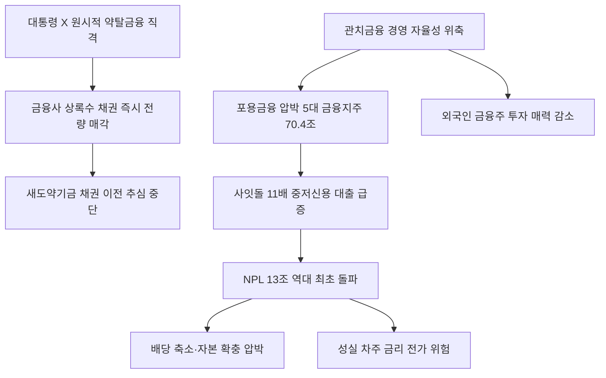

# 금융정책 分析: 배드뱅크 상록수·포용금융 압박·새도약기금·약탈금융 이재명
## 투자 신호 + 사회적 영향 평가

---

## 📌 기사 기본 정보

- **날짜**: 2026-05-13
- **출처**: 중앙일보 (김선미 기자)
- **카테고리**: 경제 > 금융정책
- **핵심 주제**: 이재명 대통령이 23년 된 민간 배드뱅크 '상록수'의 장기연체 추심을 "원시적 약탈금융"이라고 직격하자, 금융사들이 즉시 채권을 새도약기금에 전량 매각. 동시에 포용금융 압박(5대 금융지주 70.4조 원 공급 약속)에 따라 4대 금융그룹 NPL이 처음으로 13조 원대를 돌파

**메타데이터**
- 주요 사건: 이재명 대통령 X(트위터) "원시적 약탈금융" 발언 → 신한카드·하나은행 등 상록수 채권 전량 새도약기금 매각 결정, 4대 금융그룹 NPL 13조 6,203억 원(역대 최초 13조 돌파, YoY +7.97%), 사잇돌 대출 171억(전년比 11배)
- 핵심 원인: 정치적 압박에 의한 금융 경영 자율성 위축, 포용금융 강제 확대(중·저신용 대출 급증), NPL 구조적 증가
- 주요 주체: 이재명 대통령, 신한카드(지분 30%)·하나은행·우리카드 등(상록수 주주), 캠코·금융위(새도약기금 운용)
- 키워드: 배드뱅크, 상록수, NPL, 새도약기금, 포용금융, 관치금융, 사잇돌 대출, 새희망홀씨

---

## 🔍 기사를 통한 투자 신호 추출

### 1단계: 핵심 사건 분해

**What (무엇이 일어났는가?)**
- 이재명 대통령이 X에 "원시적 약탈금융"이라고 상록수 추심을 직격한 다음 날, 신한카드·하나은행·우리카드·KB국민은행 등이 보유 채권을 전량 새도약기금에 매각하기로 결정했습니다. 동시에 포용금융 압박으로 사잇돌 대출이 1년 만에 11배 증가했고, 4대 금융그룹 NPL이 처음으로 13조 원대를 돌파했습니다.

**When (언제 일어났는가?)**
- 2026-05-13 (NPL 사상 최초 13조 돌파 확인, 포용금융 압박 가속화 시점)

**Why (왜 일어났는가?)**
- 대통령 SNS 한 줄이 23년 된 민간 기관의 채권 정리를 결정지을 만큼 정치적 압박이 금융 경영에 강하게 개입하고 있습니다.
- 포용금융 강제 확대로 중·저신용 대출이 급증하고, 그 손실이 NPL 증가로 이어지는 구조적 악화가 진행 중입니다.

**Who (누가 주도하는가?)**
- 정책 주도: 이재명 정부(포용금융·배드뱅크 정리 압박)
- 손실 부담: 금융사(NPL 증가), 성실 차주(간접적 금리 인상 전가 위험)

---

### 2단계: 투자 신호 해석

#### A. **긍정적 신호 (Bullish)**

**① 새도약기금 → 장기연체자 추심 중단 → 소비 여력 소폭 개선**
- **신호**: 장기연체자의 추심 중단과 채무 조정·소각으로 일부 서민의 가처분소득 개선
- **의미**: 단기적으로는 미미하지만 구조적으로 부실 채무의 사회적 처리가 이루어지면 금융 소외 계층의 경제 참여 복원에 기여
- **투자 기회**: 서민금융 소셜벤처, 새희망홀씨·사잇돌 대출 취급 기관

**② 관치금융 논란 → 금융당국의 규제 정교화 압박 → 핀테크·리걸테크 수혜**
- **신호**: 포용금융과 건전성 균형 사이의 제도 설계 논쟁 심화
- **의미**: 정부 주도 포용금융의 한계가 드러날수록 AI 기반 신용 평가·대안금융 핀테크의 역할이 부각될 가능성
- **투자 기회**: 신용평가 AI 스타트업, 중금리 대출 핀테크

---

#### B. **위험 신호 (Bearish)**

**① NPL 13조 사상 최초 돌파 — 은행 건전성 경고**
- **신호**: 4대 금융그룹 NPL 13조 6,203억 원(+7.97% YoY), 사잇돌 대출 11배 급증
- **의미**: 포용금융 강제 확대로 중·저신용 대출이 급증하고 그 손실이 NPL로 누적되는 구조. 손실 부담이 성실 차주의 금리 인상으로 전가되면 금융 소비자 전체의 비용 증가
- **투자 리스크**: 은행·카드사의 건전성 지표 악화 → 배당 축소·자본 확충 압박 → 주주 가치 훼손

**② 정치적 발언이 금융 경영을 즉각 움직이는 관치금융 리스크**
- **신호**: 대통령 X 한 줄에 하루 만에 23년 된 기관의 채권 정리가 결정
- **의미**: 금융사 경영 자율성 위축이 가속화되면 장기적으로 금융산업의 리스크 관리 능력과 투자 수익성이 저하. 외국인 투자자들의 금융주 투자 매력도 감소
- **투자 리스크**: 국내 은행주·카드사 주가의 정책 리스크 프리미엄 확대

---

### 3단계: 섹터별 투자 기회 매트릭스

#### 🔴 **낮은 기대도 + 높은 리스크 (단기)**

**국내 은행주·카드사 (NPL 상승 + 관치금융 이중 압박)**
- NPL이 사상 최초로 13조 원대를 돌파한 상황에서 포용금융 강제가 지속되면 건전성 지표 추가 악화 가능성이 높습니다. 배당 안정성과 자기자본비율에 대한 불확실성이 단기 투자 심리를 억제합니다.
- **투자 추천도**: ⭐⭐ (건전성 지표 개선 확인 후 재평가)

---

## 💰 구체적 투자 신호 변환

### 신호 1: 포용금융 강제의 역설 — 약자를 위한 정책이 또 다른 약자에게 비용을 전가

**투자 해석**: 이번 사태의 핵심은 포용금융 확대의 속도와 건전성 관리 사이의 균형이 무너지고 있다는 것입니다. 사잇돌 대출 11배 급증은 정책 드라이브가 시장 원리를 압도한 결과이며, 이 비용이 NPL 증가를 통해 은행 건전성을 훼손하고 있습니다. 투자자는 국내 은행주의 NPL 추이를 분기별로 모니터링하며, NPL이 안정화되는 신호가 나오기 전까지는 은행주 비중을 보수적으로 유지하는 것을 권고합니다.

---

## 🌍 사회적 영향 평가

### A. 긍정적 사회 영향
- **장기연체자의 채무 굴레 해방**: 20년 이상 추심을 받아온 장기연체자들이 새도약기금을 통해 채무 조정·소각 기회를 얻는 것은 명백한 사회적 선입니다.

### B. 부정적 사회 영향
- **성실 차주에게 전가되는 손실**: 중·저신용 대출 손실이 성실 차주의 금리 인상으로 전가되는 역진적 재분배 구조가 심화됩니다.
- **관치금융의 금융 자율성 훼손**: 대통령 SNS 한 줄이 시장을 즉각 움직이는 구조는 장기적으로 금융 생태계의 건전한 자율성을 훼손합니다.

---

## 🎯 결론: 당신의 투자 전략 수립

- **즉시 실행**: 4대 금융그룹 NPL 동향을 분기별로 모니터링. NPL 비율이 추가 상승하거나 포용금융 압박이 강화되면 은행주·카드사 비중 축소 검토
- **3개월 후**: 2분기 은행 실적 발표 시 NPL 비율 및 대손충당금 적립 추이 확인. 포용금융 이행 평가 지표 도입 여부를 관치금융 리스크의 구체적 심화 신호로 추적

---

## 📝 Obsidian 연결 구조

