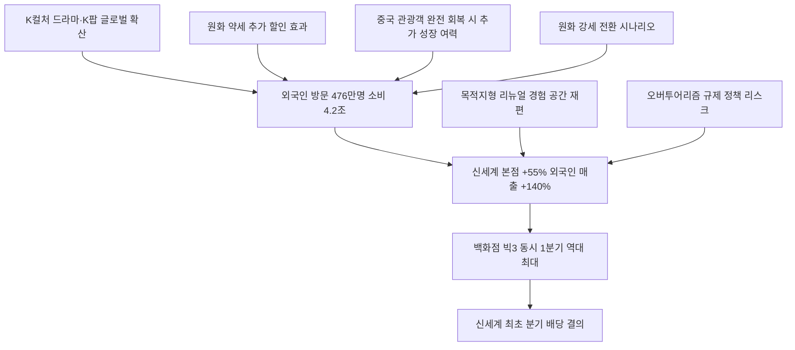

# 유통/소비 分析: 신세계백화점 역대 최대 실적 — 외국인 효과·K콘텐츠·관광소비
## 투자 신호 + 사회적 영향 평가

---

## 📌 기사 기본 정보

- **날짜**: 2026-05-13
- **출처**: 중앙일보 (노유림 기자)
- **카테고리**: 경제 > 유통·소비
- **핵심 주제**: 1분기 외국인 관광객 476만 명의 소비가 신세계 본점 매출을 55% 끌어올리며, 백화점 빅3(신세계·롯데·현대) 모두 1분기 역대 최대 실적을 동시 달성. 신세계 연결 영업이익 +49.5%, 외국인 고객 매출 +140%, 신세계 최초 분기 배당 결의

**메타데이터**
- 주요 사건: 신세계 1Q 영업이익 1,978억 원(+49.5%), 신세계 본점 매출 +55%·외국인 매출 +140%, 외국인 관광객 476만 명·소비 4조 1,744억 원(+20%+), 신세계디에프 흑자 전환, 분기 배당 최초 결의
- 핵심 원인: K컬처(드라마·K팝) 효과 + 원화 약세 + 의료관광·체험형 수요 급증, 신세계 본점·강남점 목적지형 리뉴얼 효과
- 주요 주체: 신세계(분기 배당 결의), 롯데백화점(역대 최고), 현대백화점(역대 최고), 외국인 관광객(소비 주도)
- 키워드: 외국인 매출, K컬처 경제화, 목적지형 백화점, 분기 배당, 면세점 흑자, 인바운드 소비

---

## 🔍 기사를 통한 투자 신호 추출

### 1단계: 핵심 사건 분해

**What (무엇이 일어났는가?)**
- 신세계 연결 1분기 매출 3조 2,144억 원(+11.7%), 영업이익 1,978억 원(+49.5%)으로 분기 기준 역대 최고를 기록했습니다. 신세계 본점의 외국인 고객 매출이 +140% 폭발했고, 전체 백화점 외국인 매출은 2배가 됐습니다. 롯데백화점·현대백화점도 나란히 1분기 역대 최고 실적을 달성했으며, 신세계는 첫 분기 배당까지 결의했습니다.

**When (언제 일어났는가?)**
- 2026-05-13 (글로벌 관광 재편 속 한국 인바운드 역대 최고 시점, 신세계 본점·강남점 리뉴얼 효과 가시화)

**Why (왜 일어났는가?)**
- K컬처(드라마 촬영지·K팝 아이돌 연관) + 원화 약세(외국인 추가 할인 효과) + 면세 쇼핑 매력이 복합적으로 외국인 소비를 끌어올렸습니다.
- 신세계 본점·강남점의 '목적지형 리뉴얼'(식음료·문화 공간 결합)이 방문 동기를 강화했습니다.

**Who (누가 주도하는가?)**
- 수혜 주체: 신세계·롯데·현대 백화점 빅3, 신세계디에프(면세점)
- 소비 주체: 외국인 관광객(중국·대만·동남아·서구)

---

### 2단계: 투자 신호 해석

#### A. **긍정적 신호 (Bullish)**

**① 백화점 빅3 동시 역대 최대 실적 — 구조적 재포지셔닝 성공 신호**
- **신호**: 신세계(+49.5%)·롯데(역대 최고)·현대(역대 최고) 동시 달성
- **의미**: 이커머스에 밀릴 것으로 예상됐던 백화점이 '목적지형 프리미엄 경험 공간'으로 성공적으로 재포지셔닝. K컬처 경제화와 의료관광의 구조적 성장이 뒤받치는 중장기 트렌드
- **투자 기회**: 신세계(001360), 롯데쇼핑(023530), 현대백화점(069960)

**② 신세계 분기 배당 최초 결의 — 주주환원 확대 신호**
- **신호**: 신세계가 처음으로 분기 배당을 결의하며 주주환원 정책 강화
- **의미**: 경영진이 현재 실적 흐름을 구조적 성장으로 인식하고 있다는 신뢰의 표현. 외국인 투자자 유치 및 코리아 밸류업 정책과 연계되어 주가 재평가 트리거가 될 수 있음
- **투자 기회**: 신세계 보통주(배당 수혜), 신세계디에프(면세점 흑자 전환 지속)

---

#### B. **위험 신호 (Bearish)**

**① 외국인 매출 의존도 심화 — 한중 관계·환율 반전 취약성**
- **신호**: 신세계 본점 외국인 매출 +140%, 연간 외국인 매출 1조 원 돌파 기대
- **의미**: 외국인 비중이 빠르게 높아질수록 한중 관계 악화·원화 강세·일본 관광 경쟁력 회복 등 외부 변수에 실적이 노출되는 구조적 취약성 증가
- **투자 리스크**: 중국 관광객 감소·원화 강세 시나리오에서 신세계·롯데·현대 백화점 주가 급락 가능성

**② 오버투어리즘 규제 정책 리스크**
- **신호**: 홍대·명동·경복궁 주변 주거 불편 심화로 지자체 관광객 집중 억제 정책 논의
- **의미**: 정부·지자체가 오버투어리즘 규제에 나서면 핵심 관광 상권의 외국인 유동인구가 제한되어 백화점·면세점 매출에 부정적 영향
- **투자 리스크**: 서울 핵심 상권 의존도가 높은 점포 중심 백화점 운영사

---

### 3단계: 섹터별 투자 기회 매트릭스

#### ✅ **높은 기대도 + 낮은 리스크**

**신세계·롯데·현대 백화점 빅3 (K컬처 경제화 장기 수혜)**
- 백화점이 '물건을 파는 곳'에서 '경험을 파는 곳'으로 성공적으로 재포지셔닝한 구조적 변화와 K컬처의 글로벌 확산이 결합된 중장기 성장 트렌드입니다. 중국 관광객이 아직 완전 회복되지 않은 상태에서 이미 역대 최고 기록으로, 추가 성장 여력이 있습니다.
- **투자 추천도**: ⭐⭐⭐⭐⭐

---

## 💰 구체적 투자 신호 변환

### 신호 1: 백화점 빅3 동시 역대 최대 — '죽었다'던 오프라인의 화려한 부활

**투자 해석**: 백화점은 이커머스에 밀려 사양 산업으로 분류됐지만, 2026년 1분기 결과는 '죽었다던 오프라인의 화려한 부활'입니다. 이 부활의 핵심은 K컬처 경제화·외국인 인바운드·목적지형 리뉴얼이라는 세 요인의 복합 작동입니다. 신세계의 분기 배당 결의는 경영진이 이 흐름을 일시적이 아닌 구조적으로 보고 있다는 신호입니다. 투자자는 백화점 빅3 중 외국인 매출 비중이 높고 목적지형 리뉴얼을 적극 추진하는 신세계를 최우선 투자 대상으로 고려해야 합니다.

---

## 🌍 사회적 영향 평가

### A. 긍정적 사회 영향
- **K컬처의 소프트파워 경제 전환**: K드라마·K팝이 외국인을 한국 백화점으로 이끌고 실제 매출로 연결되는 '소프트파워의 경제화'는 문화 산업이 제조업처럼 외화를 벌어들이는 선순환의 증거입니다.

### B. 부정적 사회 영향
- **국내 소비 양극화 심화**: 고급 백화점은 성장하지만 서민 소비는 위축되는 구조에서 외국인 고가 소비가 통계를 끌어올리는 착시 효과가 발생하고 있습니다.

---

## 🎯 결론: 당신의 투자 전략 수립

- **즉시 실행**: 신세계(001360) 분기 배당 실시를 계기로 중장기 보유 포지션 구축. 롯데쇼핑·현대백화점도 외국인 인바운드 트렌드 지속 수혜주로 스크리닝
- **3개월 후**: 2분기 외국인 방문객 수 및 백화점 외국인 매출 비중 확인. 원화 환율 동향과 중국 관광객 회복 속도를 추가 매수 판단 기준으로 활용

---

## 📝 Obsidian 연결 구조

