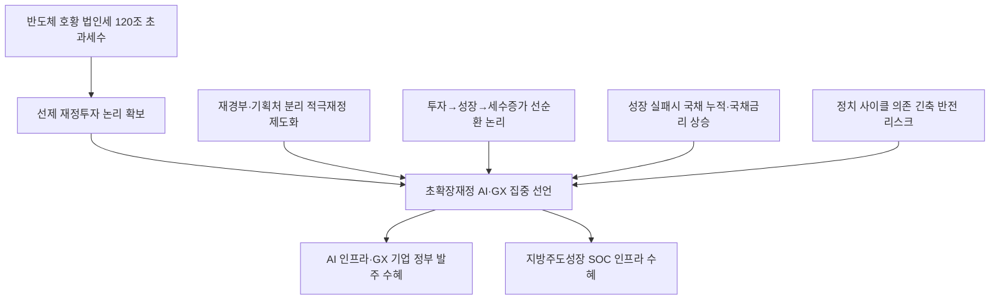

# 재정정책 分析: 초확장재정 이재명 — AI 투자·세계 1위 경제·반도체 세수
## 투자 신호 + 사회적 영향 평가

---

## 📌 기사 기본 정보

- **날짜**: 2026-05-13
- **출처**: 한국 언론 (세종=박광법·이원광 기자)
- **카테고리**: 경제 > 재정정책
- **핵심 주제**: 이재명 대통령이 "소비가 미덕인 시대"를 선언하며 AI·GX에 국가 재정을 과감히 투입하는 '초확장재정' 시대를 공식화. "투자→경제성장→세수증가" 선순환 논리 제시. 반도체 호황으로 2026년 법인세 수입 120조 원 이상 예상되는 초과세수를 선제적 투자 재원으로 활용한다는 전략

**메타데이터**
- 주요 사건: 이재명 대통령 "긴축은 무책임·소비가 미덕" 선언, 재경부·기획처 분리(2008년 통합 기획재정부 재분리), 6월 하반기 경제성장전략·8월 2027년 예산안 발표 예정, 구윤철 재경부 "세계 1위 경제 달성" 포부
- 핵심 원인: 반도체 호황 초과세수 120조 원 전망, AI·GX 구조 전환 선제 투자 논리, 재경부-기획처 분리를 통한 적극 재정 제도화
- 주요 주체: 이재명 대통령, 구윤철 재경부 장관(AI·GX 적극 투자), 박홍근 기획처 장관(예산 편성)
- 키워드: 초확장재정, GX 녹색대전환, 분모 효과, 재정승수, 선순환 논리, 케인스 확장재정, 반도체 초과세수

---

## 🔍 기사를 통한 투자 신호 추출

### 1단계: 핵심 사건 분해

**What (무엇이 일어났는가?)**
- 이재명 대통령이 "투자를 통한 경제 순환이 정부의 역할"이라며 긴축재정론을 "무책임한 목소리"로 규정하고 초확장재정을 공식 선언했습니다. 구윤철 재경부 장관은 AI·GX 투자로 "세계 1위 경제 달성"을 포부로 밝혔습니다. 반도체 호황으로 예상 초과세수 120조 원이 선제적 투자 재원으로 논의됩니다. 2008년 이명박 정부가 통합했던 기획재정부를 재경부+기획처로 재분리했습니다.

**When (언제 일어났는가?)**
- 2026-05-13 (하반기 경제성장전략 6월 발표, 2027년 예산안 8월 발표를 앞둔 시점)

**Why (왜 일어났는가?)**
- 반도체 AI 호황으로 예상치 못한 초과세수가 발생하면서 선제 투자 논리의 정치적 정당성이 확보됐습니다.
- AI·GX라는 구조 전환 시대에 정부가 마중물을 제공하지 않으면 민간 투자만으로 전환 속도를 따라잡기 어렵다는 판단입니다.

**Who (누가 주도하는가?)**
- 정책 추진: 이재명 정부, 구윤철(재경부)·박홍근(기획처)
- 수혜 대상: AI·GX·지방주도성장 관련 기업, 첨단산업 연구기관

---

### 2단계: 투자 신호 해석

#### A. **긍정적 신호 (Bullish)**

**① AI·GX 정부 집중투자 — 관련 산업 수혜 확대**
- **신호**: 구윤철 재경부 장관 "AI·GX 등에 적극 재정 투자" 공식 발표
- **의미**: 정부의 재정 방향이 명확하게 AI·GX로 집중되면서 관련 기업들의 정부 발주 계약과 R&D 보조금 수혜 기회가 확대됨
- **투자 기회**: AI 인프라 기업(데이터센터·전력 설비·반도체), GX 관련(재생에너지·수소·원전), 지방 스마트시티·인프라 업체

**② 초과세수 120조 재정 마중물 → 내수 경기 부양 효과**
- **신호**: "투자→성장→세수증가 선순환" 논리로 재정 투자를 경기 부양 수단으로 활용
- **의미**: 정부 지출 확대가 단기적으로 건설·IT·에너지 인프라 수주로 연결되며 내수 경기에 마중물 역할
- **투자 기회**: 국내 대형 건설사, 정부 IT 인프라 수주 업체, 지방자치단체 관련 SOC 기업

---

#### B. **위험 신호 (Bearish)**

**① "성장이 전제될 때만" 유효한 확장재정 — 성장 없으면 채무 누적**
- **신호**: 비판론 "국채 상환보다 팽창이 우선"이라는 재정 건전성 우려
- **의미**: 반도체 호황이 꺾이거나 AI 투자 사이클이 둔화되면 초과세수 예상이 빗나가 재정 적자가 확대되고 국채금리 상승·환율 불안으로 이어질 수 있음
- **투자 리스크**: 국채 보유 포트폴리오, 금리 상승에 취약한 부동산·건설 섹터

**② 정치 사이클 연동 재정 팽창 — 차기 정부 강한 긴축 반작용**
- **신호**: 과거 뉴딜펀드처럼 정권 교체 시 운용 방향이 흔들리는 구조적 리스크
- **의미**: 초확장재정이 AI·GX 구조 전환이 아닌 선거용 경기 부양에 치우칠 경우 차기 정부에서 강한 긴축으로 반전되어 투자 불확실성이 확대
- **투자 리스크**: 정부 재정에 의존도가 높은 공공 인프라·복지 관련 기업

---

### 3단계: 섹터별 투자 기회 매트릭스

#### ✅ **높은 기대도 + 낮은 리스크**

**AI 인프라·GX 정책 수혜 기업 (확장재정 방향성과 정렬)**
- 정부의 초확장재정이 AI·GX로 집중된다면, 데이터센터·전력망·재생에너지·수소 관련 기업들이 직접 정부 발주와 세제 혜택을 누리는 일차 수혜층입니다. 이 방향성은 글로벌 Friend-shoring 트렌드와도 정렬됩니다.
- **투자 추천도**: ⭐⭐⭐⭐

---

## 💰 구체적 투자 신호 변환

### 신호 1: '현명한 투자자' 정부 vs '방만한 재정 팽창' — 판단의 분기점

**투자 해석**: 이재명 정부의 초확장재정은 AI·GX라는 명확한 구조 전환 타깃을 제시했다는 점에서 과거 경기 부양형 확장재정과 차별됩니다. 투자자는 6월 발표될 하반기 경제성장전략과 8월 예산안에서 AI·GX 투자의 구체적 규모와 수혜 업종을 확인하고, 정부 재정 방향에 정렬된 기업들을 선별하는 전략을 취해야 합니다. 단, 반도체 초과세수 예상이 빗나갈 경우 재정 건전성 훼손 리스크를 국채금리 동향으로 상시 모니터링해야 합니다.

---

## 🌍 사회적 영향 평가

### A. 긍정적 사회 영향
- **AI·GX 전환 가속화로 미래 일자리 창출**: 정부 재정이 AI 인프라와 GX 산업에 투입되면 새로운 고부가가치 일자리가 창출되어 양질의 취업 기회가 늘어납니다.

### B. 부정적 사회 영향
- **미래 세대의 채무 부담**: 확장재정이 성장 성과를 내지 못하면 그 빚은 결국 미래 납세자가 짊어져야 하는 구조입니다. "소비가 미덕"이라는 명제는 성장이 실현될 때만 성립합니다.

---

## 🎯 결론: 당신의 투자 전략 수립

- **즉시 실행**: AI 인프라(전력 설비·데이터센터)·GX(재생에너지·수소·원전)·지방 SOC 관련 기업을 정부 예산 방향 수혜주로 스크리닝. 6월 하반기 경제성장전략 발표 내용 확인
- **3개월 후**: 8월 2027년 예산안 발표 시 AI·GX 예산 규모 확인 및 수혜 업종 포지션 조정. 반도체 세수 실현 여부(법인세 납부액)를 초과세수 논리의 팩트 체크 지표로 활용

---

## 📝 Obsidian 연결 구조

