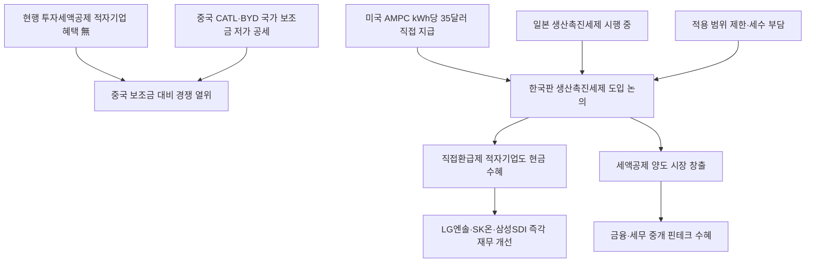

# 재정정책 分析: 한국판 IRA — 생산촉진세제·직접환급제·배터리·태양광·공급망 보호
## 투자 신호 + 사회적 영향 평가

---

## 📌 기사 기본 정보

- **날짜**: 2026-05-13
- **출처**: 국내 신문 (김지현 기자, 국회 토론회 취재)
- **카테고리**: 경제 > 재정정책·산업
- **핵심 주제**: 미국 IRA(인플레이션감축법) 방식처럼 국내 생산 실적에 연동된 세제 혜택을 현금으로 직접 환급하는 '한국판 생산촉진세제' 도입 논의. 적자 배터리·태양광 기업은 현행 법인세 감면 방식으로 혜택을 받지 못하는 구조적 한계 극복이 목표. 국회에 관련 법안 9건 발의, 기재부 2026년 경제성장전략 포함 예정

**메타데이터**
- 주요 사건: 국회 토론회(안도걸 의원 주관), LG에너지솔루션 김우섭 전무 "직접환급제 도입 시급" 발언, 미국 AMPC(배터리 셀 kWh당 35달러 직접 지급)·일본 생산촉진세제 사례 제시, 국회 관련 법안 9건 발의
- 핵심 원인: 현행 투자세액공제는 적자 기업 적용 불가(낼 법인세 없음), 중국의 국가 보조금 기반 저가 공세, 미국·일본 경쟁국은 이미 생산연동 세제 운영 중
- 주요 주체: 안도걸 의원(법안 발의), LG에너지솔루션·SK온·삼성SDI·한화솔루션(1차 수혜 예상), 기획재정부(추진 의사 표명)
- 키워드: 한국판 IRA, AMPC, 직접환급제, 생산촉진세제, 세액공제 양도, 배터리, 태양광, 공급망 내재화

---

## 🔍 기사를 통한 투자 신호 추출

### 1단계: 핵심 사건 분해

**What (무엇이 일어났는가?)**
- 국회 토론회에서 미국 IRA 방식의 한국판 생산촉진세제 도입이 시급하다는 공감대가 형성됐습니다. 현행 투자세액공제는 적자 기업에게 무용지물이지만, 직접환급제는 국내 생산 실적에 비례해 현금을 지급하므로 적자 기업도 수혜 가능합니다. 기재부가 2026년 경제성장전략에 포함 예정이며 국회에 관련 법안 9건이 발의됐습니다.

**When (언제 일어났는가?)**
- 2026-05-13 (LG에너지솔루션 등 배터리 기업들이 중국 저가 공세로 적자 상태, 미국 IRA 효과 검증 이후)

**Why (왜 일어났는가?)**
- 현행 투자세액공제는 적자 기업(낼 법인세 없음)이 혜택을 받지 못하는 구조적 한계가 있습니다.
- 중국 기업들이 국가 보조금을 받아 저가 공세를 펼치는 반면, 한국 기업은 자기 자금으로 경쟁하는 불공정 구조입니다.

**Who (누가 주도하는가?)**
- 정책 주도: 안도걸 의원, 기재부(추진 의사)
- 수혜 기업: LG에너지솔루션·SK온·삼성SDI(배터리), 한화솔루션(태양광)
- 경쟁 상대: 중국 CATL·BYD(국가 보조금 기반 경쟁)

---

### 2단계: 투자 신호 해석

#### A. **긍정적 신호 (Bullish)**

**① 직접환급제 도입 시 — LG에너지솔루션·SK온·삼성SDI 현금 수혜 직접화**
- **신호**: 미국 AMPC(배터리 셀 kWh당 35달러 직접 지급) 방식으로 도입 시 적자 배터리 기업도 생산할수록 현금 수혜
- **의미**: 현재 적자인 LG에너지솔루션·SK온이 국내 생산 실적에 비례한 현금 인센티브를 받게 되면 재무 구조가 빠르게 개선되고 추가 국내 생산 투자가 촉진됨
- **투자 기회**: LG에너지솔루션(373220), SK이노베이션(096770), 삼성SDI(006400), 한화솔루션(009830)

**② 세액공제 양도 시장 창출 — 핀테크·금융 중개 새 비즈니스**
- **신호**: 미사용 세액공제를 다른 기업에 팔 수 있는 '세액공제 양도 제도' 도입 제안
- **의미**: 세액공제 양도 시장이 형성되면 이를 중개하는 금융·핀테크 서비스 수요가 창출되고, 적자 기업의 현금 유동성이 개선됨
- **투자 기회**: 조세 전문 핀테크, 대형 세무법인, 기업금융 IB 서비스

---

#### B. **위험 신호 (Bearish)**

**① 법 시행만으로는 부족 — 중국과의 가격 격차 극복 한계**
- **신호**: 중국 CATL·BYD는 이미 규모의 경제를 확보한 상태로 가격 격차가 상당함
- **의미**: 생산촉진세제 도입이 중요하지만 전고체 배터리 등 차세대 기술 차별화 없이는 세제 지원만으로 가격 경쟁력을 따라잡기 어려움
- **투자 리스크**: 세제 도입 기대감으로 급등한 배터리주가 법안 통과 후 '소문에 사고 뉴스에 팔기' 패턴으로 차익 실현될 가능성

**② 재정 부담 — 직접환급제의 세수 감소 효과**
- **신호**: 직접환급제는 법인세 대신 현금을 지급하는 방식으로 즉각적인 세수 감소 효과
- **의미**: 초확장재정 기조 속에서도 세수 감소는 재정 균형을 추가 압박. 적용 대상·한도 설계 실패 시 재정 부담이 과도해질 수 있음
- **투자 리스크**: 도입 규모 축소·적용 범위 제한으로 기대보다 소폭의 효과에 그칠 가능성

---

### 3단계: 섹터별 투자 기회 매트릭스

#### ✅ **높은 기대도 + 낮은 리스크**

**국내 배터리 3사·태양광 기업 (직접환급제 도입 시 즉각 수혜)**
- 기재부가 2026년 경제성장전략에 포함 예정이며 국회에 9건의 법안이 발의된 상태로, 연내 입법 가능성이 높습니다. 도입 시 적자 배터리 기업의 재무 구조 개선이 즉각 반영되어 주가 상승 촉매가 됩니다.
- **투자 추천도**: ⭐⭐⭐⭐

---

## 💰 구체적 투자 신호 변환

### 신호 1: 한국판 IRA — 연내 입법 기대, 선행 포지셔닝의 기회

**투자 해석**: 한국판 생산촉진세제(직접환급제)는 기재부 추진 의사와 9건의 국회 법안이 확인된 상태로 연내 입법 가능성이 상당합니다. 투자자는 법안 통과 전 선행 매수 포지션을 구축하되, 법안 통과 후 시장의 '소문에 사고 뉴스에 팔기' 패턴에 대비한 단계적 익절 전략을 병행해야 합니다. 중장기적으로 전고체 배터리 기술 개발 속도와 국내 생산 확대 여부를 판단 기준으로 삼는 것을 권고합니다.

---

## 🌍 사회적 영향 평가

### A. 긍정적 사회 영향
- **국내 배터리·태양광 제조업 일자리 보호**: 기업들이 해외 생산 대신 국내 생산을 유지함으로써 제조업 고용이 지켜지고, 하청 협력사 생태계가 보존됩니다.

### B. 부정적 사회 영향
- **국가 보조금 경쟁의 글로벌 확산**: 한국이 IRA 방식을 도입하면 다른 국가들도 유사한 보조금 경쟁에 뛰어드는 '보조금 군비 경쟁'이 심화되어 글로벌 무역 마찰이 증가할 수 있습니다.

---

## 🎯 결론: 당신의 투자 전략 수립

- **즉시 실행**: LG에너지솔루션·SK이노베이션·삼성SDI·한화솔루션의 한국판 생산촉진세제 수혜 규모 추정치 분석. 법안 통과 전 선행 매수 분할 진입
- **3개월 후**: 2026년 경제성장전략(6월 발표) 및 국회 법안 심의 진행 상황 추적. 실제 법안 통과 시 생산량 기반 예상 환급액 산정하여 주가 적정 수준 재평가

---

## 📝 Obsidian 연결 구조

