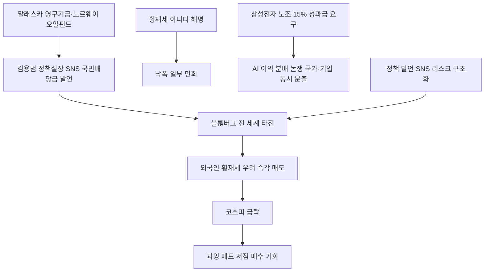

# 경제정책 分析: 김용범 국민배당금·AI 수익 재분배·횡재세 논란·블룸버그 반응
## 투자 신호 + 사회적 영향 평가

---

## 📌 기사 기본 정보

- **날짜**: 2026-05-13
- **출처**: 한국 언론 (양성희·배한님 기자)
- **카테고리**: 경제 > 정책
- **핵심 주제**: 김용범 청와대 정책실장이 페이스북에 "AI 과실의 일부를 국민배당금으로 환원"을 주장하자 코스피가 급락. 블룸버그가 "한국의 AI 수익 재분배 압박이 커져 시장이 흔들렸다"고 보도. 삼성전자 노조의 영업이익 15% 성과급 요구와 함께 'AI 이익 분배' 논쟁이 국가·기업 양 차원에서 동시 분출

**메타데이터**
- 주요 사건: 김용범 청와대 정책실장 페이스북 "국민배당금" 제안 → 코스피 급락 → 블룸버그 "AI 수익 재분배 압박" 보도 → "횡재세 아니다" 해명 → 낙폭 일부 만회. 삼성전자 노조 영업이익 15% 성과급 요구
- 핵심 원인: 횡재세 vs 초과세수 활용의 경계 모호성, 외국인 투자자의 최악 시나리오(횡재세) 먼저 반응, 정책 커뮤니케이션 실패
- 주요 주체: 김용범 청와대 정책실장, 크리스티 탄(프랭클린템플턴), 호민 리(롬바르도디에), 삼성전자 노조
- 키워드: 국민배당금, 횡재세, AI 초과세수, 알래스카 영구기금, 노르웨이 오일펀드, 코스피 정책 리스크

---

## 🔍 기사를 통한 투자 신호 추출

### 1단계: 핵심 사건 분해

**What (무엇이 일어났는가?)**
- 김용범 정책실장의 "국민배당금" 페이스북 발언이 블룸버그를 통해 전 세계에 타전되자 코스피가 급락했습니다. "횡재세가 아니다"라는 해명 이후 낙폭을 일부 만회했습니다. 삼성전자 노조의 영업이익 15% 성과급 요구까지 블룸버그가 같은 맥락으로 보도하면서 "한국에서 AI 이익 분배 요구가 국가·기업 양 차원에서 동시 분출"이라는 프레임이 형성됐습니다.

**When (언제 일어났는가?)**
- 2026-05-13 (코스피 7,999 직전, 8,000선 돌파 직전 시점)

**Why (왜 일어났는가?)**
- '횡재세'와 '초과세수 활용' 두 개념이 모두 가능한 애매한 메시지에 외국인 투자자들이 최악 시나리오(횡재세)로 먼저 반응했습니다.
- 고위 당국자 SNS 발언이 시장에 즉각 노출되는 글로벌 정보 전달 속도를 정책 당국이 인식하지 못한 커뮤니케이션 실패입니다.

**Who (누가 주도하는가?)**
- 발언 주체: 김용범 청와대 정책실장
- 시장 반응자: 외국인 기관투자자(프랭클린템플턴·롬바르도디에 등)
- 이익 분배 동시 요구: 삼성전자 노조(15% 성과급)

---

### 2단계: 투자 신호 해석

#### A. **긍정적 신호 (Bullish)**

**① 횡재세 아님 확인 → 반등 — 시장의 저점 매수 기회 생성**
- **신호**: "횡재세 아니다" 해명 후 코스피 낙폭 일부 만회
- **의미**: 시장이 최악 시나리오(횡재세)를 과잉 반영했다가 해명으로 반등하는 패턴에서 과잉 매도 구간이 저점 매수 기회로 활용 가능
- **투자 기회**: 국민배당금 발언 충격으로 급락한 삼성전자·SK하이닉스를 단기 반등 목적으로 저점 매수

**② AI 이익 분배 논쟁의 장기 구조화 → 사회적 안정 투자 확대**
- **신호**: 국가 차원(국민배당금)·기업 차원(성과급)의 AI 이익 분배 요구 동시 분출
- **의미**: 이 논쟁이 장기화되면서 기업들이 자발적 사회환원(ESG 투자·성과급 확대)을 통해 규제를 선제 방어하는 방향으로 이동. 사회적 책임 투자(ESG) 펀드 수혜
- **투자 기회**: ESG 우수 기업, 사회적 책임 투자 펀드, 국내 기업 지배구조 개선 수혜주

---

#### B. **위험 신호 (Bearish)**

**① SNS 정책 발언의 즉각 시장 충격 — 정책 불확실성 리스크 구조화**
- **신호**: 대통령실 고위 관료 SNS 한 줄 → 코스피 급락, 해명 → 반등. 이 패턴이 반복될 가능성
- **의미**: 한국 정책 당국의 SNS 발언이 글로벌 자본시장에 실시간으로 노출되면서, 향후 유사한 발언이 반복될 경우 시장 변동성이 주기적으로 확대되는 구조
- **투자 리스크**: 코스피 정책 불확실성 프리미엄이 외국인 보유 비중 감소로 이어질 잠재 위험

**② 삼성전자 노조 성과급 분쟁 장기화 — 파업 리스크 현실화**
- **신호**: 삼성전자 노조 영업이익 15% 성과급 요구, 5월 21일 총파업 예고
- **의미**: AI 이익 분배 논쟁이 노사 갈등으로 이어지며 반도체 생산 차질 위험이 상존. 글로벌 AI 공급망에서 한국의 신뢰도에 영향
- **투자 리스크**: 삼성전자 주가 단기 변동성 확대, 협력사 연쇄 타격

---

### 3단계: 섹터별 투자 기회 매트릭스

#### ⚠️ **중간 기대도 + 높은 리스크**

**코스피 반도체 대형주 (정책 리스크+파업 리스크 이중 압박 해소 전)**
- 횡재세 우려와 파업 리스크가 동시에 해소되는 시점이 반도체주 추가 매수의 최적 타이밍입니다. 현 시점에서는 해소 전까지 보수적 포지션 유지를 권고합니다.
- **투자 추천도**: ⭐⭐⭐ (이벤트 해소 후 재평가)

---

## 💰 구체적 투자 신호 변환

### 신호 1: 정책 SNS 리스크의 반복 구조 — '과잉 반응→해명→반등' 패턴 활용

**투자 해석**: 이번 사건은 한국 투자 환경의 구조적 특성을 보여줍니다. 고위 당국자 SNS 한 줄이 외국인 매도를 촉발하고, 해명 한마디로 반등하는 패턴은 앞으로도 반복될 수 있습니다. 투자자는 이 패턴을 인식하고 '정책 발언 충격 → 과잉 매도 → 저점 매수'의 역발상 전략을 적용할 수 있습니다. 단, 발언 내용이 횡재세로 구체화되는 경우는 구조적 실적 훼손이므로 이 경우에는 역발상이 아닌 즉각 매도가 적절합니다.

---

## 🌍 사회적 영향 평가

### A. 긍정적 사회 영향
- **AI 이익 분배 논쟁의 공론화**: 반도체·AI 호황의 수익이 소수 주주·경영진에게 집중되는 구조에 대한 공론화 자체는 사회적으로 유의미한 문제 제기입니다. 알래스카 영구기금처럼 제도화로 이어지면 사회 통합에 기여합니다.

### B. 부정적 사회 영향
- **정책 커뮤니케이션 실패의 국민 자산 피해**: 코스피 급락 하루 동안 수십조 원의 시가총액이 감소하며 개인 투자자·국민연금이 평가 손실을 입었습니다.

---

## 🎯 결론: 당신의 투자 전략 수립

- **즉시 실행**: 삼성전자 파업(5월 21일) 및 국민배당금 법제화 여부를 정책 리스크 모니터링 지표로 설정. 정책 발언 충격에 따른 반도체 급락 시 분할 매수 포지션 검토
- **3개월 후**: 국민배당금 법안 발의 여부 및 구체적 재원 조달 방식 확인(횡재세 vs 초과세수 활용). 삼성전자 노사 협상 타결 여부를 파업 리스크 해소의 판단 기준으로 활용

---

## 📝 Obsidian 연결 구조

