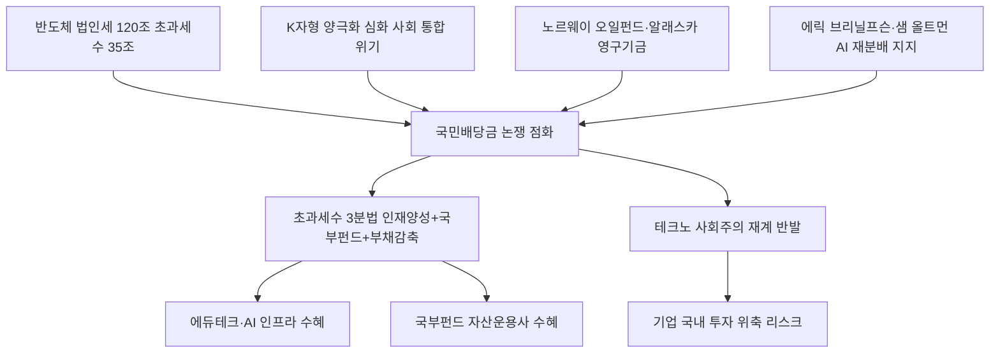

# 경제정책 분析: 청와대 AI 신분배론·국민배당금·반도체 초과세수 논쟁
## 투자 신호 + 사회적 영향 평가

---

## 📌 기사 기본 정보

- **날짜**: 2026-05-13
- **출처**: 조선일보
- **카테고리**: 경제 > 정책
- **핵심 주제**: 청와대 정책실장이 반도체·AI 초과세수를 '국민배당금'으로 환원하자고 제안하며 'AI 신분배론' 논쟁 점화. 에릭 브리닐프슨·샘 올트먼의 AI 재분배론과 연결되는 글로벌 트렌드, 노르웨이 오일펀드 모델 제시. 재계 "테크노 사회주의 논란" 반발, 청와대 "개인 의견"으로 발을 뺐지만 향후 10년 한국 복지·재정 설계의 출발점으로 기록될 논쟁

**메타데이터**
- 주요 사건: 김용범 청와대 정책실장 "AI 과실 일부를 국민에게 구조적 환원" → 국민배당금 제안 → 재계 "테크노 사회주의" 반발 → 청와대 "개인 의견" 발언 철회, 법인세 수입 2026년 120조 원 전망(초과세수 35조 원), K자형 양극화 심화 배경
- 핵심 원인: AI·반도체 호황으로 초과세수 발생, K자형 양극화 심화로 사회 안정 위협, 알래스카 영구기금·노르웨이 오일펀드 등 선진국 사례 벤치마크
- 주요 주체: 김용범(청와대 정책실장), 재계(반발), 조동근 명지대 교수(테크노 사회주의 경고), 에릭 브리닐프슨(스탠퍼드), 샘 올트먼(오픈AI)
- 키워드: AI 신분배론, 국민배당금, K자형 양극화, 노르웨이 오일펀드, 테크노 사회주의, 초과세수 120조, HBM

---

## 🔍 기사를 통한 투자 신호 추출

### 1단계: 핵심 사건 분해

**What (무엇이 일어났는가?)**
- 김용범 정책실장이 "반세기에 걸쳐 전국민이 함께 쌓아온 산업 기반 위에서 나온 AI 과실을 구조적으로 환원해야 한다"며 국민배당금을 제안했습니다. 이 논리는 알래스카 영구기금(석유→배당), 노르웨이 오일펀드와 유사합니다. 재계는 "테크노 사회주의 논란"이라며 반발했고, 청와대는 "개인 의견"으로 물러섰습니다. 그러나 법인세 120조(초과세수 35조) 전망이 실재하는 만큼 이 논쟁은 향후 10년 재정·복지 설계의 출발점으로 기록될 것입니다.

**When (언제 일어났는가?)**
- 2026-05-13 (K자형 양극화 심화, 반도체 초과세수 현실화 직전)

**Why (왜 일어났는가?)**
- AI·반도체 호황으로 소득 양극화가 심화되면서 사회 통합 비용을 선제 지불해야 한다는 필요성이 제기됐습니다.
- 알래스카·노르웨이처럼 자원 수익을 국민에게 환원한 선진 사례가 '반도체=21세기 석유'로 재해석됐습니다.

**Who (누가 주도하는가?)**
- 제안 주체: 김용범(청와대 정책실장)
- 반발 주체: 재계(기업 이익 재분배에 대한 투자 위축 우려)
- 학문적 지지: 에릭 브리닐프슨(스탠퍼드), 샘 올트먼(오픈AI)

---

### 2단계: 투자 신호 해석

#### A. **긍정적 신호 (Bullish)**

**① 초과세수 120조 원의 '미래 투자형 환원' 시나리오 — AI·GX 수혜**
- **신호**: 초과세수 35조 원의 활용 방식이 현금 직접 배당보다 AI 인재 양성·취약계층 재교육·국부펀드로 방향이 잡힐 경우
- **의미**: 미래 투자형 환원이 실현되면 AI 인프라·교육 기술·사회 안전망 기업들이 직접 수혜
- **투자 기회**: AI 인재 양성 에듀테크, AI 인프라 기업, 미래 국부펀드 운용 증권사·자산운용사

**② AI 이익 분배 논쟁의 사회 안정화 효과 — 장기 투자 환경 개선**
- **신호**: 이 논쟁이 공론화되어 체계적 제도로 설계되면 K자형 양극화로 인한 사회 불안 리스크가 감소
- **의미**: 사회 안정이 장기 투자 환경을 개선하고, 외국인 자본의 한국 증시 신뢰도를 높이는 간접 효과
- **투자 기회**: 사회적 책임 투자(ESG) 우수 기업, 한국 코리아 디스카운트 해소 수혜주

---

#### B. **위험 신호 (Bearish)**

**① 테크노 사회주의 논란 — 기업 투자 의욕 저하 리스크**
- **신호**: 재계 "초과 이익을 국가가 구조적으로 재분배하겠다는 발상이 투자 의사결정에 부정적 신호"
- **의미**: 삼성·SK하이닉스 등 기업들이 국내 투자보다 해외 투자를 선호하는 현상이 발생하면 국내 반도체 생산·고용의 공동화 위험이 커짐
- **투자 리스크**: 국내 첨단 제조업 장기 투자 심리 위축, 외국인 직접투자(FDI) 감소

**② 현금 직접 배당 구조 시 반도체 호황 종료 후 재정 기반 붕괴**
- **신호**: 반도체 호황이 끝나면 초과세수가 사라지지만 배당 지급 요구는 지속되는 구조적 문제
- **의미**: 알래스카처럼 자원 수익이 연속적인 경우와 달리, 반도체 호황은 사이클 의존적이어서 지속 가능성이 불확실
- **투자 리스크**: 미래 재정 기반 약화에 따른 국채 발행 증가·금리 상승 리스크

---

### 3단계: 섹터별 투자 기회 매트릭스

#### ⚠️ **중간 기대도 + 높은 리스크**

**반도체 대형주 (논쟁 결론 도출 전 불확실성 구간)**
- 국민배당금 논쟁이 횡재세로 구체화되지 않는다면 반도체 주가에 직접적 영향은 없습니다. 그러나 논쟁이 장기화되면 외국인 투자 심리에 지속적 악영향을 미치므로, 논쟁의 결론이 날 때까지 보수적 포지션을 유지하는 것이 합리적입니다.
- **투자 추천도**: ⭐⭐⭐ (논쟁 결론 확인 후 재평가)

---

## 💰 구체적 투자 신호 변환

### 신호 1: 초과세수 35조 원의 3분법 — 가장 균형 잡힌 활용 방안

**투자 해석**: AI 컨설턴트 관점에서 초과세수의 가장 균형 잡힌 활용은 3분법입니다. ① 일부는 AI 인재 양성·취약계층 재교육(현재 세대의 전환 충격 완충), ② 일부는 미래 국부펀드 조성(노르웨이 모델, 반도체가 아닌 시기의 재원), ③ 일부는 부채 감축(재정 건전성 유지). 이 3분법이 실현될 경우 ①은 에듀테크·사회서비스 기업, ②는 자산운용사, ③은 국채금리 안정으로 채권·부동산 수혜가 발생합니다.

---

## 🌍 사회적 영향 평가

### A. 긍정적 사회 영향
- **AI 전환기 사회 통합 논의 촉진**: K자형 양극화가 심화되는 가운데 AI 이익의 공정한 분배를 공론화한 자체가 사회적으로 유의미한 진전입니다.

### B. 부정적 사회 영향
- **기업 투자 심리 위축의 고용 불안 연결**: 재계의 우려처럼 기업이 국내 투자를 줄이면 결국 피해는 제조업 근로자와 협력사 직원들에게 집중됩니다.

---

## 🎯 결론: 당신의 투자 전략 수립

- **즉시 실행**: 국민배당금 논쟁이 횡재세로 구체화되는지 여부를 최우선 모니터링 지표로 설정. 법제화 시도가 가시화되면 삼성전자·SK하이닉스 비중 단기 축소 검토
- **3개월 후**: 6월 하반기 경제성장전략 발표 시 초과세수 35조 원의 활용 방향이 '미래 투자형'인지 '현금 배분형'인지 확인하여 재정정책 수혜 섹터 포지션 조정

---

## 📝 Obsidian 연결 구조

