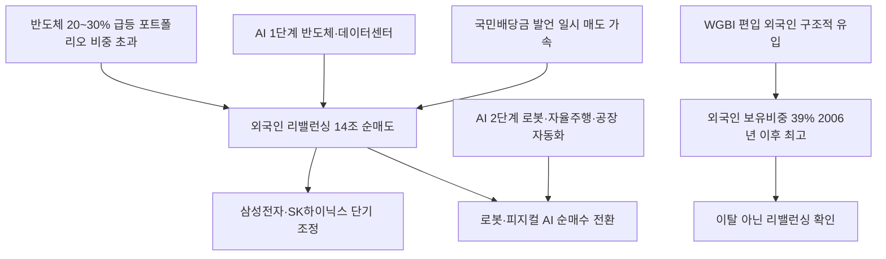

# 증시/수급 分析: 외국인 리밸런싱 — 반도체 매도·로봇 매수·코스피 수급 전환
## 투자 신호 + 사회적 영향 평가

---

## 📌 기사 기본 정보

- **날짜**: 2026-05-13
- **출처**: 한국 언론 (김세관 기자)
- **카테고리**: 경제 > 주식·수급
- **핵심 주제**: 외국인이 이달 코스피에서 14조 5,000억 원 순매도(SK하이닉스 6.4조·삼성전자 5.5조). 그러나 이는 '이탈'이 아닌 '리밸런싱'. 외국인 코스피 보유비중은 2006년 이후 최고치(39%대 중반). 동시에 로봇주 순매수로 반도체(AI 1단계 수혜)→로봇(AI 2단계 수혜) 섹터 로테이션 진행 중. 국민배당금 발언이 순간적 매도세를 자극

**메타데이터**
- 주요 사건: 외국인 이달 코스피 순매도 14조 5,000억 원(SK하이닉스 6.4조·삼성전자 5.5조), 코스피 6,700→7,800→8,000 근접, 외국인 코스피 보유비중 39%대 중반(2006년 이후 최고), 로봇주 외국인 순매수 전환
- 핵심 원인: 반도체 급등(20~30%)에 따른 포트폴리오 비중 초과→리밸런싱, AI 1단계(반도체)→2단계(로봇·피지컬 AI) 섹터 로테이션, 김용범 정책 발언이 일시 매도 가속
- 주요 주체: 외국인 기관투자자(리밸런싱), 로봇·피지컬 AI 관련 종목(순매수 수혜), 개인 투자자(외국인 매도 물량 수용)
- 키워드: 리밸런싱, 섹터 로테이션, 피지컬 AI, 외국인 보유비중 역대 최고, 코리아 디스카운트 해소

---

## 🔍 기사를 통한 투자 신호 추출

### 1단계: 핵심 사건 분해

**What (무엇이 일어났는가?)**
- 외국인이 이달 코스피에서 14조 5,000억 원을 순매도했습니다(SK하이닉스 6.4조·삼성전자 5.5조). 그러나 외국인 코스피 보유비중은 오히려 39%대 중반으로 2006년 이후 최고치를 기록했습니다. 반도체주를 팔면서 로봇주를 사는 AI 사이클 2단계 섹터 로테이션이 동시에 진행 중입니다.

**When (언제 일어났는가?)**
- 2026-05-13 (코스피 한 달간 6,700→8,000 근접, 반도체 20~30% 급등 후 과열 구간 진입)

**Why (왜 일어났는가?)**
- 반도체주 급등으로 포트폴리오 내 비중이 목표치를 초과한 외국인들이 비중을 줄이는 리밸런싱을 실시했습니다.
- AI 사이클이 1단계(반도체·데이터센터)에서 2단계(로봇·자율주행·공장 자동화)로 이동하는 섹터 로테이션이 시작됐습니다.

**Who (누가 주도하는가?)**
- 매도 주체: 글로벌 기관 투자자(과잉 비중 조정)
- 매수 전환: 로봇·피지컬 AI 관련 종목 순매수

---

### 2단계: 투자 신호 해석

#### A. **긍정적 신호 (Bullish)**

**① 외국인 보유비중 역대 최고 — 코리아 디스카운트 해소 구조 확인**
- **신호**: 외국인 코스피 보유비중 39%대 중반(2006년 이후 최고), 14조 순매도에도 비중 유지
- **의미**: 14조 순매도가 이탈이 아닌 리밸런싱임을 입증하는 수치. 코리아 디스카운트 해소 구조가 진행 중이며 외국인 자금의 한국 증시 구조적 선호 확인
- **투자 기회**: 외국인 보유비중이 높아지는 코스피 대형주, WGBI 편입 효과 지속 수혜 채권·주식 시장

**② 로봇·피지컬 AI 섹터 로테이션 — 다음 수혜주 포착**
- **신호**: 외국인이 반도체를 팔면서 로봇주를 사는 패턴 확인(AI 1단계→2단계 전환)
- **의미**: 외국인이 이미 로봇·피지컬 AI의 다음 성장 사이클을 내다보고 선행 매수 중. 개인 투자자도 이 방향을 따라 포트폴리오를 조정할 필요
- **투자 기회**: 국내 로봇 관련주, 자율주행 부품·센서, 공장 자동화 설비, 피지컬 AI 하드웨어

---

#### B. **위험 신호 (Bearish)**

**① 개인 투자자가 외국인 매도 물량 수용 — 고점 물량 부담**
- **신호**: 외국인 14조 순매도 물량을 개인·기관이 수용
- **의미**: 외국인 리밸런싱이 지속될 경우 물량 부담이 개인 투자자에게 집중. 고점에서 매수한 개인이 단기 손실을 입을 위험
- **투자 리스크**: 코스피 반도체주 단기 조정 시 개인 투자자 손실 집중

**② 정책 발언에 의한 외국인 매도 가속 패턴 반복 가능성**
- **신호**: 김용범 발언이 외국인 매도세를 일시적으로 자극
- **의미**: 향후 유사한 정책 불확실성 발언이 반복될 경우 외국인이 리밸런싱 속도를 높여 수급 불안이 증폭될 수 있음
- **투자 리스크**: 정책 리스크 이벤트 시 코스피 수급 변동성 확대

---

### 3단계: 섹터별 투자 기회 매트릭스

#### ✅ **높은 기대도 + 낮은 리스크**

**로봇·피지컬 AI (외국인 선행 매수 확인, AI 2단계 수혜)**
- 외국인이 이미 반도체에서 로봇으로 이동하는 패턴이 확인됐습니다. AI 2단계(피지컬 AI) 사이클이 본격화되기 전 선행 포지션을 구축하는 외국인의 흐름을 따라가는 전략이 유효합니다.
- **투자 추천도**: ⭐⭐⭐⭐⭐

---

## 💰 구체적 투자 신호 변환

### 신호 1: 외국인 '이탈'이 아닌 '판을 바꾸는 리밸런싱' — 로봇으로 올라타기

**투자 해석**: 이번 외국인 14조 순매도는 "한국을 떠나는 것"이 아니라 "한국 안에서 반도체(AI 1단계)에서 로봇(AI 2단계)으로 이동하는 것"입니다. 외국인 보유비중이 2006년 이후 최고치라는 사실이 이를 증명합니다. 투자자는 외국인이 선행 매수하는 로봇·피지컬 AI 관련 종목을 포트폴리오에 단계적으로 편입해야 합니다. 반도체는 리밸런싱 매물 소화 후 재반등 구간에서 추가 매수 기회를 노리고, 로봇·자율화 부품은 현 시점부터 분산 매수를 시작하는 투트랙 전략이 유효합니다.

---

## 🌍 사회적 영향 평가

### A. 긍정적 사회 영향
- **코리아 디스카운트 해소 진행**: 외국인 보유비중 역대 최고치는 한국 기업의 지배구조·주주환원 개선이 실제로 자본시장에서 인정받고 있다는 증거입니다.

### B. 부정적 사회 영향
- **개인 투자자의 정보 비대칭 피해**: 외국인이 리밸런싱하며 로봇으로 이동하는 흐름을 실시간으로 파악하지 못한 개인 투자자들이 반도체 고점 물량을 받아서 단기 손실을 입을 수 있습니다.

---

## 🎯 결론: 당신의 투자 전략 수립

- **즉시 실행**: 로봇·피지컬 AI 관련 종목(자율주행 부품·산업용 로봇·센서) 분할 매수 시작. 반도체 대형주(삼성전자·SK하이닉스)는 외국인 리밸런싱 매물 소화 후 재반등 구간에서 추가 매수 타이밍 포착
- **3개월 후**: 외국인의 로봇주 순매수 지속 여부 모니터링. AI 2단계(피지컬 AI) 기업들의 실적 가시화 시점을 로봇주 추가 매수의 판단 기준으로 설정

---

## 📝 Obsidian 연결 구조

