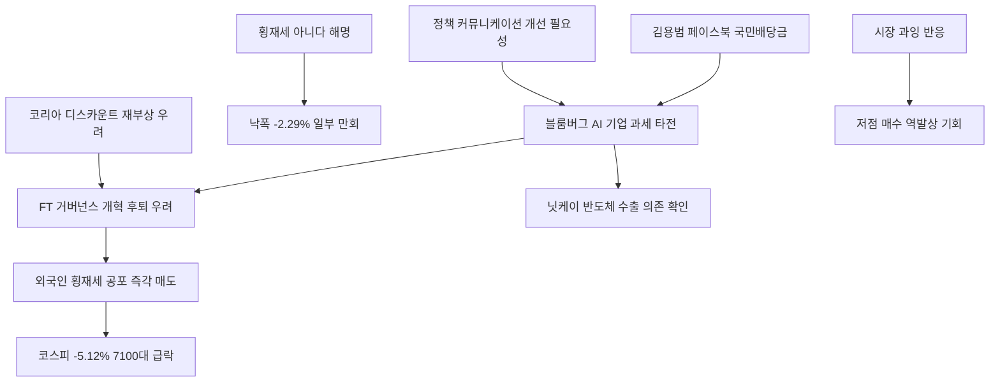

# 증시 分析: 국민배당금 코스피 급락 — 블룸버그·FT·닛케이 외신 반응과 시장 충격
## 투자 신호 + 사회적 영향 평가

---

## 📌 기사 기본 정보

- **날짜**: 2026-05-13
- **출처**: 조선일보
- **카테고리**: 경제 > 증시
- **핵심 주제**: 김용범 청와대 정책실장의 AI 국민배당금 발언이 블룸버그·FT·닛케이를 통해 전 세계에 타전되며 코스피가 장중 5% 급락. "횡재세 아니다" 해명 후 낙폭 일부 만회(전일比 -2.29%). 외신이 한국의 정책 불확실성과 코리아 디스카운트 재부상 우려를 집중 보도

**메타데이터**
- 주요 사건: 코스피 장중 7,100대까지 급락(-5.12%), 삼성전자·SK하이닉스 동반 하락, 블룸버그·FT·닛케이 한국 시장 불안 일제 보도, 이호민(롬바르드 오디에) "예상치 못한 발언이 급락 원인", 이남우(한국기업거버넌스포럼) FT 인용 "거버넌스 개혁 후퇴 우려"
- 핵심 원인: 횡재세 vs 초과세수 경계 모호성, 외국인 최악 시나리오 과잉 반응, 글로벌 정보 전달 속도(한국어 SNS→블룸버그 영문→전 세계 실시간)
- 주요 주체: 이호민(롬바르드 오디에 싱가포르), 이남우(한국기업거버넌스포럼), 블룸버그·FT·닛케이(외신)
- 키워드: 코스피 급락, 블룸버그 보도, 코리아 디스카운트, 밸류업 역행 우려, 정책 커뮤니케이션 실패, 황재세

---

## 🔍 기사를 통한 투자 신호 추출

### 1단계: 핵심 사건 분해

**What (무엇이 일어났는가?)**
- 코스피가 장중 5.12% 급락해 7,100대까지 내려갔습니다. 원인은 김용범 정책실장의 AI 국민배당금 발언을 블룸버그가 "한국이 AI 수익에 세금을 부과할 것"으로 타전했기 때문입니다. FT는 이를 "한국의 시장·거버넌스 개혁 후퇴 우려"로 보도했고, 닛케이는 "아시아 4위 경제국의 반도체 수출 의존 확인"이라고 평가했습니다. 최종 코스피는 -2.29%로 낙폭을 일부 만회했습니다.

**When (언제 일어났는가?)**
- 2026-05-13 (코스피 7,999 직전, 8,000선 돌파 직전 최고점 심리에서 급락)

**Why (왜 일어났는가?)**
- 한국어 페이스북 발언이 블룸버그를 통해 수 시간 만에 전 세계 기관투자자에게 "한국 정부 고위 관계자가 AI 기업 과세를 주장"이라는 메시지로 타전됐습니다.
- 외국인 투자자들은 한국어 뉴스를 읽지 않아 "개인 의견" 해명을 즉각 접하지 못하고 최악 시나리오로 먼저 반응했습니다.

**Who (누가 주도하는가?)**
- 매도 촉발: 외국인 기관투자자(싱가포르·유럽 기반 기관)
- 피해 당사자: 국내 개인 투자자, 국민연금(평가 손실)

---

### 2단계: 투자 신호 해석

#### A. **긍정적 신호 (Bullish)**

**① 해명 후 반등 패턴 — 과잉 매도 구간의 저점 매수 기회**
- **신호**: "횡재세 아니다" 해명 후 -5.12%→-2.29%로 낙폭 반절 만회
- **의미**: 시장이 최악 시나리오를 과잉 반영한 구간에서 해명이 나오면 빠르게 회복하는 패턴. 향후 유사 상황에서 과잉 매도 구간을 저점 매수 기회로 활용 가능
- **투자 기회**: 국민배당금 발언 충격으로 급락한 삼성전자·SK하이닉스 단기 저점 매수

**② 코리아 디스카운트 해소 정책의 지속적 필요성 재확인**
- **신호**: FT "거버넌스 개혁 후퇴 우려"가 언급될 만큼 밸류업 정책의 신뢰가 쌓여있음을 역설적으로 확인
- **의미**: 외신이 코리아 디스카운트 해소 흐름을 중요하게 모니터링하고 있다는 것은 한국 증시 재평가가 글로벌 관심사임을 뜻함. 정책 불확실성 해소 시 강한 반등 여지
- **투자 기회**: 코리아 밸류업 지수 ETF, 주주환원 우수 기업

---

#### B. **위험 신호 (Bearish)**

**① 정책 커뮤니케이션 리스크의 반복 구조 — 코스피 변동성 확대**
- **신호**: 한국어 SNS 한 줄 → 블룸버그 타전 → 전 세계 실시간 반응 → 코스피 5% 급락
- **의미**: 이제 한국 고위 당국자의 발언이 사실상 글로벌 시장에 실시간 노출. 향후 경제 관련 발언이 반복될 경우 코스피 변동성이 구조적으로 높아지는 리스크
- **투자 리스크**: 코스피 정책 불확실성 프리미엄(추가 할인) 반영, 외국인 보유비중 감소 가능성

**② FT "거버넌스 개혁 후퇴" 신호 — 코리아 디스카운트 재발 경계**
- **신호**: FT가 밸류업 정책과 역행하는 신호로 해석
- **의미**: 최근 몇 년간 쌓아온 코리아 디스카운트 해소 신뢰가 정책 발언 하나로 외국인 눈에 퇴색될 수 있다는 경고. 밸류업 정책과 배치되는 정책이 반복될 경우 외국인 자금 이탈 가속
- **투자 리스크**: 외국인 보유비중 39% 최고치에서 급격한 비중 축소 시나리오

---

### 3단계: 섹터별 투자 기회 매트릭스

#### ✅ **높은 기대도 + 낮은 리스크 (해명 이후)**

**코스피 반도체 대형주 (과잉 반응 해소 후 저점 매수)**
- 발언 충격이 일시적임이 확인(해명 후 낙폭 반절 회복)되면서 반도체 대형주는 과잉 매도 구간을 저점 매수 기회로 활용할 수 있습니다. 단, 파업 이슈가 해결되지 않은 상태이므로 분할 매수 전략을 권고합니다.
- **투자 추천도**: ⭐⭐⭐⭐

---

## 💰 구체적 투자 신호 변환

### 신호 1: '정책 발언→시장 충격→해명→반등' 사이클 — 역발상 전략 매뉴얼

**투자 해석**: 이번 사건은 한국 증시 투자자를 위한 명확한 '역발상 전략 매뉴얼'을 제시합니다. ① 고위 당국자의 정책 발언이 외신에 부정적으로 타전되어 코스피가 3% 이상 급락하면 → ② 발언 내용이 횡재세·직접 기업 과세 여부를 확인하고 → ③ 아니라면 과잉 매도 구간으로 판단하여 저점 분할 매수 → ④ 해명 이후 반등 시 차익 실현. 이 사이클이 향후에도 반복될 것임을 인식하고 냉정한 역발상 투자를 준비해야 합니다.

---

## 🌍 사회적 영향 평가

### A. 긍정적 사회 영향
- **정책 커뮤니케이션 개선 압박**: 이번 충격이 한국 정책 당국이 글로벌 시장 친화적 커뮤니케이션 체계를 정비하는 계기가 된다면 장기적으로 코리아 디스카운트 해소에 기여합니다.

### B. 부정적 사회 영향
- **개인 투자자·국민연금의 하루 평가 손실**: 코스피가 5% 급락하는 동안 수십조 원의 시가총액이 감소하며 개인 투자자와 국민연금이 직접적인 평가 손실을 입었습니다.

---

## 🎯 결론: 당신의 투자 전략 수립

- **즉시 실행**: '정책 발언→코스피 급락'이 발생할 경우 발언 내용의 횡재세 해당 여부를 즉시 확인. 아닌 경우 과잉 매도 구간 저점 분할 매수 전략 실행
- **3개월 후**: 국민배당금 법제화 방향(횡재세 vs 초과세수 활용) 및 밸류업 정책 지속 여부 모니터링. 외국인 보유비중 39%의 유지 또는 하락 추이를 코리아 디스카운트 재부상 신호로 추적

---

## 📝 Obsidian 연결 구조

