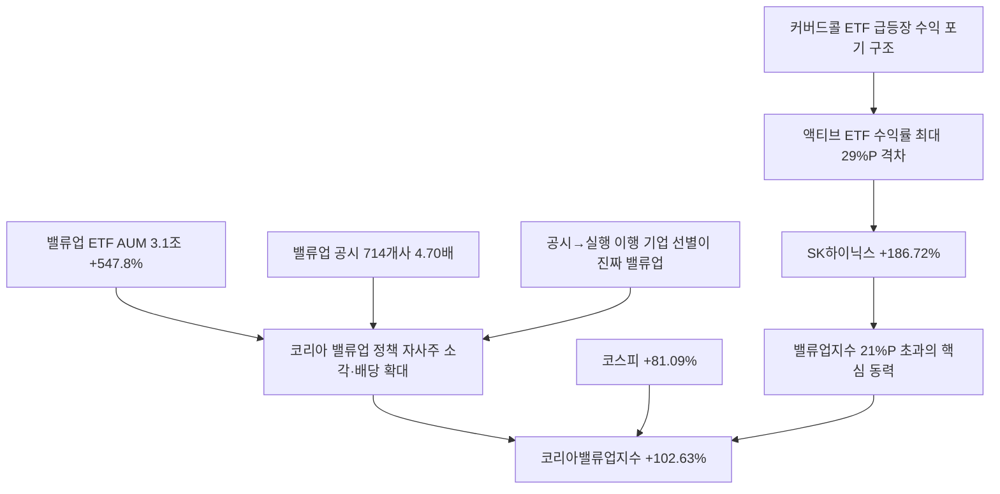

# 증시/ETF 分析: 코리아밸류업지수 코스피 21%P 초과 — ETF 성과·주주환원
## 투자 신호 + 사회적 영향 평가

---

## 📌 기사 기본 정보

- **날짜**: 2026-05-13
- **출처**: 국내 신문 (배한님 기자, 한국거래소 데이터)
- **카테고리**: 경제 > 증시·ETF
- **핵심 주제**: 코스피가 연초 이후 +81% 상승한 가운데 코리아밸류업지수는 +102.6%로 코스피를 21.54%P 초과 달성. 밸류업 ETF 13종 순자산총액 3조 1,000억 원(설정 이후 +547.8%). 액티브 ETF끼리는 SK하이닉스 편입 비중에 따라 수익률이 최대 29%P 벌어지는 차별화 발생

**메타데이터**
- 주요 사건: 코리아밸류업지수 +102.63%(코스피 +81.09%보다 21.54%P 초과), 밸류업 ETF AUM 3조 1,000억 원(+547.8%), 밸류업 본공시 참여 714개사(전년 2분기 대비 4.70배), TIME 코리아밸류업액티브 108.42% vs TRUSTON 79.24%(격차 29%P)
- 핵심 원인: SK하이닉스(+186.72%)·삼성전자(+133.47%) 폭등으로 반도체 비중이 높은 ETF 수익률 우월, 밸류업 공시 기업 4.70배 증가로 제도 정착
- 주요 주체: 한국거래소(밸류업지수 산출), ETF 운용사(TIME·KODEX·ACE·KoAct·TRUSTON·RISE), 밸류업 공시 기업 714개사
- 키워드: 코리아밸류업지수, 밸류업 ETF, 주주환원, SK하이닉스 편입 비중, 코리아 디스카운트, 커버드콜, 패시브 vs 액티브

---

## 🔍 기사를 통한 투자 신호 추출

### 1단계: 핵심 사건 분해

**What (무엇이 일어났는가?)**
- 코리아밸류업지수가 연초 이후 +102.63%로 코스피(+81.09%)를 21.54%P 앞질렀습니다. 밸류업 ETF 13종의 AUM이 설정 이후 547.8% 급증해 3.1조 원에 달합니다. 그러나 액티브 ETF끼리는 SK하이닉스 편입 비중에 따라 수익률이 최대 29%P 벌어지는 극단적 차별화가 발생했습니다.

**When (언제 일어났는가?)**
- 2026-05-13 (코스피 7,500~8,000 강세장, 밸류업 ETF 설정 이후 최초 성과 평가 시점)

**Why (왜 일어났는가?)**
- SK하이닉스(+186.72%)·삼성전자(+133.47%)의 압도적 상승이 반도체 편입 비중이 높은 ETF의 수익률을 폭발적으로 높였습니다.
- 밸류업 공시 기업이 714개사(4.70배)로 급증하며 제도가 시장에 정착되는 신호를 보냈습니다.

**Who (누가 주도하는가?)**
- 수익 차별화 결정 요소: SK하이닉스 편입 비중 (TIME 31.16% vs TRUSTON 17.60%)
- 제도 확산: 714개 밸류업 공시 참여 기업

---

### 2단계: 투자 신호 해석

#### A. **긍정적 신호 (Bullish)**

**① 밸류업 ETF AUM 547.8% 폭증 — 주주환원 정책의 시장 수용 확인**
- **신호**: 밸류업 ETF AUM 3조 1,000억 원(설정 이후 547.8%), 공시 기업 714개(4.70배)
- **의미**: 정부의 밸류업 정책이 시장에서 실질적으로 수용되고 있다는 확인. 기업들의 자사주 소각·배당 확대 실행이 가시화되면 밸류업지수의 구조적 초과수익이 지속될 가능성
- **투자 기회**: 코리아밸류업지수 ETF(패시브), 주주환원 공시 참여 기업 중 배당 확대 실행 기업

**② 코리아밸류업지수 21%P 초과 — 밸류업 전략의 알파 확인**
- **신호**: 코리아밸류업지수 102.63%(코스피 81.09% 대비 21.54%P 초과)
- **의미**: 밸류업 기준을 충족하는 기업들이 시장 평균을 21%P 이상 초과 달성. 이 전략의 타당성을 수치로 증명하며 추가 자금 유입의 촉매로 작용
- **투자 기회**: 밸류업 기준 충족 기업(PBR·ROE 개선, 자사주 소각·배당 확대) 중 아직 저평가된 기업

---

#### B. **위험 신호 (Bearish)**

**① SK하이닉스 집중 효과 — 반도체 둔화 시 밸류업 초과수익 급소멸**
- **신호**: 밸류업지수의 21%P 초과수익이 SK하이닉스 +186.72% 독주에 크게 의존
- **의미**: 반도체 업황이 둔화되거나 SK하이닉스 단독 모멘텀이 약해지면 밸류업지수와 코스피 간 격차가 빠르게 좁혀짐. '반도체=밸류업'이라는 착시 위험
- **투자 리스크**: 반도체 사이클 고점 논란 시 밸류업 ETF 수익률 급격 정상화

**② 액티브 ETF 수익률 최대 29%P 격차 — 운용사 선택 리스크**
- **신호**: TIME 108.42% vs TRUSTON 79.24%(지수 대비 -23.39%P 부진)
- **의미**: 액티브 ETF는 종목 선택이 수익률을 결정. TRUSTON처럼 SK하이닉스보다 삼성전자 비중을 높게 가져간 ETF가 대폭 부진한 사례에서 운용사의 종목 선택 실패 리스크가 여실히 드러남
- **투자 리스크**: 액티브 ETF 선택 시 편입 종목·비중 확인 미흡으로 인한 수익률 손실

---

### 3단계: 섹터별 투자 기회 매트릭스

#### ✅ **높은 기대도 + 낮은 리스크**

**밸류업 ETF 패시브 상품 (낮은 수수료로 지수 수익률 온전히 확보)**
- 패시브(지수 추종) ETF는 운용사 간 수익률 차이가 1%P 이내로 미미하고, 수수료도 낮습니다. 밸류업지수의 장기적 구조적 성장을 믿는다면 패시브 ETF가 가장 안전한 접근입니다.
- **투자 추천도**: ⭐⭐⭐⭐

---

## 💰 구체적 투자 신호 변환

### 신호 1: 밸류업 ETF 선택의 핵심 — 패시브 vs 액티브, SK하이닉스 비중 확인

**투자 해석**: 이번 밸류업 ETF 수익률 분석은 명확한 투자 지침을 제시합니다. 패시브 ETF는 수수료가 가장 낮은 상품을 선택하여 지수 수익률을 온전히 확보하는 것이 최선입니다. 액티브 ETF를 선택할 경우에는 반드시 SK하이닉스·삼성전자의 편입 비중을 확인해야 합니다. 특히 커버드콜(주간 분배) 상품은 급등장에서 수익을 포기하는 구조임을 명심하고, 성장 국면에서는 일반 ETF가 더 유리합니다. 장기적으로 밸류업 효과가 진짜라면 '공시에서 실행으로 이어지는 기업'을 선별하는 것이 가장 중요합니다.

---

## 🌍 사회적 영향 평가

### A. 긍정적 사회 영향
- **주주 문화 정착 — 소액주주 권리 강화**: 밸류업 공시 기업 714개사의 자사주 소각·배당 확대가 실행으로 이어지면 소액주주들이 기업 성장의 과실을 실질적으로 나눠 갖는 주주 문화가 정착됩니다.

### B. 부정적 사회 영향
- **반도체 편중 착시**: 밸류업 정책 성과가 SK하이닉스 독주에 과도하게 의존하는 구조에서 반도체 업황이 꺾이면 개인 투자자들이 '밸류업 믿고 샀다가 손실'이라는 실망을 겪을 수 있습니다.

---

## 🎯 결론: 당신의 투자 전략 수립

- **즉시 실행**: 보유한 밸류업 ETF가 패시브인지 액티브인지, SK하이닉스 편입 비중이 어느 수준인지 즉시 확인. 커버드콜 상품 보유 시 시장 급등 구간에서의 기회비용 재평가
- **3개월 후**: 밸류업 공시 714개사 중 실제로 자사주 소각·배당 확대를 이행하는 기업과 공시만 한 기업의 분류 작업. 이행 기업 중 아직 저평가된 종목을 중장기 매수 대상으로 선별

---

## 📝 Obsidian 연결 구조

