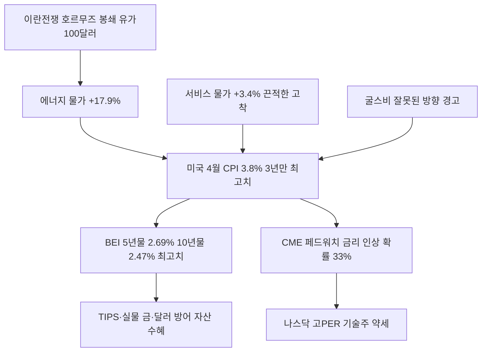

# 거시/물가 分析: 미국 CPI 3.8% 3년 만의 최고치 — 에너지·서비스 물가·연준 금리 인상 전망·나스닥 약세·BEI 급등
## 투자 신호 + 사회적 영향 평가

---

## 📌 기사 기본 정보

- **날짜**: 2026-05-14
- **출처**: 정혜인·윤세미·조한송 기자
- **카테고리**: 경제 > 거시경제·물가
- **핵심 주제**: 2026년 4월 미국 CPI가 전년 대비 3.8% 상승하며 2023년 5월 이후 3년 만의 최고치 기록. 에너지(+17.9%)와 서비스 물가(+3.4%) 동시 급등으로 연준의 연내 금리 인상 가능성이 급부상. CME 페드워치 12월 금리 인상 확률이 하루 만에 7%p 급등(26%→33%). BEI 5년물 2.69%(2022년 이후 최고)·10년물 2.47% 급등

**메타데이터**
- 주요 사건: 미국 4월 CPI 3.8%(예상 3.7% 상회), 에너지 전년比 +17.9%(휘발유 +28.4%), 서비스 물가 +3.4% 고착, CME 페드워치 12월 금리 인상 확률 33%, BEI 5년물 2.69% 최고치
- 핵심 원인: 이란전쟁·호르무즈 봉쇄로 인한 유가 급등(1차 효과), 임금·임대료·의료비 중심 서비스 물가 고착화(2차 효과)
- 주요 주체: 미국 연준(Fed), 오스틴 굴스비(시카고 연은 총재), 채권 투자자(BEI 급등)
- 키워드: CPI 3.8%, BEI, 브레이크이븐 인플레이션율, CME 페드워치, 서비스 물가 끈적함, 물가연동국채(TIPS)

---

## 🔍 기사를 통한 투자 신호 추출

### 1단계: 핵심 사건 분해

**What (무엇이 일어났는가?)**
- 미국 4월 CPI가 3.8%로 시장 예상(3.7%)을 상회하며 3년 만의 최고치를 기록했습니다. 에너지 가격이 전년 대비 17.9% 급등하며 전체 CPI 상승분의 40% 이상을 견인했고, 서비스 물가(+3.4%)도 끈적한 고착 신호를 보냈습니다. 채권 시장의 인플레이션 기대 지표인 BEI(5년물 2.69%·10년물 2.47%)가 각각 2022년, 2023년 이후 최고치로 급등했습니다.

**When (언제 일어났는가?)**
- 2026-05-14 (이란전쟁 호르무즈 봉쇄 장기화, AI 낙관론으로 사상 최고치를 달리던 뉴욕 증시가 흔들리는 시점)

**Why (왜 일어났는가?)**
- 이란전쟁 호르무즈 봉쇄 장기화로 국제유가가 배럴당 100달러를 돌파하며 에너지 가격이 폭등했습니다.
- 에너지 충격이 시간이 지나면서 운송비·제조비·서비스 가격 전반으로 확산(2차 효과)되면서 서비스 물가가 고착화됐습니다.

**Who (누가 주도하는가?)**
- 물가 압박 주체: 이란(호르무즈 봉쇄), 글로벌 에너지 투기 자본
- 정책 대응 주체: 미국 연준(오스틴 굴스비 "인플레이션이 잘못된 방향")

---

### 2단계: 투자 신호 해석

#### A. **긍정적 신호 (Bullish)**

**① 물가연동국채(TIPS)·실물 금·에너지 자산 — 인플레이션 방어**
- **신호**: BEI 5년물 2.69%(2022년 이후 최고), 10년물 2.47%(2023년 이후 최고)
- **의미**: 채권 시장이 이미 장기 인플레이션 재점화를 가격에 반영하기 시작. TIPS·실물 금·에너지 관련 자산이 인플레이션 방어 수단으로 부각
- **투자 기회**: 물가연동국채(TIPS) ETF, 실물 금(Gold), 원유·LNG 관련 에너지주

**② 달러 강세 지속 — 달러 자산 수혜**
- **신호**: 연준 금리 인상 가능성 상승으로 달러 강세 기조 지속
- **의미**: 글로벌 안전자산 선호와 미국 금리 프리미엄이 결합되어 달러화 자산의 실질 수익률 향상
- **투자 기회**: 달러 MMF, 달러 국채 단기물, 환노출형 미국 ETF

---

#### B. **위험 신호 (Bearish)**

**① AI 낙관론 기술주 밸류에이션 압박 — 나스닥 약세**
- **신호**: 3.8% CPI 발표 후 S&P500·나스닥 동반 약세. 금리 인상 확률 급등(26%→33%)
- **의미**: AI 낙관론으로 고PER를 유지하던 기술주가 금리 인상 압력에 직면하면 밸류에이션 조정이 불가피. 국채금리 상승 → 기업 자금조달 비용 증가 → 성장주 할인율 상승
- **투자 리스크**: 고PER 나스닥 기술주(엔비디아·마이크로소프트·애플 등) 단기 조정 위험

**② 공급 충격 스태그플레이션 — 경기 둔화와 물가 동시 악화**
- **신호**: 굴스비 시카고 연은 총재 "문제는 유가·관세 때문만이 아니다" — 서비스 물가 고착화 경고
- **의미**: 유가 공급 충격에 금리를 올리면 물가는 잡히지 않고 경기만 악화하는 '잘못된 처방' 딜레마. 스태그플레이션 위험이 현실화되면 주식·채권 동반 하락
- **투자 리스크**: 내수 소비재·건설·고부채 기업 전반, 변동금리 대출 비중 높은 가계

---

### 3단계: 섹터별 투자 기회 매트릭스

#### ✅ **높은 기대도 + 낮은 리스크**

**TIPS·실물 금·달러 자산 (인플레이션 가속 구조적 방어)**
- BEI 급등으로 채권 시장이 이미 장기 인플레이션을 반영하기 시작했습니다. TIPS와 실물 금은 인플레이션이 심화될수록 실질 수익률이 개선되는 구조적 수혜 자산입니다.
- **투자 추천도**: ⭐⭐⭐⭐⭐

---

## 💰 구체적 투자 신호 변환

### 신호 1: BEI 급등 — 채권 시장의 인플레이션 조기 경보를 포트폴리오에 반영

**투자 해석**: BEI(브레이크이븐 인플레이션율)가 5년물 2.69%·10년물 2.47%로 급등한 것은 채권 시장이 이미 장기 인플레이션을 가격에 반영한다는 신호입니다. 투자자는 즉시 포트폴리오에서 고PER 성장주 비중을 소폭 줄이고, TIPS·실물 금·달러 자산으로 리밸런싱해야 합니다. 단, 굴스비의 경고처럼 서비스 물가 고착화가 확인된다면 연준의 금리 인상이 현실화될 수 있으므로, 5월 28일 미국 PCE 물가지수(연준이 선호하는 인플레이션 지표) 발표를 핵심 모니터링 이벤트로 설정해야 합니다.

---

## 🌍 사회적 영향 평가

### A. 긍정적 사회 영향
- **에너지 전환 투자 가속**: 유가 충격이 재생에너지·원전 투자의 경제성을 높여 에너지 안보 강화 논의를 국가 정책 1순위로 격상시킵니다.

### B. 부정적 사회 영향
- **서민 이중 압박**: 에너지·식품 물가 상승(1차)에 더해 서비스 물가 고착(임대료·의료비·외식비)이 저소득층의 실질 구매력을 2중으로 잠식합니다.

---

## 🎯 결론: 당신의 투자 전략 수립

- **즉시 실행**: 포트폴리오 내 TIPS ETF 5~10% 편입, 실물 금 및 달러 MMF 비중 유지. 고PER 나스닥 기술주 비중 소폭 축소
- **3개월 후**: 연준 FOMC 회의(6월·7월) 결과 및 PCE 물가지수 동향으로 금리 인상 현실화 여부 확인

---

## 📝 Obsidian 연결 구조

