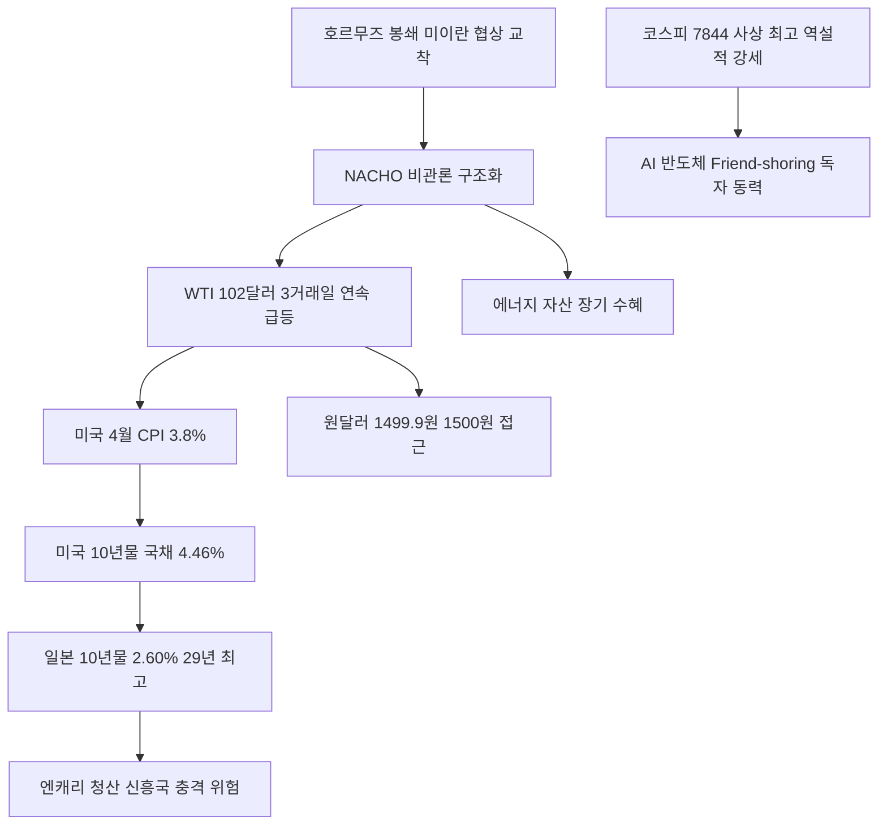

# 거시/에너지 分析: 호르무즈 봉쇄·유가 100달러 돌파·나초 비관론·Fed 금리 동결 딜레마
## 투자 신호 + 사회적 영향 평가

---

## 📌 기사 기본 정보

- **날짜**: 2026-05-14
- **출처**: 뉴시스·WSJ
- **카테고리**: 경제 > 거시경제·에너지
- **핵심 주제**: 호르무즈해협 봉쇄 장기화로 WTI 3거래일 연속 급등해 배럴당 102.18달러(+4.2%) 돌파. NACHO(Not A Chance Hormuz Opens) 비관론이 월가 지배. 4월 CPI 3.8%, 미국 10년물 국채금리 4.46%, 원-달러 장중 1,499.9원. Fed 연말 금리 동결 확률 61.4% vs 인상 30.5% — 진퇴양난의 딜레마

**메타데이터**
- 주요 사건: WTI 102.18달러(+4.2%), 브렌트유 107.69달러(+3.3%), 미국 10년물 국채 4.46%, 일본 10년물 국채 2.60%(29년 만의 최고), 원-달러 장중 1,499.9원, 코스피 7,844.01(사상 최고치) 역설적 동반 상승
- 핵심 원인: 미-이란 휴전 협상 교착, NACHO 비관론 득세(단기 해소 기대 소멸), 채권 시장 인플레이션 반영 선행
- 주요 주체: 월가 트레이더(NACHO 프레임), 미국 연준(Fed 딜레마), 이란(협상 거부), 한국 외환시장(원화 약세 압박)
- 키워드: NACHO, 호르무즈, 공급 충격 인플레이션, 스태그플레이션, 캐리트레이드 청산, 엔화 역설

---

## 🔍 기사를 통한 투자 신호 추출

### 1단계: 핵심 사건 분해

**What (무엇이 일어났는가?)**
- WTI가 3거래일 연속 급등하며 배럴당 102.18달러를 기록했습니다. 미-이란 휴전 협상이 교착 상태에 빠지면서 '호르무즈해협이 열릴 가능성은 없다(NACHO)'는 비관론이 월가를 지배하고 있습니다. 4월 CPI 3.8%와 맞물려 미국 10년물 국채 금리가 4.46%까지 치솟았고, 일본 10년물 국채는 29년 만의 최고치를 경신했습니다. 원-달러 환율은 장중 1,499.9원까지 급등했습니다.

**When (언제 일어났는가?)**
- 2026-05-14 (미-이란 협상 교착 확인, 글로벌 긴축 동조 가속화 시점)

**Why (왜 일어났는가?)**
- 호르무즈 봉쇄가 '일시적 사건'이 아닌 '구조적 위기'로 굳어지면서 에너지 공급 차질이 장기화되고 있습니다.
- 공급 충격 인플레이션에 금리를 올리기 어려운 Fed의 딜레마가 시장에 불확실성을 가중시킵니다.

**Who (누가 주도하는가?)**
- 비관론 확산: 월가 매크로 헤지펀드·원유 선물 트레이더(NACHO 포지셔닝)
- 역설적 강세: 코스피(AI 반도체 수혜 독자 동력, 사상 최고치 경신)

---

### 2단계: 투자 신호 해석

#### A. **긍정적 신호 (Bullish)**

**① 원유·에너지 관련 자산 — NACHO 구조화의 직접 수혜**
- **신호**: WTI 102달러 돌파, 3거래일 연속 급등, 국제에너지기구(IEA) 사상 최대 분기 재고 고갈
- **의미**: NACHO 비관론이 구조화되면 유가 100달러 이상이 중기 뉴 노멀로 자리 잡으며 에너지 기업의 수익성이 장기 개선됨
- **투자 기회**: 원유 ETF, LNG 관련 에너지 기업, 에너지 인프라 관련주

**② 코스피 역설적 강세 — 한국의 지정학 프리미엄 차별화**
- **신호**: 전 세계 공포 속에서 코스피가 7,844.01로 사상 최고치 경신(+2.63%)
- **의미**: 한국은 AI 반도체 수혜(삼성·SK하이닉스)와 Friend-shoring 지정학 프리미엄이 글로벌 에너지 공포를 상쇄. 외국인 자금 유입이 지속되는 구조
- **투자 기회**: [[삼성전자]], [[SK하이닉스]], 한국 방산·조선 대형주

---

#### B. **위험 신호 (Bearish)**

**① 원-달러 1,500원 접근 — 수입 물가 폭등·가계 이중 압박**
- **신호**: 원-달러 장중 1,499.9원(1,500원 직전)
- **의미**: 원화 약세가 에너지·식품 수입 물가를 추가로 끌어올리며, 한은의 금리 인상 압박을 강화하여 가계 부채 이자 부담이 폭증하는 이중 압박
- **투자 리스크**: 수입 원자재 의존 중소 제조업체, 변동금리 주담대 보유 가계

**② 일본 10년물 국채 29년 최고치 — 글로벌 엔캐리 청산 위험**
- **신호**: 일본 10년물 국채 2.60%(29년 만의 최고)
- **의미**: BOJ가 금리 정상화를 가속화하면 전 세계에 풀려 있는 엔화 캐리트레이드 자금이 급격히 청산되며 신흥국 자산 시장 전반에 충격을 줄 수 있음
- **투자 리스크**: 신흥국 주식·채권 보유 포트폴리오, 달러 강세에 취약한 원자재 소비 기업

---

### 3단계: 섹터별 투자 기회 매트릭스

#### ✅ **높은 기대도 + 낮은 리스크**

**에너지 자산 + 달러·금 방어 조합 (NACHO 구조화 수혜)**
- 호르무즈 봉쇄가 NACHO 수준으로 장기화된다면 유가 100달러 이상이 중기 구조로 정착됩니다. 이 환경에서 에너지 자산과 달러·금 방어 자산의 조합은 포트폴리오의 핵심 방어 축입니다.
- **투자 추천도**: ⭐⭐⭐⭐⭐

---

## 💰 구체적 투자 신호 변환

### 신호 1: 'NACHO' 구조화 대응 — 포트폴리오의 나초화

**투자 해석**: NACHO 비관론이 구조적으로 확산되는 상황에서 투자자는 포트폴리오를 '나초화(Nachoization)'해야 합니다. 구체적으로 ① 원유·LNG 에너지 자산 10~15% 편입, ② 달러 자산 40% 이상 유지, ③ 실물 금 5~10% 편입, ④ 한국 내에서는 AI 반도체+방산+조선의 Friend-shoring 수혜주를 핵심 축으로 유지하는 4분면 전략을 실행해야 합니다. 코스피의 역설적 강세가 지속되는 한 한국 반도체·방산주는 글로벌 공포 속 오아시스입니다.

---

## 🌍 사회적 영향 평가

### A. 긍정적 사회 영향
- **원화 약세의 수출 기업 환차익**: 달러 결제 비중이 높은 반도체·조선·방산 수출 기업의 원화 환산 실적이 극대화됩니다.

### B. 부정적 사회 영향
- **에너지 빈곤층 직격**: 유가 100달러 고착화는 난방비·교통비·배달비를 통해 저소득층 서민의 실질 생활 수준을 직접 잠식합니다.

---

## 🎯 결론: 당신의 투자 전략 수립

- **즉시 실행**: 원유 ETF·에너지 인프라 비중 편입. 달러 MMF 40% 이상 유지. 코스피 반도체·방산 핵심 보유 유지
- **3개월 후**: 미-이란 휴전 협상 재개 여부 모니터링(NACHO→TACO 전환 가능성). 일본 BOJ 금리 인상 속도를 엔캐리 청산 리스크 지표로 추적

---

## 📝 Obsidian 연결 구조

