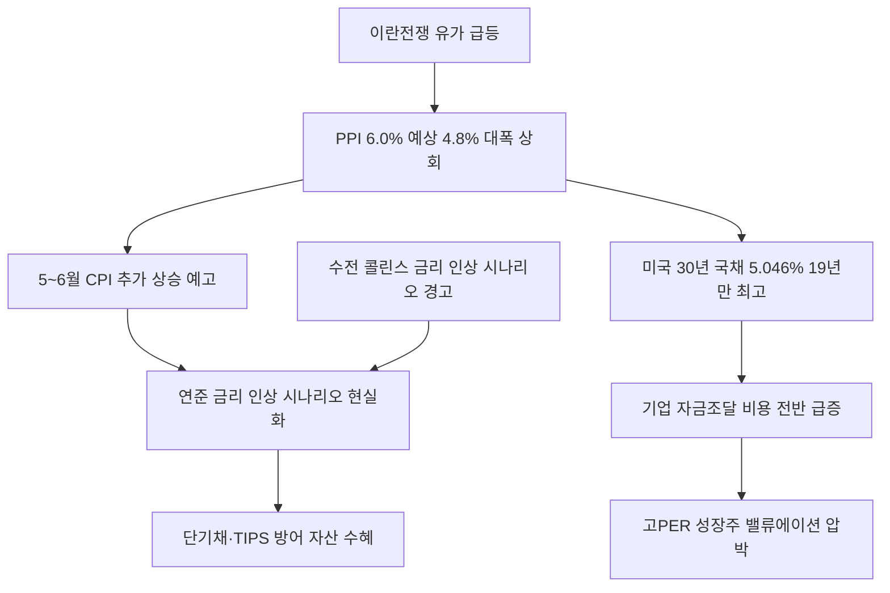

# 금융/채권 分析: 미국 30년 국채 5% 돌파 — 19년 만·PPI 6%·이란전쟁 인플레·연준 금리 인상 시나리오
## 투자 신호 + 사회적 영향 평가

---

## 📌 기사 기본 정보

- **날짜**: 2026-05-14
- **출처**: 파이낸셜타임스 외 (조한송·윤세미 기자)
- **카테고리**: 경제 > 금융·채권
- **핵심 주제**: 미국 30년 만기 국채 발행 금리가 5.046%를 기록하며 2007년 이후 19년 만에 5%대 돌파. 4월 PPI가 전년 대비 6% 상승(예상 4.8% 대폭 상회)하며 CPI 추가 상승을 예고. 이란전쟁 유가 급등이 공급망 전반으로 비용을 전이하는 2차 효과가 본격화. 연준의 금리 인상 시나리오가 현실화되는 구조 분析

**메타데이터**
- 주요 사건: 미국 30년 국채 발행 금리 5.046%(2007년 이후 19년 만의 최고), 4월 PPI +6.0%(예상 4.8% 대폭 상회, 2022년 12월 이후 최고), 250억 달러 규모 발행, 보스턴 연준 총재 수전 콜린스 "금리 인상 시나리오 구상 가능"
- 핵심 원인: 이란전쟁 → 유가 급등 → PPI 6% → CPI 상승 예고 → 인플레이션 장기화 우려 → 채권 투자자 금리 프리미엄 요구
- 주요 주체: 미국 연준(수전 콜린스 보스턴 연은 총재), 채권 투자자, 조셉 브루스엘라스(RSM 수석 이코노미스트)
- 키워드: 30년 국채, PPI(생산자물가지수), 코스트 푸시 인플레이션, 금리 인상 딜레마, 자금 조달 비용

---

## 🔍 기사를 통한 투자 신호 추출

### 1단계: 핵심 사건 분해

**What (무엇이 일어났는가?)**
- 미국 30년 만기 국채 발행 금리가 5.046%를 기록하며 2007년 이후 19년 만에 5%대를 돌파했습니다. 4월 PPI가 6.0%로 시장 예상(4.8%)을 크게 상회하며 2022년 12월 이후 최고치를 기록했습니다. 이란전쟁 이후 30년 국채 수익률이 0.4%포인트 급등했고, 250억 달러 발행 채권에서 미국 정부의 이자 부담이 그만큼 증가했습니다.

**When (언제 일어났는가?)**
- 2026-05-14 (PPI→CPI 전이 1~3개월 시차를 감안하면 5~6월 CPI 추가 상승 예고 시점)

**Why (왜 일어났는가?)**
- 이란전쟁 → 호르무즈 봉쇄 → 유가 급등 → PPI(공장 출구 가격) 폭등 → 향후 1~3개월 내 CPI 추가 상승 예고라는 공급망 전이 메커니즘이 작동했습니다.
- 채권 투자자들이 장기 인플레이션 위험에 대한 프리미엄으로 더 높은 금리를 요구하면서 30년 국채 금리가 급등했습니다.

**Who (누가 주도하는가?)**
- 금리 상승 촉매: 이란(공급 충격), 채권 투자자(인플레이션 프리미엄 요구)
- 정책 대응: 수전 콜린스(보스턴 연은) "금리 인상 시나리오 구상 가능" 경고

---

### 2단계: 투자 신호 해석

#### A. **긍정적 신호 (Bullish)**

**① 미국 단기채 — 금리 상승기 고수익 확정 상품**
- **신호**: 30년물 5.046% 돌파로 전반적인 미국 금리 상승 환경 확인
- **의미**: 금리 상승 환경에서 단기채(1~2년물)는 만기가 짧아 재투자 시 더 높은 금리로 롤오버할 수 있어 실질 수익률이 개선됨
- **투자 기회**: 미국 단기 국채 ETF(SHV, BIL), 미국 6개월~1년 만기 T-Bill

**② 에너지·원자재 기업 — 공급 충격 장기화 수혜**
- **신호**: PPI 6%의 핵심 원인이 에너지·원자재 가격 급등
- **의미**: 생산자 가격 인상이 소비자 가격으로 전이되는 1~3개월의 시간 동안 에너지·원자재 관련 기업의 마진이 최대화됨
- **투자 기회**: 에너지 생산·유통 기업, 원유·LNG 관련 ETF

---

#### B. **위험 신호 (Bearish)**

**① 기업 자금조달 비용 급증 → 성장주·고부채 기업 직격**
- **신호**: 30년 국채 5.046% — 모든 금융의 기준점이 올라감
- **의미**: 국채 금리 상승 → 회사채 금리 상승 → 기업 자금조달 비용 증가 → 고부채·고성장 기업의 수익성과 밸류에이션 압박. 특히 국채금리 상승폭(이란전쟁 이후 +0.4%p)이 전체 기업 이자 비용을 대폭 높임
- **투자 리스크**: 나스닥 고PER 성장주, 부채 비율 높은 부동산·건설 기업

**② PPI→CPI 전이 — 5~6월 CPI 추가 상승 예고**
- **신호**: PPI 6%(예상 4.8% 대폭 상회) — 1~3개월 뒤 CPI로 전이
- **의미**: PPI가 1~3개월 시차를 두고 CPI에 반영되므로, 5~6월 CPI가 4%에 근접할 가능성이 높아짐. 연준의 금리 인상 압박이 더 강화될 수 있음
- **투자 리스크**: 금리 인상 현실화 시 채권 장기물 보유 포트폴리오 급락, 주식 전반 할인율 상승

---

### 3단계: 섹터별 투자 기회 매트릭스

#### ✅ **높은 기대도 + 낮은 리스크**

**미국 단기 국채 + 물가연동국채(TIPS) (금리 상승기 핵심 방어 자산)**
- 30년 국채 금리 5% 돌파는 금리 상승기의 개막을 알리는 신호입니다. 이 환경에서 만기가 짧은 단기 국채와 인플레이션 방어 기능을 가진 TIPS의 결합이 포트폴리오의 핵심 방어 축입니다.
- **투자 추천도**: ⭐⭐⭐⭐⭐

---

## 💰 구체적 투자 신호 변환

### 신호 1: PPI→CPI 전이 시계 — 5~6월 CPI 4% 접근 시나리오 대비

**투자 해석**: 4월 PPI 6%는 5~6월 CPI 추가 상승의 선행 신호입니다. 연준의 금리 인상 현실화 여부를 판단하는 핵심 지표는 5월 28일 PCE 물가지수와 6월 10일 CPI 발표입니다. 투자자는 이 두 이벤트 전까지 장기채 비중을 낮추고 단기채·TIPS·에너지 자산으로 방어적 포지셔닝을 유지해야 합니다. 특히 한국 투자자는 미국 금리 인상이 원-달러 환율에 미치는 영향(추가 원화 약세)을 동시에 대비해야 합니다.

---

## 🌍 사회적 영향 평가

### A. 긍정적 사회 영향
- **단기 저축 금리 개선**: 금리 상승은 은행 예금·단기 채권 금리를 높여 보수적 저축자들의 실질 수익률을 개선합니다.

### B. 부정적 사회 영향
- **주택담보대출 금리 상승**: 30년 국채 금리 5% 돌파는 주택담보대출 금리(일반적으로 30년 국채금리에 연동)를 더욱 높여 주거 부담을 가중시키고 주택시장을 냉각시킵니다.

---

## 🎯 결론: 당신의 투자 전략 수립

- **즉시 실행**: 장기채(10년물 이상) 비중 축소, 미국 단기 국채 ETF(SHV·BIL) 및 TIPS 편입. 에너지 자산 유지
- **3개월 후**: 5월 PCE·6월 CPI 발표 확인 후 연준 금리 인상 여부 재평가. PPI→CPI 전이 속도가 예상보다 빠를 경우 보유 성장주 추가 비중 조정

---

## 📝 Obsidian 연결 구조

