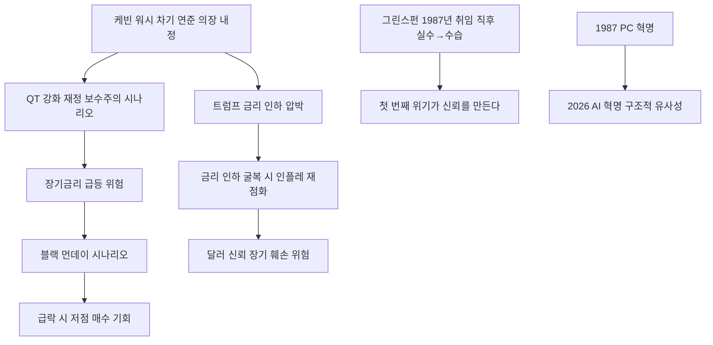

# 금융/Fed 역사 分析: 케빈 워시 연준 의장 — 그린스펀·블랙 먼데이·Fed 독립성·양적긴축 역사 비교
## 투자 신호 + 사회적 영향 평가

---

## 📌 기사 기본 정보

- **날짜**: 2026-05-14
- **출처**: 중앙일보 (김성재 미국 퍼먼대 경영학 교수·「관세 이야기」 저자, '김성재의 마켓 나우')
- **카테고리**: 경제 > 금융·통화정책
- **핵심 주제**: 1987년 블랙 먼데이와 그린스펀 초대 위기를 역사적 렌즈로 삼아, 차기 연준 의장 케빈 워시가 AI 혁명·트럼프 압박·매파 분위기 속에서 겪을 시험대를 분析. "의장 신뢰는 취임사가 아니라 첫 번째 위기에서 만들어진다"는 핵심 교훈 제시

**메타데이터**
- 주요 사건: 케빈 워시 차기 연준 의장 내정(트럼프 낙점, 월가 출신 재벌가 사위), 1987년 블랙 먼데이(S&P500 하루 -22%) vs 2026년 AI 혁명 유사성, 양적긴축(QT) 강화 시나리오, 장기금리 급등 위험
- 핵심 원인: 트럼프의 금리 인하 압박 vs 연준 내 매파 목소리 vs 물가 압박의 3각 갈등. 그린스펀 취임 직후 블랙 먼데이 패턴 반복 가능성
- 주요 주체: 케빈 워시(차기 연준 의장), 트럼프(금리 인하 압박), 그린스펀(1987년 위기 관리 선례)
- 키워드: 블랙 먼데이, 그린스펀, QT(양적긴축), 장기금리 급등, Fed 독립성, 트럼프 압박

---

## 🔍 기사를 통한 투자 신호 추출

### 1단계: 핵심 사건 분해

**What (무엇이 일어났는가?)**
- 퍼먼대 김성재 교수가 1987년 블랙 먼데이(S&P500 하루 -22%)와 현재의 구조적 유사성을 분析했습니다. 당시 그린스펀이 취임 2개월 만에 긴축을 단행했다가 블랙 먼데이를 촉발했으나 다음 날 즉각 유동성 공급을 선언하여 위기를 수습한 선례와, 케빈 워시가 직면할 트럼프 압박·QT 강화 시나리오·장기금리 급등 위험을 연결하여 분析했습니다.

**When (언제 일어났는가?)**
- 2026-05-14 (케빈 워시 연준 의장 취임 전, 물가 압박과 트럼프 금리 인하 압박이 동시 고조되는 시점)

**Why (왜 일어났는가?)**
- 1987년과 현재의 구조적 유사성: PC 혁명 → AI 혁명, 장기 주가 상승 후 고평가 논란, 연준 의장 교체에 대한 시장 불신.
- 워시가 QT를 강화하거나 트럼프 압박에 반응하는 방식이 1987년 블랙 먼데이 수준의 시장 충격을 만들 수 있습니다.

**Who (누가 주도하는가?)**
- 위험 생성 주체: 케빈 워시(첫 정책 결정), 트럼프(금리 인하 압박)
- 역사적 선례 제공자: 그린스펀(블랙 먼데이 수습의 교과서)

---

### 2단계: 투자 신호 해석

#### A. **긍정적 신호 (Bullish)**

**① QT 축소 시나리오 — 유동성 공급 신호 시 주식 시장 랠리**
- **신호**: 워시가 첫 번째 시장 충격에서 그린스펀처럼 즉각 유동성 공급 선언 시
- **의미**: 1987년 블랙 먼데이 다음 날 그린스펀의 유동성 공급 선언이 시장을 빠르게 안정시켰듯, 워시도 위기 시 즉각 대응하면 주식 시장의 빠른 반등 촉매가 됨
- **투자 기회**: 위기 시 과잉 매도된 우량주 저점 매수 전략 (그린스펀 패턴 활용)

**② 트럼프 압박 굴복 시나리오 — 단기 금리 인하 랠리**
- **신호**: 워시가 트럼프 금리 인하 압박에 부분적으로 응할 경우
- **의미**: 단기적으로 주식·부동산 자산 가격이 상승하는 '금리 인하 랠리'가 발생할 수 있음
- **투자 기회**: 금리 민감 성장주, 부동산 리츠(REITs)

---

#### B. **위험 신호 (Bearish)**

**① QT 강화 → 장기금리 급등 → 블랙 먼데이 시나리오**
- **신호**: 워시가 재정 보수주의자로서 연준 자산 규모 축소(QT)를 강화할 경우, 장기금리가 급등하여 주식 시장 급락 위험
- **의미**: 1987년 블랙 먼데이도 장기금리 급등이 주요 원인. 30년 국채 5% 돌파 환경에서 QT 강화는 유동성을 추가로 흡수하여 시장에 이중 충격을 줄 수 있음
- **투자 리스크**: 나스닥 AI 기술주, 장기채 보유 포트폴리오, 고PER 성장주

**② 트럼프 압박 굴복 → 인플레이션 재점화 → 장기 달러 신뢰 훼손**
- **신호**: 워시가 독립성을 포기하고 금리를 인하하면 단기 랠리 후 인플레이션 재점화 및 달러 신뢰 훼손
- **의미**: 연준 독립성 훼손 → 시장 신뢰 붕괴 → 장기 채권 금리 급등 → 자산 가격 전반 하락이라는 악순환의 씨앗
- **투자 리스크**: 달러 자산의 장기 신뢰도, 미국 채권 장기 보유 포트폴리오

---

### 3단계: 섹터별 투자 기회 매트릭스

#### ⚠️ **중간 기대도 + 높은 리스크 (워시 의장 취임 전 불확실성 구간)**

**미국 증시 전반 (QT 강화 vs 인하 압박 시나리오 불확실성)**
- 워시의 첫 정책 결정 방향을 확인하기 전까지 포지션을 보수적으로 유지하는 것이 합리적입니다. 첫 번째 위기 대응이 그린스펀처럼 즉각적이고 명확하다면 강한 반등 매수 기회가 됩니다.
- **투자 추천도**: ⭐⭐⭐ (취임 후 첫 정책 확인 후 재평가)

---

## 💰 구체적 투자 신호 변환

### 신호 1: '그린스펀 패턴' 재연 가능성 — 첫 번째 위기에서 매수 기회 포착

**투자 해석**: 1987년 그린스펀 사례의 핵심 교훈은 "의장 신뢰는 첫 번째 위기에서 만들어진다"는 것입니다. 워시가 취임 초기 QT 강화로 시장에 충격을 주더라도, 그린스펀처럼 즉각 유동성 공급을 선언하면 시장은 빠르게 반등합니다. 투자자는 워시 취임 이후 첫 번째 시장 충격 시나리오(5~15% 급락)를 저점 매수 기회로 미리 준비해야 합니다. 단, 트럼프 압박에 굴복하는 시나리오에서는 단기 랠리 이후 인플레이션 재점화가 더 큰 위험이므로, 이 경우는 달러·금 방어 자산 비중 확대로 대응해야 합니다.

---

## 🌍 사회적 영향 평가

### A. 긍정적 사회 영향
- **Fed 독립성 유지 시 물가 안정**: 워시가 트럼프 압박을 이겨내고 독립성을 지키면 장기적으로 인플레이션이 안정되어 서민의 실질 구매력이 보호됩니다.

### B. 부정적 사회 영향
- **QT 강화의 신흥국 금융 불안**: 미국 연준의 QT가 달러 강세와 신흥국 통화 약세를 동반하면 한국을 포함한 신흥국의 외채 상환 부담이 급증합니다.

---

## 🎯 결론: 당신의 투자 전략 수립

- **즉시 실행**: 워시 취임 이후 첫 번째 정책 결정(QT 확대 vs 완화)을 모니터링하며 시장 충격 시 저점 매수 여력 유지. 보수적 현금 비중 20~30% 유지
- **3개월 후**: 워시의 첫 번째 위기 대응 방식으로 'Fed 독립성 수호형'인지 '트럼프 굴복형'인지 판단하여 포트폴리오 방향 결정

---

## 📝 Obsidian 연결 구조

