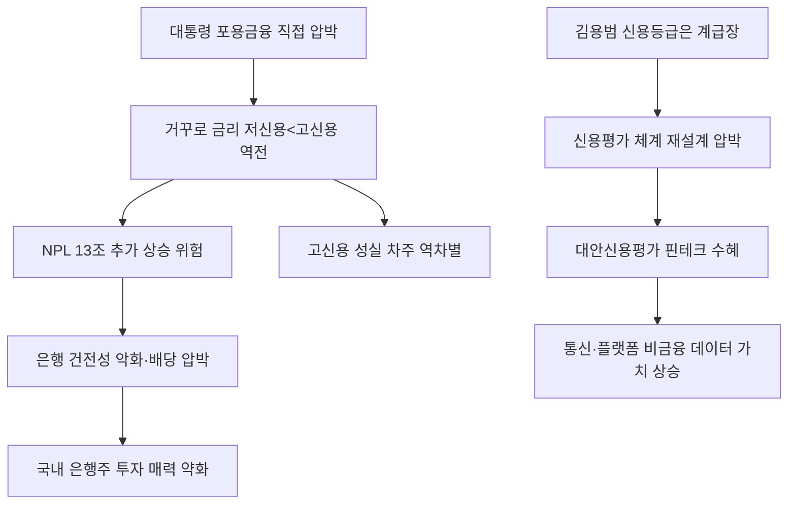

# 금융정책 分析: 포용금융 '거꾸로 금리' — 저신용 우대·신용평가 왜곡·역차별
## 투자 신호 + 사회적 영향 평가

---

## 📌 기사 기본 정보

- **날짜**: 2026-05-14
- **출처**: 국내 신문 (염지현 기자, 은행연합회 데이터 취재)
- **카테고리**: 경제 > 금융정책
- **핵심 주제**: 이재명 정부의 포용금융 드라이브로 시장금리가 오르는데도 저신용자 대출금리는 떨어지고 고신용자 금리는 오르는 '거꾸로 금리' 현상 발생. 하나은행 마이너스통장에서 최저신용자(3.73%)가 최고신용자(4.86%)보다 1.13%p 낮은 금리 역전 사례까지 등장. 신용평가 체계의 구조적 왜곡 경고

**메타데이터**
- 주요 사건: 하나은행 마이너스통장 최저신용(600점 이하) 3.73% vs 최고신용(951~1000점) 4.86% — 금리 역전. 우리은행 대출금리 상한제(연 7% 이하), 신한은행 저신용자 금리 12%→6.9%(-5%p), 5대 시중은행 최저신용자 신규 신용대출 금리 1월比 0.5%p 이상 인하
- 핵심 원인: 대통령 직접 압박("포용금융 제도적 강제 방법 없냐"), 김용범 정책실장 "신용등급은 금융이 설계한 보이지 않는 계급장" 발언, 성실 차주 손실 전가 우려
- 주요 주체: 이재명 정부, 5대 시중은행(포용금융 경쟁), 고신용 성실 차주(역차별 피해), 저신용자(단기 수혜)
- 키워드: 거꾸로 금리, 포용금융, 신용가격 체계, 대안신용평가, 관치금융, 역차별, 도덕적 해이

---

## 🔍 기사를 통한 투자 신호 추출

### 1단계: 핵심 사건 분해

**What (무엇이 일어났는가?)**
- 시장금리가 상승하는 환경에서 이재명 정부의 포용금융 압박으로 저신용자 대출금리는 오히려 내려가고 고신용자 금리는 올라가는 '거꾸로 금리' 현상이 발생했습니다. 하나은행에서 최저신용자(3.73%)가 최고신용자(4.86%)보다 낮은 금리를 적용받는 금리 역전이 실제로 나타났습니다.

**When (언제 일어났는가?)**
- 2026-05-14 (NPL 13조 원 돌파, 시장금리 상승기 — 정반대 방향으로 움직이는 정책 금리의 역설)

**Why (왜 일어났는가?)**
- 대통령이 국무회의에서 포용금융 이행 강제를 직접 언급했고, 김용범 정책실장이 "신용등급은 계급장"이라고 발언하며 신용평가 체계 재설계 의지를 공개 표명했습니다.
- 은행들이 정치적 압박에 응해 경쟁적으로 저신용자 금리를 인하하면서 정상적인 신용 가격 체계가 왜곡됐습니다.

**Who (누가 주도하는가?)**
- 정책 압박: 이재명 대통령, 김용범 정책실장
- 손실 부담: 은행(NPL 증가), 고신용 성실 차주(역차별)
- 단기 수혜: 저신용자(금리 인하 직접 수혜)

---

### 2단계: 투자 신호 해석

#### A. **긍정적 신호 (Bullish)**

**① 대안신용평가 핀테크 수혜 — 비금융 데이터 기반 신용 평가 시장 성장**
- **신호**: 신한은행 공과금·통신비 납부 이력 활용, 하나은행 통신사·플랫폼 소비 데이터 신용 평가 모델 개발
- **의미**: 기존 금융 이력 중심 신용평가에서 비금융 빅데이터 기반 신용평가로의 전환이 가속화되면서, 이 데이터를 보유하고 분석하는 핀테크·플랫폼 기업들의 시장 기회가 확대됨
- **투자 기회**: 신용평가 AI 스타트업, 통신사·플랫폼 빅데이터 기반 핀테크, CB(신용평가) 서비스 업체

**② 포용금융 정책 수혜 — 새희망홀씨·사잇돌 취급 기관**
- **신호**: 새희망홀씨 9,877억 원(+22.3% YoY), 사잇돌 대출 11배 급증
- **의미**: 정부 주도 포용금융 상품의 폭발적 성장이 취급 기관의 수수료·수익 증가로 연결될 수 있음
- **투자 기회**: 서민금융진흥원 협력 기관, 중금리 대출 핀테크

---

#### B. **위험 신호 (Bearish)**

**① 신용가격 체계 붕괴 → NPL 추가 증가 → 은행 건전성 악화**
- **신호**: 신용위험과 무관하게 정치적 압박으로 금리가 결정되는 구조. NPL 이미 13조 돌파
- **의미**: 리스크 대비 충분한 금리를 받지 못하는 저신용 대출이 부실화되면 NPL이 추가 증가하고 은행 자본이 잠식됨. 이 비용은 결국 고신용 차주의 금리 인상으로 전가됨
- **투자 리스크**: 국내 은행주·카드사 주가의 추가 하락 압박, 배당 축소·자본 확충 위험

**② 성실 고신용 차주의 역차별 → 금융 불신 심화**
- **신호**: 고신용자 금리 상승 + 저신용자 금리 하락의 역전 현상 가속화
- **의미**: 신용 관리를 성실히 해온 사람들이 오히려 손해를 보는 구조가 고착되면 장기적으로 금융 시장에 대한 신뢰와 신용 관리 동기 자체가 훼손됨
- **투자 리스크**: 금융 신뢰 하락에 따른 한국 금융 섹터 전반의 밸류에이션 프리미엄 약화

---

### 3단계: 섹터별 투자 기회 매트릭스

#### 🔴 **낮은 기대도 + 높은 리스크**

**국내 은행주 (거꾸로 금리+NPL 이중 압박)**
- 정치적 압박에 의한 신용가격 왜곡과 NPL 사상 최고치(13조)가 동시에 진행되는 구조에서 은행주의 수익성 개선은 어렵습니다. 포용금융 이행 평가 지표 도입 시 추가 압박이 예상됩니다.
- **투자 추천도**: ⭐⭐ (건전성 지표 개선 확인 전까지 비중 유지 최소화)

---

## 💰 구체적 투자 신호 변환

### 신호 1: 대안신용평가 시장의 구조적 성장 — 비금융 데이터의 가치 재정의

**투자 해석**: 거꾸로 금리 현상의 역설적 수혜는 '대안신용평가' 시장입니다. 기존 금융 이력 중심 신용평가가 한계를 드러낼수록, 통신비·공과금·소비 패턴 등 비금융 데이터를 활용하는 대안 신용평가의 필요성이 높아집니다. 이 데이터를 보유하고 분석 모델을 구축한 기업들이 은행의 파트너로 성장하는 구조적 기회가 있습니다. 단, 은행주 자체는 포용금융 압박과 NPL 상승의 이중 압박으로 보수적 관리가 필요합니다.

---

## 🌍 사회적 영향 평가

### A. 긍정적 사회 영향
- **금융 소외 계층의 접근성 개선**: 저신용자가 고금리 사금융 대신 제도권 금융으로 편입되는 것은 명백한 사회적 선입니다.

### B. 부정적 사회 영향
- **성실 차주의 역차별과 도덕적 해이**: 신용 관리를 열심히 해도 불이익을 받는 구조는 장기적으로 성실한 금융 생활의 유인 자체를 훼손합니다.

---

## 🎯 결론: 당신의 투자 전략 수립

- **즉시 실행**: 국내 은행주 비중 최소화. 대안신용평가 핀테크 및 비금융 데이터 플랫폼 스크리닝
- **3개월 후**: 포용금융 이행 평가 지표 도입 여부 및 2분기 은행 NPL 비율 확인 후 은행주 재진입 여부 판단

---

## 📝 Obsidian 연결 구조

