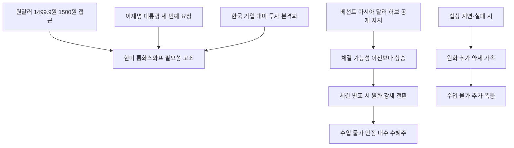

# 금융/외환 分析: 한미 통화스와프 — 이재명·베선트·환율 변동성·달러 유동성
## 투자 신호 + 사회적 영향 평가

---

## 📌 기사 기본 정보

- **날짜**: 2026-05-14
- **출처**: 국내 신문 (윤성민·장원석 세종 기자)
- **카테고리**: 경제 > 금융·외환
- **핵심 주제**: 이재명 대통령이 베선트 미국 재무장관과의 접견에서 한미 통화스와프 체결을 재차 강조. 베선트 장관은 X에서 "상설 통화스와프 라인 확대가 아시아 달러 투자 센터 구축의 첫걸음"이라며 긍정적 반응. 원-달러 환율 1,499.9원 직전까지 상승한 외환시장 불안 배경 속 한국의 달러 유동성 안전망 필요성 고조

**메타데이터**
- 주요 사건: 이재명 대통령·베선트 재무장관 접견 시 통화스와프 요청(3번째), 원-달러 장중 1,499.9원, 베선트 X 발언 "상설 통화스와프 확대가 아시아 달러 투자 센터 구축 첫걸음", 한국 기업 미국 투자 본격화 달러 수요 증가
- 핵심 원인: 중동전쟁·호르무즈 봉쇄·미중 무역 긴장으로 원화 환율 변동성 확대, 한국 기업 대미 투자 확대로 달러 수요 증가, 미국의 '아시아 달러 허브' 전략적 구상
- 주요 주체: 이재명 대통령, 베선트(미 재무장관), 한국은행, 삼성·SK·현대차(미국 투자 확대)
- 키워드: 통화스와프, 달러 유동성, 아시아 달러 허브, 안전망, 무제한 vs 한도부 스와프

---

## 🔍 기사를 통한 투자 신호 추출

### 1단계: 핵심 사건 분해

**What (무엇이 일어났는가?)**
- 이재명 대통령이 베선트 미국 재무장관과의 접견에서 세 번째로 한미 통화스와프를 요청했습니다. 베선트 장관은 공개적으로 "상설 통화스와프 확대가 아시아 달러 투자 센터 구축의 첫걸음"이라며 긍정적 반응을 보였습니다. 원-달러 환율이 장중 1,499.9원까지 치솟으며 1,500원 선이 눈앞에 다가온 외환 불안 상황이 배경입니다.

**When (언제 일어났는가?)**
- 2026-05-14 (원-달러 1,500원 직전, 한국 기업 대미 투자 본격화 임박 시점)

**Why (왜 일어났는가?)**
- 중동전쟁·호르무즈 봉쇄·미중 무역 긴장이 겹치며 원화 환율 변동성이 확대됐습니다.
- 삼성전자·SK하이닉스·현대차 등 한국 기업의 대미 투자가 본격화되면서 달러 수요가 급증할 예정입니다.
- 미국도 '아시아 달러 허브' 전략 추진과 대미 투자 유치 측면에서 통화스와프 확대를 이익으로 보기 시작했습니다.

**Who (누가 주도하는가?)**
- 요청 주체: 한국 정부 (이재명 대통령, 세 번째 요청)
- 결정 주체: 미국 연준(Fed)·재무부·의회 (베선트 장관은 긍정적이나 최종 결정권자 아님)

---

### 2단계: 투자 신호 해석

#### A. **긍정적 신호 (Bullish)**

**① 통화스와프 체결 시 — 원화 안정화·외국인 투자 신뢰 회복**
- **신호**: 베선트 장관의 이례적 공개 지지 발언으로 체결 가능성 이전보다 높아짐
- **의미**: 체결 발표 즉시 원화 강세 전환 → 수입 물가 안정 → 한은 금리 인상 압박 완화 → 주식·채권 시장 안정화의 선순환
- **투자 기회**: 통화스와프 체결 발표 시 원화 강세 수혜 → 수입 의존도 높은 내수 소비재·항공주, 달러 부채 비중 높은 기업

**② 한국의 대미 투자 확대 공식화 — 방산·반도체 수혜 지속**
- **신호**: 통화스와프와 대미 투자를 패키지로 연결한 협상 전략
- **의미**: 삼성·SK·현대차 등 대미 투자 확대가 공식화되면 미국 현지 공장 건설 관련 기업(건설·엔지니어링·부품)이 수혜
- **투자 기회**: 한국 방산 대형주, 반도체·전기차 배터리 부품 공급사

---

#### B. **위험 신호 (Bearish)**

**① 통화스와프 협상 지연/실패 — 원화 추가 약세 위험**
- **신호**: 지난해 한미 관세 협상에서 미국이 통화스와프를 거절한 선례
- **의미**: 체결이 지연되거나 한국이 원하는 수준(무제한·상설)이 아닌 한도부·기한부로 타협될 경우, 외환 시장의 실망 반응으로 원화 약세가 가속화될 위험
- **투자 리스크**: 원화 약세 지속 시 수입 물가 상승 → 한은 금리 인상 → 내수 경기 추가 위축

**② 원-달러 1,500원 돌파 시나리오 — 수입 물가 폭등**
- **신호**: 장중 1,499.9원 접근 — 심리적 저항선 1,500원이 언제든 돌파 가능
- **의미**: 1,500원 돌파 시 수입 원자재·에너지 비용이 추가 폭등하며 기업 원가 부담이 급증. 특히 원유·천연가스·식품 원자재 의존 기업에 직격
- **투자 리스크**: 수입 의존도 높은 식품·화학·소재 중소 제조업체

---

### 3단계: 섹터별 투자 기회 매트릭스

#### ✅ **높은 기대도 + 낮은 리스크 (통화스와프 체결 가능성 증가 구간)**

**달러 자산 헷지 + 원화 강세 전환 대비 포지션**
- 통화스와프 체결 발표 전까지는 달러 자산 비중을 유지하되, 체결 발표 즉시 원화 강세 전환에 대비한 원화 자산 비중 확대(내수 소비재·항공·수입 의존 기업) 포지션을 준비합니다.
- **투자 추천도**: ⭐⭐⭐⭐

---

## 💰 구체적 투자 신호 변환

### 신호 1: 통화스와프 체결 발표를 원화 자산 재편 타이밍으로 설정

**투자 해석**: 이번 협상에서 베선트 장관의 공개 지지 발언은 이전 협상보다 진전된 신호입니다. 투자자는 통화스와프 체결 발표를 원화 강세 전환의 촉매로 인식하고, ① 체결 전: 달러 자산 유지, ② 체결 발표: 달러 비중 일부 축소 및 내수 소비재·항공 비중 확대, ③ 체결 실패·지연: 달러 자산 추가 확대의 3단계 시나리오별 대응을 미리 준비해야 합니다.

---

## 🌍 사회적 영향 평가

### A. 긍정적 사회 영향
- **서민 물가 안정**: 통화스와프 체결로 원화 강세가 실현되면 수입 에너지·식품 가격이 안정되어 서민 생활 부담이 경감됩니다.

### B. 부정적 사회 영향
- **대미 투자 패키지의 국내 일자리 공동화 우려**: 한국 대기업이 미국 현지 공장 투자를 확대할수록 국내 제조업 일자리가 줄어드는 공동화 위험이 있습니다.

---

## 🎯 결론: 당신의 투자 전략 수립

- **즉시 실행**: 달러 자산 40% 이상 비중 유지. 통화스와프 체결 발표를 원화 자산 재편 타이밍으로 설정하고 포지션 준비
- **3개월 후**: 통화스와프 협상 타결 여부(6~9월 예상) 및 원-달러 환율 1,500원 돌파 여부를 한은 추가 긴축 판단의 핵심 지표로 모니터링

---

## 📝 Obsidian 연결 구조

