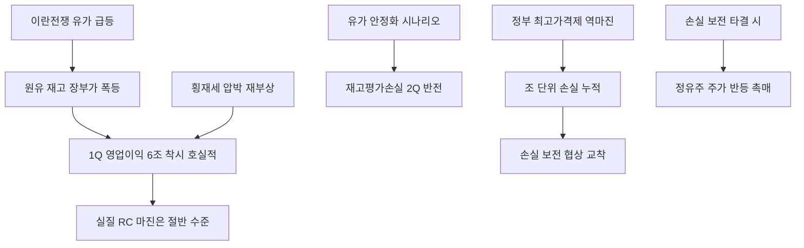

# 에너지/정유 分析: 정유 4사 6조 이익의 함정 — 재고평가이익·최고가격제 손실·이란전쟁
## 투자 신호 + 사회적 영향 평가

---

## 📌 기사 기본 정보

- **날짜**: 2026-05-14
- **출처**: 김도균 산업1부 기자 (기자수첩)
- **카테고리**: 경제 > 에너지·정유
- **핵심 주제**: 정유 4사(SK이노베이션·HD현대오일뱅크·GS칼텍스·에쓰오일) 1분기 합산 6조 원 영업이익의 절반 이상이 유가 급등으로 인한 재고평가이익이라는 착시 분析. 유가가 안정되면 2분기에 재고평가손실로 반전 가능. 정부 최고가격제 손실이 조 단위로 쌓이는데 보전 협상이 평행선 지속

**메타데이터**
- 주요 사건: 정유 4사 1Q 합산 영업이익 6조 원, 에쓰오일 영업이익 1조 2,310억 중 재고 관련 이익 6,434억(52%), 정부 최고가격제 손실 조 단위 예상·보전 협상 교착, 2022년 러-우 전쟁 패턴 재현
- 핵심 원인: 이란전쟁 발발(2026년 2월 28일) → 유가 급등 → 원유 재고 장부가 폭등(재고평가이익), 정부 최고가격제로 시장가보다 싸게 판매 강제 → 역마진 누적
- 주요 주체: 에쓰오일(S-Oil), SK이노베이션, GS칼텍스, HD현대오일뱅크, 정부(최고가격제 집행자)
- 키워드: 재고평가이익, 최고가격제, 재고평가손실, 횡재세, 러-우 전쟁 패턴, 실질 정제 마진

---

## 🔍 기사를 통한 투자 신호 추출

### 1단계: 핵심 사건 분해

**What (무엇이 일어났는가?)**
- 정유 4사가 1분기 합산 6조 원의 영업이익을 기록했으나, 에쓰오일 기준으로 영업이익의 52%가 실제 정제 마진이 아닌 재고평가이익임이 확인됐습니다. 이란전쟁으로 비싸게 매입한 원유 재고의 장부가가 올라간 착시 이익입니다. 동시에 정부 최고가격제 손실이 조 단위에 달하는데 보전 협상이 교착 상태입니다.

**When (언제 일어났는가?)**
- 2026-05-14 (이란전쟁 발발 이후 고가 매입 원유가 2분기 정제 라인에 본격 투입되는 시점)

**Why (왜 일어났는가?)**
- 이란전쟁(2026년 2월 28일) 발발 후 유가 급등으로 보유 재고 장부가가 상승 → 재고평가이익 발생.
- 고가에 매입한 원유가 2분기 정제에 투입될 때 유가가 안정/하락하면 재고평가손실로 반전됩니다.
- 정부 최고가격제로 원가 이하 판매가 강제되어 역마진 손실이 누적됩니다.

**Who (누가 주도하는가?)**
- 손실 부담: 정유 4사(최고가격제 역마진, 재고평가손실 위험)
- 정책 주도: 정부(최고가격제 집행, 손실 보전 협상 교착)

---

### 2단계: 투자 신호 해석

#### A. **긍정적 신호 (Bullish)**

**① 이란전쟁 장기화 시 — 유가 고착화로 정유 마진 구조적 개선**
- **신호**: NACHO 비관론 득세 → 유가 100달러 이상 중기 고착화
- **의미**: 유가가 장기적으로 높은 수준을 유지한다면 재고평가이익이 지속적으로 발생하고, 정제 마진도 개선될 수 있음. 다만 최고가격제 손실이 상쇄 변수
- **투자 기회**: 에쓰오일(S-Oil), SK이노베이션 — 유가 고착화 수혜. 단, 최고가격제 손실 변수 반드시 반영

**② 최고가격제 손실 보전 협상 타결 시 — 즉각 주가 반등 촉매**
- **신호**: 손실 보전 협상이 평행선을 달리는 중이나, 정치적 압박이 완화되면 타결 가능성
- **의미**: 조 단위 손실 보전이 현실화되면 정유사 재무 구조 개선 및 주가 반등의 즉각적 촉매
- **투자 기회**: 에쓰오일, SK이노베이션, GS칼텍스 모회사 GS 홀딩스

---

#### B. **위험 신호 (Bearish)**

**① 2분기 재고평가손실 반전 — 호실적 착시의 역풍**
- **신호**: 에쓰오일 1Q 이익의 52%가 재고평가이익(미실현) → 유가 안정화 시 2분기 재고평가손실로 반전
- **의미**: 1분기 6조 호실적이 시장에 기대감을 심었다면, 2분기에 재고평가손실이 현실화될 때의 심리적 충격이 더 클 수 있음. "잘 벌 때가 오히려 나을 정도"라는 업계의 자조가 현실화
- **투자 리스크**: 정유 4사 주가의 2분기 실적 발표 전후 변동성 확대

**② 횡재세 논란 재부상 — 정치적 이익 환수 압박**
- **신호**: 6조 호실적에 "횡재세 부과해야" 압박이 반복될 수 있음(2022년 러-우 전쟁 패턴 재현)
- **의미**: 횡재세 현실화 시 정유사 이익이 직접 잠식. 그러나 유가가 안정되면 분위기가 바뀌어 정유사가 오히려 대규모 적자를 걱정해야 하는 사이클로 전환
- **투자 리스크**: 정치적 횡재세 논란 속 정유주 투자 심리 냉각

---

### 3단계: 섹터별 투자 기회 매트릭스

#### ⚠️ **중간 기대도 + 높은 리스크**

**정유 4사 (재고평가이익 착시 + 최고가격제 손실 이중 리스크)**
- 6조 호실적이 재고평가이익 착시임을 인식하고, 2분기 실질 정제 마진과 최고가격제 손실 보전 협상 타결 여부를 확인한 후 투자 결정하는 것이 합리적입니다.
- **투자 추천도**: ⭐⭐⭐ (손실 보전 타결 확인 후 재평가)

---

## 💰 구체적 투자 신호 변환

### 신호 1: '6조 호실적'의 진짜 내용 파악 — 재고평가이익 제거 후 실질 마진 점검

**투자 해석**: 정유주 투자 시 '재고평가이익을 제거한 실질 정제 마진(RC 마진)'을 반드시 별도로 확인해야 합니다. 에쓰오일의 경우 RC 마진 기준 영업이익은 5,876억 원으로, 장부상 1조 2,310억 원의 절반 수준입니다. 투자자는 최고가격제 손실 보전 협상 타결을 트리거로, 정유 4사의 실질 이익 구조가 개선되는 시점에 분할 매수하는 전략을 취해야 합니다.

---

## 🌍 사회적 영향 평가

### A. 긍정적 사회 영향
- **최고가격제로 서민 에너지 부담 완화**: 시장가보다 낮은 가격으로 기름을 공급하는 최고가격제는 에너지 비용 급등 상황에서 서민의 직접 부담을 줄여줍니다.

### B. 부정적 사회 영향
- **정유사 재무 악화 → 에너지 공급 불안**: 손실 보전 없이 최고가격제가 장기화되면 정유사의 투자 여력이 소진되어 장기적으로 에너지 공급 안정성이 훼손될 수 있습니다.

---

## 🎯 결론: 당신의 투자 전략 수립

- **즉시 실행**: 정유 4사의 2분기 RC 마진 및 최고가격제 손실 보전 협상 타결 여부를 모니터링. 횡재세 논란 가시화 시 즉시 비중 축소 검토
- **3개월 후**: 최고가격제 손실 보전 협상 타결 + 유가 안정화 + RC 마진 회복의 3가지 조건이 동시 충족되는 시점을 정유주 매수 적기로 설정

---

## 📝 Obsidian 연결 구조

