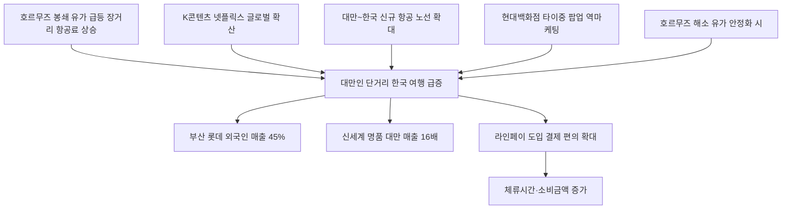

# 유통/관광 分析: 대만 관광객 큰손 부상 — 백화점 45%·라인페이·K콘텐츠 소비
## 투자 신호 + 사회적 영향 평가

---

## 📌 기사 기본 정보

- **날짜**: 2026-05-14
- **출처**: 조선일보
- **카테고리**: 경제 > 유통·관광
- **핵심 주제**: 고유가로 장거리 여행이 줄어든 대만 젊은 개별 관광객들이 K콘텐츠에 이끌려 한국을 찾으면서, 부산 롯데백화점 외국인 매출의 45%를 차지하는 '새 큰손'으로 급부상. 신세계 명품 카테고리 대만 매출 전년比 16배 폭등. 라인페이 도입과 현대백화점의 대만 현지 팝업 역마케팅 전략 분析

**메타데이터**
- 주요 사건: 대만 관광객 2026년 1분기 54만 명(+37.7%, 주요국 최고 증가율), 부산 롯데백화점 외국인 매출 中 대만 45%(1위), 신세계 명품 대만 매출 16배 폭등, 라인페이 도입(롯데·신세계·편의점), 현대백화점 타이중 팝업 역마케팅
- 핵심 원인: 호르무즈 봉쇄→유가 급등→장거리 항공료 상승→단거리 한국 여행 선호, K콘텐츠(드라마·K팝) 수요 폭발, 대만~한국 신규 항공 노선 확대
- 주요 주체: 대만 젊은 개별 관광객(FIT), 롯데·신세계·현대백화점, 편의점 업계
- 키워드: 대만 관광객, 라인페이, 인바운드 다변화, 역마케팅, FIT, K콘텐츠 경제화

---

## 🔍 기사를 통한 투자 신호 추출

### 1단계: 핵심 사건 분해

**What (무엇이 일어났는가?)**
- 대만 관광객이 한국 백화점의 최대 외국인 큰손으로 부상했습니다. 부산 롯데백화점 외국인 매출의 45%가 대만 고객이며, 신세계 명품 카테고리에서 대만 매출이 전년 대비 16배 폭등했습니다. 유통업계는 대만 1위 결제 수단 라인페이를 앞다퉈 도입하고, 현대백화점은 대만 현지 팝업을 통한 역마케팅까지 전개하고 있습니다.

**When (언제 일어났는가?)**
- 2026-05-14 (2026년 1분기 대만 관광객 37.7% 급증, 연간 220만 명 돌파 전망 시점)

**Why (왜 일어났는가?)**
- 호르무즈 봉쇄로 유가 급등 → 장거리 항공료 상승 → 3시간 단거리인 한국 여행 선호도 급증
- K콘텐츠(드라마·K팝) 넷플릭스 확산으로 한국 방문 수요 구조적 증가
- 대만인 1인당 GDP가 3만 5,000달러로 높은 소비력을 보유

**Who (누가 주도하는가?)**
- 소비 주체: 대만 젊은 개별 여행객(FIT) — K콘텐츠 팬, 체험형·쇼핑형 소비 집중
- 수혜 주체: 롯데·신세계·현대백화점, K뷰티·명품 브랜드, 편의점·음식점

---

### 2단계: 투자 신호 해석

#### A. **긍정적 신호 (Bullish)**

**① 백화점 빅3 — 대만 관광객의 구조적 매출 확대**
- **신호**: 부산 롯데 외국인 매출 45%, 신세계 명품 16배 폭등. 연간 220만 명 전망(2025년 189만 명에서 17% 추가 성장)
- **의미**: 중국 의존형 인바운드 관광 구조의 다변화가 진행되면서, 대만이 구조적으로 높은 소비력을 가진 새로운 핵심 관광 수요원으로 자리 잡음
- **투자 기회**: 롯데쇼핑(023530), 신세계(001360), 현대백화점(069960) — 대만 관광객 수혜 지속

**② 라인페이 도입 → 결제 편의 → 체류시간·소비 증가**
- **신호**: 롯데·신세계·이마트24·세븐일레븐 라인페이 도입 확산
- **의미**: 대만인이 자국 결제 앱을 그대로 사용할 수 있는 환경이 구축되면 소비 마찰이 줄어들고 체류시간과 소비금액이 증가. 결제 플랫폼 라인(LINE)의 한국 사업 영향력도 확대
- **투자 기회**: 라인(LINE) 관련 핀테크, 편의점 업계 GS리테일·BGF리테일

---

#### B. **위험 신호 (Bearish)**

**① 호르무즈 봉쇄 해소 시 대만 관광 증가세 둔화**
- **신호**: 대만 관광 급증의 핵심 원인 중 하나가 고유가로 인한 장거리 여행 비용 상승
- **의미**: 이란전쟁이 종전되고 유가가 안정되면 대만인들이 다시 유럽·일본 등 장거리·경쟁 여행지로 분산되어 한국 집중도가 약화될 수 있음
- **투자 리스크**: 대만 의존도가 높아진 유통·관광 기업의 매출 변동성

**② 일본 관광 경쟁력 회복 — 한국과의 경쟁 심화**
- **신호**: 엔화 약세가 지속될 경우 일본이 대만 관광객에게 가격 경쟁력을 회복할 수 있음
- **의미**: 일본이 K콘텐츠 에이 추진하는 '재팬 쿨' 전략과 가격 경쟁력을 함께 제시하면 한국과의 대만 관광객 유치 경쟁이 심화
- **투자 리스크**: 한국 관광 산업의 대만 의존도 과집중으로 인한 경쟁 취약성

---

### 3단계: 섹터별 투자 기회 매트릭스

#### ✅ **높은 기대도 + 낮은 리스크**

**백화점 빅3·K뷰티·편의점 (대만 관광객 구조적 성장)**
- 대만 관광객의 부상은 중국 의존 구조를 다변화하는 구조적 변화입니다. 고유가 환경이 지속되는 한 단거리 한국 여행 선호는 유지됩니다. K콘텐츠의 장기 확산까지 결합하면 구조적 중기 성장입니다.
- **투자 추천도**: ⭐⭐⭐⭐

---

## 💰 구체적 투자 신호 변환

### 신호 1: 대만 관광 '중국 대체재' 확인 — 인바운드 다변화 수혜 포지셔닝

**투자 해석**: 대만 관광객의 급부상은 한국 관광·유통 산업이 중국 단일 의존 구조에서 탈피하는 인바운드 다변화의 핵심 증거입니다. 현대백화점의 대만 현지 팝업 역마케팅(현지에서 팬층을 먼저 만든 뒤 한국으로 유입)은 미래 경쟁우위를 선점하는 전략으로 평가됩니다. 투자자는 롯데·신세계·현대 백화점 빅3와 K뷰티(코스맥스·한국콜마)를 '대만 관광 직접 수혜주'로 포트폴리오에 유지해야 합니다.

---

## 🌍 사회적 영향 평가

### A. 긍정적 사회 영향
- **지방 관광 활성화**: 부산·제주·대구 등 지방 도시에 대만 관광객이 유입되면서 수도권 편중 해소와 지역 경제 활성화에 기여합니다.

### B. 부정적 사회 영향
- **관광 의존 구조의 새로운 단일화**: 중국에서 대만으로 관광 의존 국가가 바뀐다면 외교·경제적 변수에 따른 취약성이 반복될 수 있습니다.

---

## 🎯 결론: 당신의 투자 전략 수립

- **즉시 실행**: 롯데쇼핑·신세계·현대백화점의 대만 매출 비중 추이 분기별 모니터링. K뷰티 기업(코스맥스·한국콜마) 중기 보유 유지
- **3개월 후**: 이란전쟁 종전 협상 동향 및 유가 안정화 여부 확인. 유가 급락 시 대만 장거리 여행 복귀 가능성 반영하여 인바운드 관련주 비중 점진적 조정

---

## 📝 Obsidian 연결 구조

