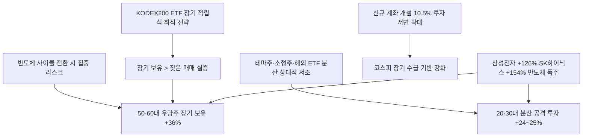

# 주식/세대투자 分析: 50·60대 수익률 36% vs 20·30대 25% — 코스피 상승장의 세대별 역설
## 투자 신호 + 사회적 영향 평가

---

## 📌 기사 기본 정보

- **날짜**: 2026-05-14
- **출처**: 머니투데이 / 미래에셋증권
- **카테고리**: 경제 > 주식·세대별 투자
- **핵심 주제**: 코스피 77% 상승장에서 50·60대(+36%)가 20·30대(+24~25%)를 크게 앞선 '연륜의 역설' 확인. 우량주 중심 장기 보유 vs 공격적·분산 투자 성향 차이가 결정적. 전체 평균(32.8%)도 코스피 상승률의 절반에 불과한 구조적 현실 분析

**메타데이터**
- 주요 사건: 코스피 2026 YTD +77%, 50대 +36.77%(1위), 60대 이상 +36.35%(2위), 30대 +24.06%(최하위), 전체 평균 +32.8%, 신규 계좌 개설 10.5%, 20대 미만 신규 비율 28.8%
- 핵심 원인: 50·60대의 삼성전자·SK하이닉스 대형주 장기 보유 vs 20·30대의 테마주·소형주·해외 ETF 분산 공격 투자. 이번 상승이 반도체 대형주 독주 구조
- 주요 주체: 50·60대 투자자(우량주 보유), 20·30대 투자자(분산 공격 투자), 20대 미만(부모가 대신 매수한 우량주 장기 보유)
- 키워드: 연륜의 역설, 대형주 장기 보유, 세대별 수익률, 반도체 독주, 공격적 분산 투자의 함정

---

## 🔍 기사를 통한 투자 신호 추출

### 1단계: 핵심 사건 분해

**What (무엇이 일어났는가?)**
- 코스피가 77% 급등하는 동안 연령대별 수익률이 크게 갈렸습니다. 50·60대는 36% 이상의 수익을 올린 반면, 20·30대는 24~25% 수준에 그쳤습니다. 전체 평균 32.8%도 코스피 상승률(77%)의 절반 수준이었습니다. 20대 미만은 33.18%로 높은 편이었는데, 부모가 자녀 계좌에 삼성전자 등 우량주를 매수해 장기 보유시킨 패턴 때문입니다.

**When (언제 일어났는가?)**
- 2026-05-14 (2026년 1월 2일~5월 7일 분석 기간, 반도체 AI 슈퍼사이클 중반)

**Why (왜 일어났는가?)**
- 이번 상승장의 핵심 엔진이 삼성전자(+126%)·SK하이닉스(+154%)라는 반도체 대형주 독주 구조였기 때문에, 이 종목을 장기 보유한 50·60대가 가장 큰 수혜를 받았습니다.
- 20·30대의 테마주·소형주·코스닥·해외 ETF 분산 투자는 이번 상승장에서 반도체만큼 오르지 못했습니다.

**Who (누가 주도하는가?)**
- 승자: 50·60대 우량주 장기 보유자, 20대 미만(부모가 매수한 우량주 보유)
- 패자: 20·30대 분산 공격 투자자

---

### 2단계: 투자 신호 해석

#### A. **긍정적 신호 (Bullish)**

**① 반도체 대형주 독주 사이클 지속 — 장기 보유 전략의 지속 유효성**
- **신호**: 삼성전자 +126%, SK하이닉스 +154% — 시총 상위 종목이 지수 상승을 독식
- **의미**: AI 수요 사이클이 지속되는 한 반도체 대형주 중심의 장기 보유 전략이 지속 유효. 이번 사이클이 2~3년 이상 이어진다면 현재 진입해도 장기적 수혜 가능
- **투자 기회**: [[삼성전자]], [[SK하이닉스]] 분할 매수 후 장기 보유

**② 코스피 상승장 신규 진입자 급증 → 시장 저변 확대**
- **신호**: 신규 계좌 개설 비율 10.5%, 20대 미만 신규 비율 28.8%
- **의미**: 투자 인구 저변이 확대되면서 코스피의 장기 수급 기반이 강화됨. 특히 20대 미만의 조기 투자 참여는 장기 복리 효과 극대화의 시작점
- **투자 기회**: 장기적으로 한국 주식 시장의 개인 투자자 비중 확대 수혜 — 증권사, 자산운용사

---

#### B. **위험 신호 (Bearish)**

**① 전체 평균 수익률 32.8% — 지수 77%의 절반 수준, 대부분의 개인은 충분히 못 벌었다**
- **신호**: 코스피 +77% vs 개인 평균 +32.8% — 44%포인트 차이
- **의미**: 대부분의 개인 투자자가 상승장의 과실을 충분히 수확하지 못했음을 의미. 지수 추종(패시브) 전략이 개인의 종목 선택보다 훨씬 효율적이었음을 실증
- **투자 리스크**: 지수 대비 초과 수익을 추구하는 개인의 종목 선택 비용(기회비용)이 누적

**② 반도체 쏠림의 역설 — 사이클 전환 시 역풍**
- **신호**: 반도체 독주 구조에서 수혜를 본 50·60대도 사이클 전환 시 동일한 집중 리스크에 노출
- **의미**: AI 수요 사이클이 꺾이거나 삼성·SK하이닉스가 부진할 경우, 지금 우량주 집중 보유 전략이 가장 큰 손실을 낼 수 있는 역방향 리스크
- **투자 리스크**: 반도체 고점 도달 후 포트폴리오 분산이 늦어지는 경우 집중 손실

---

### 3단계: 섹터별 투자 기회 매트릭스

#### ✅ **높은 기대도 + 낮은 리스크**

**코스피 대형주 패시브 ETF (KODEX 200) — 개인의 가장 효율적 전략**
- 전체 평균 32.8%가 지수 77%의 절반에도 못 미친다는 사실은 개인의 종목 선택이 지수 추종보다 비효율적임을 증명합니다. 코스피200 ETF를 장기 적립식으로 보유하는 것이 개인 투자자에게 가장 합리적인 전략입니다.
- **투자 추천도**: ⭐⭐⭐⭐⭐

---

## 💰 구체적 투자 신호 변환

### 신호 1: 연륜의 역설이 가르치는 투자 원칙 — 우량주 장기 보유 > 잦은 매매

**투자 해석**: 이번 세대별 수익률 비교의 핵심 교훈은 단순합니다. "우량주를 장기 보유하는 단순함이 이긴다." 전원주 씨의 SK하이닉스 9,800% 수익률과 50·60대의 36% 수익은 같은 원칙의 실증 사례입니다. 20·30대 투자자는 테마주·소형주·잦은 매매에서 벗어나, 코스피 대형주(삼성전자·SK하이닉스) 또는 코스피200 ETF를 장기 적립식으로 보유하는 전략으로 전환하는 것을 강력히 권고합니다.

---

## 🌍 사회적 영향 평가

### A. 긍정적 사회 영향
- **세대 간 자산 형성 기회의 민주화**: 신규 계좌 개설 급증과 20대 미만의 조기 투자 참여는 젊은 세대의 장기 자산 형성 기회를 열어줍니다.

### B. 부정적 사회 영향
- **20·30대의 상대적 자산 격차 심화**: 이번 상승장에서 20·30대가 50·60대보다 낮은 수익률을 기록한 것은 기존 부의 불평등을 더욱 심화시키는 방향으로 작용합니다.

---

## 🎯 결론: 당신의 투자 전략 수립

- **즉시 실행**: 보유 포트폴리오에서 소형 테마주 비중을 줄이고 삼성전자·SK하이닉스·KODEX 200 ETF 비중을 확대. 장기 적립식 전략으로 전환
- **3개월 후**: 2분기 말 세대별 수익률 추이 재확인. 반도체 사이클 전환 신호 포착 시 포트폴리오 분산도 점진적 확대

---

## 📝 Obsidian 연결 구조

