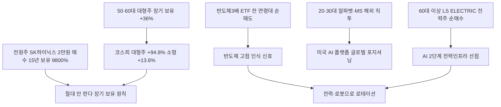

# 주식/세대투자 分析: 전원주 SK하이닉스 9,800% — 5060 대형주 장기 보유 vs 2030 해외주식 세대별 순매수
## 투자 신호 + 사회적 영향 평가

---

## 📌 기사 기본 정보

- **날짜**: 2026-05-14
- **출처**: 머니투데이 (김은령 기자)
- **카테고리**: 경제 > 주식·장기투자
- **핵심 주제**: 배우 전원주 씨가 2011년 SK하이닉스를 2만 원대에 매수 후 "절대 안 판다"며 장기 보유 → 197만 6,000원(9,800% 수익률). 코스피 대형주(+94.8%)가 중형(+33.4%)·소형(+13.6%)·코스닥(+26.7%)을 압도. 50·60대는 삼성전자·SK하이닉스 장기 보유, 20·30대는 미국 빅테크 해외 직투라는 세대별 순매수 전략 차별화 分析

**메타데이터**
- 주요 사건: 전원주 SK하이닉스 9,800% 수익률 재조명, 코스피 대형주 지수 +94.8%(2026 YTD), 중형 +33.4%·소형 +13.6%·코스닥 +26.7%, 전 연령대 공통 순매수 1위 삼성전자·SK하이닉스·현대차, 세대별 차이 해외 직투(20~30대 알파벳·MS) vs 국내 전력주(60대 이상 LS ELECTRIC)
- 핵심 원인: AI 반도체 슈퍼사이클로 코스피 대형주 독주, 20·30대의 해외 직투 플랫폼 접근성 향상, 50·60대의 대형주 장기 보유 관성
- 주요 주체: 전원주(9,800% 수익률 상징), 50·60대(대형주 장기 보유 최대 수혜), 20·30대(해외 직투·레버리지 ETF 차익실현)
- 키워드: 9,800%, 장기 투자, 코스피 대형주 독주, 해외 직투, 피지컬 AI, 세대별 순매수·순매도

---

## 🔍 기사를 통한 투자 신호 추출

### 1단계: 핵심 사건 분해

**What (무엇이 일어났는가?)**
- 코스피 대형주 지수가 2026년 연초 이후 94.8% 급등하며 코스피 전체(+77%), 중형(+33.4%), 소형(+13.6%), 코스닥(+26.7%)을 압도했습니다. 전 연령대에서 삼성전자·SK하이닉스·현대차를 순매수한 공통점이 확인됐고, 세대별 차이는 20·30대의 미국 빅테크 해외 직투 vs 50·60대의 국내 전력주·우량주 집중에서 나타났습니다.

**When (언제 일어났는가?)**
- 2026-05-14 (AI 반도체 사이클 중반, 외국인이 반도체에서 로봇·전력인프라로 리밸런싱하는 시점)

**Why (왜 일어났는가?)**
- 이번 상승장이 AI 반도체 슈퍼사이클에 의한 코스피 대형주 독주 구조였기 때문에, 이를 보유한 투자자와 그렇지 않은 투자자의 수익률 격차가 극단적으로 벌어졌습니다.

**Who (누가 주도하는가?)**
- 최대 수혜: 삼성전자·SK하이닉스 장기 보유자(전원주 씨 포함)
- 다음 수혜 물색: 외국인(로봇·전력인프라로 이동), 60대 이상(LS ELECTRIC 순매수)

---

### 2단계: 투자 신호 해석

#### A. **긍정적 신호 (Bullish)**

**① 60대 이상의 전력주 선호 — AI 인프라 2단계 선행 포착**
- **신호**: 60대 이상이 LS ELECTRIC를 순매수하며 전력 인프라 분야에 선제 진입
- **의미**: AI 1단계(반도체) 수혜를 이미 충분히 누린 보수적 투자자들이 AI 2단계(전력망·전력 설비) 수혜주로 자연스럽게 이동. 외국인의 대한전선·전력인프라 매수와 동일 방향
- **투자 기회**: LS ELECTRIC, 대한전선, 현대일렉트릭, HD현대에너지솔루션

**② 20·30대 미국 빅테크 해외 직투 — AI 소프트웨어·플랫폼 2단계 포지셔닝**
- **신호**: 20·30대 순매수 4~5위 내에 알파벳A·마이크로소프트 포함
- **의미**: 20·30대가 코스피 국내주 외에 미국 AI 플랫폼(구글·MS)을 장기 보유하는 전략을 구사함. AI 소프트웨어·플랫폼 수혜를 직접 포착하려는 시도
- **투자 기회**: 알파벳(GOOGL), 마이크로소프트(MSFT) 장기 보유

---

#### B. **위험 신호 (Bearish)**

**① 반도체 레버리지 ETF 차익 실현 — 고점 인식 신호**
- **신호**: 20대 미만~40대까지 '디렉시온 반도체3배 ETF' 순매도 1위
- **의미**: 반도체 3배 레버리지 ETF를 팔았다는 것은 이 세대들이 반도체 랠리의 단기 고점을 인식하고 차익을 실현한다는 신호. 과열 구간 진입의 경고
- **투자 리스크**: 반도체 대형주의 추가 상승 여력 제한 가능성, 레버리지 ETF 단기 변동성 확대

**② 코스닥 +26.7% — 코스피 대형주(+94.8%) 대비 극단적 소외**
- **신호**: 코스닥 +26.7%로 코스피 대형주(+94.8%)의 4분의 1 수준
- **의미**: 벤처·바이오·소형 성장주가 반도체 독주 구조에서 구조적으로 소외된 상황. 자금이 반도체에서 다음 주도주(로봇·전력)로 이동할 때 코스닥 일부 종목의 복귀 가능성이 있지만 시기 불확실
- **투자 리스크**: 코스닥 장기 저성과로 인한 투자자 이탈 가속화

---

### 3단계: 섹터별 투자 기회 매트릭스

#### ✅ **높은 기대도 + 낮은 리스크**

**코스피 대형주(삼성·SK하이닉스) + 전력인프라(LS ELECTRIC·대한전선) + 해외 빅테크(알파벳·MS)**
- 이번 세대별 순매수 데이터가 보여주는 최적 포트폴리오는 ① 코스피 반도체 대형주(AI 1단계), ② 전력·로봇 인프라(AI 2단계), ③ 미국 AI 소프트웨어 플랫폼(AI 글로벌)의 3분면 구성입니다.
- **투자 추천도**: ⭐⭐⭐⭐⭐

---

## 💰 구체적 투자 신호 변환

### 신호 1: 전원주의 9,800% — "절대 안 판다"는 원칙의 복리 마법

**투자 해석**: 전원주 씨의 9,800% 수익률은 복리와 시간의 마법을 가장 극명하게 보여줍니다. 15년간 단 한 번도 팔지 않은 것이 전략의 전부입니다. 지금 투자를 시작하는 20·30대에게 이 사례는 명확한 메시지를 전달합니다. "AI 시대를 만드는 기업(삼성전자·SK하이닉스·알파벳·마이크로소프트)을 장기 보유하라." 레버리지 ETF 차익 실현(반도체 고점 인식)과 전력인프라 순매수(AI 2단계 선점)라는 현재 시장 시그널을 포트폴리오 조정에 반영해야 합니다.

---

## 🌍 사회적 영향 평가

### A. 긍정적 사회 영향
- **장기 투자 문화 확산**: 전원주 씨 사례가 다시 주목받으면서 젊은 세대에게 '장기 보유의 복리 마법'을 알리는 교육적 효과가 발생합니다.

### B. 부정적 사회 영향
- **투자 격차의 세대 간 고착**: 1990~2000년대부터 대형주를 보유해온 세대와 지금 시작하는 세대 사이의 자산 출발선 격차가 구조적으로 확대됩니다.

---

## 🎯 결론: 당신의 투자 전략 수립

- **즉시 실행**: 반도체 레버리지 ETF 차익 실현 고려. 전력인프라(LS ELECTRIC·대한전선) 및 미국 AI 플랫폼(알파벳·MS) 비중 점진 확대. 코스닥 소형 테마주 비중 축소
- **3개월 후**: AI 2단계(전력·로봇) 로테이션의 속도를 외국인 순매수 동향으로 추적. 코스피 대형주 독주 사이클의 지속 기간을 분기 실적으로 검증

---

## 📝 Obsidian 연결 구조

