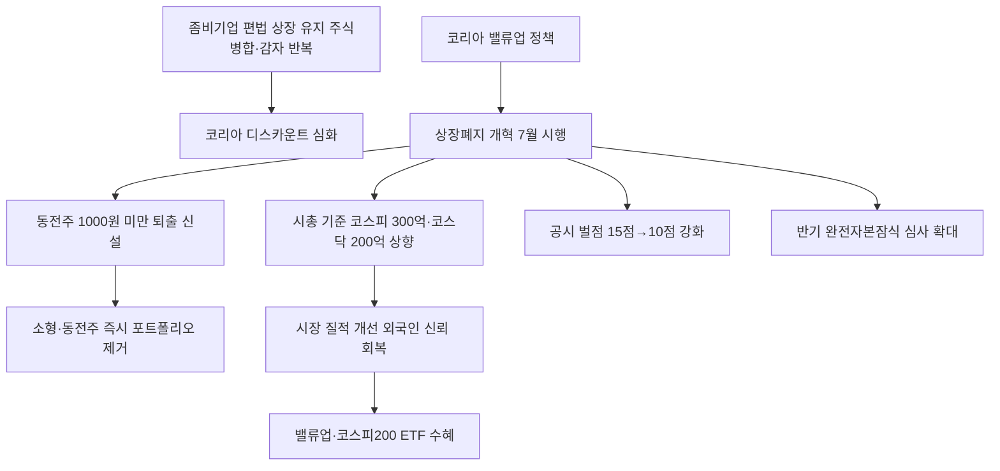

# 증시개혁 分析: 상장폐지 요건 강화 — 동전주 퇴출·시총 기준·공시 벌점·코스피·코스닥 개혁
## 투자 신호 + 사회적 영향 평가

---

## 📌 기사 기본 정보

- **날짜**: 2026-05-14
- **출처**: 방윤영 기자
- **카테고리**: 경제 > 증시개혁
- **핵심 주제**: 금융위원회가 상장폐지 시가총액 요건을 코스피 300억→500억·코스닥 200억→300억 원(단계적 상향)하고, 7월부터 주가 1,000원 미만 동전주 퇴출 기준을 신설. 주식병합·감자를 통한 편법 방지, 공시 위반 벌점 기준 강화(15점→10점), 반기 완전자본잠식 심사 확대로 좀비기업 신속 퇴출 추진

**메타데이터**
- 주요 사건: 2026년 7월 1일 시행 — 코스피 시총 300억·코스닥 200억 원 기준 적용, 동전주(1,000원 미만) 신규 퇴출 요건 신설, 주식병합·감자 우회 방지, 2027년 1월 코스피 500억·코스닥 300억 원으로 추가 상향
- 핵심 원인: 좀비기업의 편법 상장 유지(병합·감자 반복), 코리아 디스카운트 해소를 위한 시장 질적 개선, 밸류업 정책과 연계한 시장 신뢰 회복
- 주요 주체: 금융위원회, 한국거래소, 관리종목 편입 예상 기업, 소액 투자자
- 키워드: 동전주, 관리종목, 상장폐지, 시가총액 기준, 공시 벌점, 완전자본잠식, 주식병합

---

## 🔍 기사를 통한 투자 신호 추출

### 1단계: 핵심 사건 분해

**What (무엇이 일어났는가?)**
- 금융위원회가 상장폐지 개혁 방안을 발표했습니다. 7월 1일부터 ① 시총 요건 대폭 상향(코스피 300억·코스닥 200억 원), ② 동전주(1,000원 미만) 퇴출 요건 신설, ③ 주식병합·감자 편법 방지, ④ 공시 위반 벌점 기준 강화(15점→10점)가 시행됩니다. 2027년 1월에는 시총 기준이 코스피 500억·코스닥 300억 원으로 추가 상향됩니다.

**When (언제 일어났는가?)**
- 2026-05-14 (코리아 밸류업 정책의 후속 조치, 7월 시행을 앞둔 준비 단계)

**Why (왜 일어났는가?)**
- 주식병합·감자를 반복해 동전주 퇴출 기준을 회피하는 좀비기업들이 투자자에게 손실을 끼치는 구조를 차단하기 위해서입니다.
- 코리아 디스카운트 해소를 위한 시장 질적 개선과 밸류업 정책의 연장선상에 있습니다.

**Who (누가 주도하는가?)**
- 정책 주도: 금융위원회·한국거래소
- 영향 대상: 시총 기준 미달 기업(관리종목 편입), 동전주 보유 투자자

---

### 2단계: 투자 신호 해석

#### A. **긍정적 신호 (Bullish)**

**① 시장 질적 개선 → 코스피·코스닥 신뢰도 상승 → 외국인 자금 유입 지속**
- **신호**: 좀비기업 퇴출로 시장 구성 종목의 질적 수준이 높아짐
- **의미**: 코리아 디스카운트 해소의 핵심 원인 중 하나(불투명한 좀비기업 잔존)를 제거하면서 외국인 기관 투자자의 한국 증시 신뢰도가 개선됨. 밸류업 정책과 시너지 효과
- **투자 기회**: 코리아 밸류업 ETF, 코스피200 ETF — 시장 신뢰 개선 수혜

**② 우량 기업 재평가 — 시장 정화 효과**
- **신호**: 동전주·좀비기업 퇴출로 투자자 자금이 우량 기업으로 집중
- **의미**: 부실 기업이 시장에서 제거되면 잔존 우량 기업들의 상대적 밸류에이션이 높아지는 시장 정화 효과 발생
- **투자 기회**: 실적 기반의 우량 중소형주, 코스닥 내 기술력 보유 성장 기업

---

#### B. **위험 신호 (Bearish)**

**① 관리종목 편입 급증 → 단기 수급 교란**
- **신호**: 7월 시행 직전 시총 기준 미달 기업들의 급격한 주가 상승 시도(인위적 거래 가능성) 또는 급락 우려
- **의미**: 7월 1일 시행을 앞두고 관리종목 편입을 피하기 위한 기업들의 증자·병합 시도가 단기 시장 교란을 일으킬 수 있음. 이런 종목에 투자한 소액주주들이 피해를 입을 위험
- **투자 리스크**: 시총 300~500억 원 내외의 소형·동전주 보유 투자자

**② 코스닥 부실 퇴출 가속화 → 코스닥 시총 추가 감소**
- **신호**: 코스닥 이미 코스피 대비 구조적 소외(+26.7% vs +94.8%), 추가 퇴출로 시총 축소
- **의미**: 코스닥 시총이 줄어들면 코스닥100 ETF 등 패시브 자금도 줄어들며 코스닥 유동성이 추가 위축될 수 있음
- **투자 리스크**: 코스닥 소형주 전반의 수급 악화

---

### 3단계: 섹터별 투자 기회 매트릭스

#### ⚠️ **중간 기대도 + 높은 리스크**

**코스닥 소형·동전주 (7월 시행 전 관리종목 편입 리스크)**
- 7월 1일 시행 전 시총 기준 미달 종목을 확인하고, 관리종목 편입 가능성이 있는 종목은 즉시 포트폴리오에서 제거하는 것을 권고합니다.
- **투자 추천도**: ⭐ (퇴출 요건 미달 종목 즉시 회피)

---

## 💰 구체적 투자 신호 변환

### 신호 1: 7월 시행 전 포트폴리오 점검 — 관리종목 편입 예상 종목 즉시 정리

**투자 해석**: 7월 1일 시행을 앞두고 투자자는 즉시 보유 종목의 시가총액을 확인해야 합니다. 코스피 300억 원 미만, 코스닥 200억 원 미만 종목은 관리종목 편입 후 상장폐지 위험에 노출됩니다. 주가 1,000원 미만 동전주도 즉시 매도 검토가 필요합니다. 반면 시장 정화 효과로 코스피200·코스닥 우량주의 상대적 수혜를 기대할 수 있어 KODEX 200 등 우량주 ETF로의 자금 재배치를 검토해야 합니다.

---

## 🌍 사회적 영향 평가

### A. 긍정적 사회 영향
- **소액 투자자 보호 강화**: 좀비기업이 시장에서 퇴출됨으로써 부실 기업에 투자해 손실을 입는 개인 투자자 피해가 구조적으로 감소합니다.

### B. 부정적 사회 영향
- **중소·벤처기업의 성장 기회 조기 차단**: 성장 잠재력이 있지만 아직 시총이 작은 중소기업이 기준 강화로 상장 기회를 잃을 수 있습니다.

---

## 🎯 결론: 당신의 투자 전략 수립

- **즉시 실행**: 보유 종목의 시가총액이 코스피 300억·코스닥 200억 원 미만이거나 주가가 1,000원 미만인 동전주 즉시 매도 검토. 7월 1일 이전 포트폴리오 정리 완료
- **3개월 후**: 관리종목 편입 파동이 일단락된 후 코스닥 내 실제 기술력 보유 기업의 저점 매수 기회 탐색. 코스피200 ETF 비중 유지

---

## 📝 Obsidian 연결 구조

