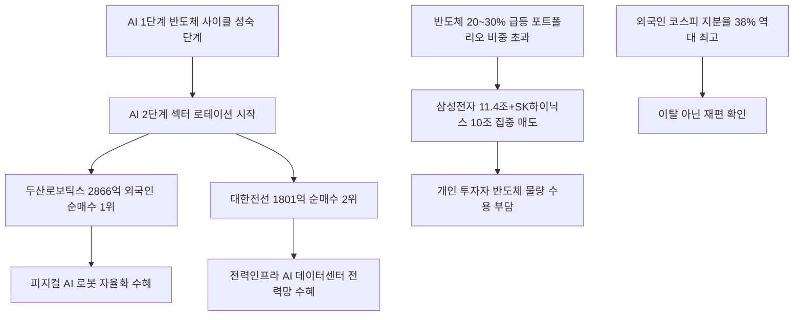

# 증시/수급 分析: 외국인 반도체 매도 21조 — 로봇·전력인프라 매수·두산로보틱스·대한전선·코스피 지분율 역대 최고
## 투자 신호 + 사회적 영향 평가

---

## 📌 기사 기본 정보

- **날짜**: 2026-05-14
- **출처**: 배한님 기자
- **카테고리**: 경제 > 증시·수급
- **핵심 주제**: 외국인이 5거래일 연속 24조 이상 코스피 순매도했지만, 삼성전자·SK하이닉스 단 두 종목에서 21조 원 집중 매도(차익 실현)한 리밸런싱. 동시에 두산로보틱스(2,866억 1위)·대한전선(1,801억 2위) 집중 순매수로 AI 2단계(로봇·전력인프라) 섹터 로테이션 확인. 외국인 코스피 지분율은 31%→38%(7.5%p 상승)라는 역설

**메타데이터**
- 주요 사건: 외국인 5연속 순매도 24조 1,418억 원(삼성전자 11.4조+SK하이닉스 10조=21조 집중), 두산로보틱스 2,866억·대한전선 1,801억 순매수, 80조 원 누적 순매도에도 외국인 코스피 지분율 31%→38% 상승, 삼성전기·현대차 신고가 경신
- 핵심 원인: 반도체 20~30% 급등 후 포트폴리오 비중 초과→리밸런싱, AI 1단계(반도체) 사이클에서 AI 2단계(로봇·피지컬 AI·전력인프라)로 전환 선행
- 주요 주체: 글로벌 기관 투자자(리밸런싱 주도), 두산로보틱스·대한전선(순매수 수혜), 개인 투자자(반도체 매도 물량 수용)
- 키워드: 리밸런싱, 섹터 로테이션, 두산로보틱스, 대한전선, 피지컬 AI, 외국인 지분율 역설

---

## 🔍 기사를 통한 투자 신호 추출

### 1단계: 핵심 사건 분해

**What (무엇이 일어났는가?)**
- 외국인이 5거래일 동안 24조 1,418억 원을 순매도했으나, 그 중 21조 원이 삼성전자(11.4조)와 SK하이닉스(10조)에 집중됐습니다. 동시에 두산로보틱스(2,866억)·대한전선(1,801억)·현대차·POSCO홀딩스 등 약 350개 종목을 순매수했습니다. 누적 80조 원 순매도에도 외국인의 코스피 지분율(시가총액 기준)은 31%→38%(7.5%p 상승)라는 역설이 확인됐습니다.

**When (언제 일어났는가?)**
- 2026-05-14 (삼성전자·SK하이닉스 20~30% 급등 후 과잉 비중 조정 시점, AI 2단계 수혜주 선행 매수 시작)

**Why (왜 일어났는가?)**
- 반도체 급등으로 포트폴리오 내 비중이 목표치를 초과한 외국인들이 비중을 줄이는 리밸런싱을 실시했습니다.
- AI 산업이 1단계(반도체·데이터센터)에서 2단계(로봇·피지컬 AI·전력망)로 전환되면서 선행 매수가 시작됐습니다.

**Who (누가 주도하는가?)**
- 매도 주도: 글로벌 기관(과잉 비중 조정)
- 매수 수혜: 두산로보틱스(로봇), 대한전선(전력인프라), 삼성SDI(배터리), POSCO홀딩스(소재)

---

### 2단계: 투자 신호 해석

#### A. **긍정적 신호 (Bullish)**

**① 두산로보틱스·대한전선 집중 매수 — AI 2단계 외국인 선행 포착**
- **신호**: 두산로보틱스 2,866억(순매수 1위)·대한전선 1,801억(2위) — 외국인이 로봇·전력인프라에 최대 자금 투입
- **의미**: 세계 최대 기관 투자자들이 이미 AI 2단계 수혜주를 선행 매수하는 패턴 확인. 개인 투자자는 이 흐름을 따라 로봇·전력인프라 관련주를 분할 매수할 기회
- **투자 기회**: 두산로보틱스(454910), 대한전선(001440), LS ELECTRIC, 현대일렉트릭

**② 외국인 코스피 지분율 38% 역대 최고 — 코리아 디스카운트 해소 진행 중**
- **신호**: 80조 원 누적 순매도에도 외국인 코스피 지분율 31%→38%(7.5%p 상승)
- **의미**: 팔았지만 보유 종목 가격 상승으로 지분율이 오른 역설은 외국인이 한국 증시에서 '이탈'이 아닌 '재편'하고 있음을 의미. 코리아 디스카운트 해소 구조가 공고해지는 과정
- **투자 기회**: 코스피 대형주·코리아 밸류업 ETF 중기 보유 유지

---

#### B. **위험 신호 (Bearish)**

**① 삼성전자·SK하이닉스 리밸런싱 지속 가능성 — 추가 매도 압박**
- **신호**: 5연속 순매도에서 21조 원이 반도체 2종목에 집중
- **의미**: 외국인의 반도체 리밸런싱이 아직 완료되지 않았다면 추가 매도 압박이 지속될 수 있어 단기 반도체 주가 조정이 이어질 수 있음
- **투자 리스크**: 삼성전자·SK하이닉스 단기 변동성 확대, 개인 투자자 물량 소화 부담

**② 개인이 외국인 매도 물량 수용 — 고점 물량 부담**
- **신호**: 외국인 14조+ 순매도를 개인·기관이 수용
- **의미**: 외국인 리밸런싱이 지속되면 개인이 고점 매수한 반도체 물량이 단기 손실 위험에 노출됨
- **투자 리스크**: 반도체 단기 조정 시 개인 투자자 손절 압박

---

### 3단계: 섹터별 투자 기회 매트릭스

#### ✅ **높은 기대도 + 낮은 리스크**

**두산로보틱스·대한전선·전력인프라 (외국인 선행 매수 확인, AI 2단계 초입)**
- 세계 최대 기관들이 이미 두산로보틱스·대한전선을 1~2위로 순매수한다는 것은 AI 2단계 수혜주 랠리의 초입임을 의미합니다. 외국인이 선행 포지셔닝하는 방향을 따라가는 전략이 역사적으로 가장 높은 성공률을 보입니다.
- **투자 추천도**: ⭐⭐⭐⭐⭐

---

## 💰 구체적 투자 신호 변환

### 신호 1: 외국인의 AI 2단계 선행 매수 — 두산로보틱스·대한전선이 보내는 로테이션 시그널

**투자 해석**: 외국인의 두산로보틱스 1위·대한전선 2위 순매수는 AI 산업의 다음 단계(피지컬 AI·전력인프라)를 선점하라는 가장 명확한 시장 신호입니다. 투자자는 ① 두산로보틱스·LS ELECTRIC·대한전선·현대일렉트릭 등 AI 2단계 인프라주를 분할 매수하고, ② 반도체 대형주(삼성전자·SK하이닉스)는 리밸런싱 매물이 소화되는 구간에서 저점 재매수 기회를 노리는 투트랙 전략을 실행해야 합니다.

---

## 🌍 사회적 영향 평가

### A. 긍정적 사회 영향
- **AI 2단계 수혜 기업 성장 → 신규 일자리 창출**: 두산로보틱스 등 로봇 기업의 외국인 자금 유입이 기업 성장과 R&D 투자 확대로 이어지면 첨단 제조업 일자리가 창출됩니다.

### B. 부정적 사회 영향
- **정보 비대칭 피해**: 외국인이 이미 두산로보틱스·대한전선을 선행 매수하는 흐름을 실시간으로 파악하지 못한 개인 투자자들이 뒤늦게 고점 매수할 위험이 있습니다.

---

## 🎯 결론: 당신의 투자 전략 수립

- **즉시 실행**: 두산로보틱스·대한전선·LS ELECTRIC·현대일렉트릭 분할 매수 시작. 삼성전자·SK하이닉스 리밸런싱 매물 소화 후 저점 재매수 포지션 대기
- **3개월 후**: 외국인 로봇·전력인프라 순매수 지속 여부 추적. AI 2단계 기업들의 실적 가시화(수주 발표·매출 성장) 시점을 추가 매수 판단 기준으로 활용

---

## 📝 Obsidian 연결 구조

