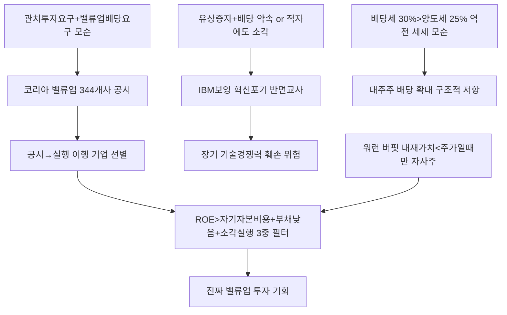

# 증시/지배구조 分析: 주주환원 딜레마 — 코리아 밸류업의 모순·자사주 매입 vs 투자·IBM·보잉 반면교사
## 투자 신호 + 사회적 영향 평가

---

## 📌 기사 기본 정보

- **날짜**: 2026-05-14
- **출처**: 중앙일보 (염지현 금융팀 기자, 'Long View' 시리즈)
- **카테고리**: 경제 > 증시·지배구조
- **핵심 주제**: 코리아 밸류업 정책으로 주주환원이 증가하지만 투자 대신 주가 달래기에 그치는 사례 속출. IBM·보잉은 자사주 매입에 집중하다 기술 혁신 포기 → 추락한 반면교사. 한국 밸류업의 세 가지 구조적 모순(투자+배당 동시 요구, 세제 모순, 관치와 밸류업 충돌) 분析

**메타데이터**
- 주요 사건: 한화솔루션 2.4조 유상증자+순이익 10% 환원(돈 빌리면서 사은품), 빙그레·롯데웰푸드 영업이익 30% 감소에도 자사주 소각, 코스피 상장사 42.5%(344개사) 밸류업 공시, 배당소득 분리과세 최고세율(30%) > 양도소득세 최고세율(25%) 세제 역차별
- 핵심 원인: ROE < 자기자본비용인 기업의 구조적 주주환원 필요, IBM·보잉 자사주 매입 집중 후 혁신 포기 교훈, 정부의 투자+배당 동시 요구라는 모순
- 주요 주체: 한화솔루션·빙그레·롯데웰푸드(비정상 주주환원 사례), IBM·보잉(미국 반면교사), 워런 버핏(자사주 원칙)
- 키워드: ROE, 주주환원율, 자사주 소각, 배당소득 분리과세, 관치 충돌, IBM 쇠락, 보잉 결함

---

## 🔍 기사를 통한 투자 신호 추출

### 1단계: 핵심 사건 분해

**What (무엇이 일어났는가?)**
- 코스피 상장사의 42.5%가 밸류업 공시에 참여했지만, 한화솔루션처럼 유상증자(청구서)를 내밀며 동시에 배당(사은품)을 약속하거나, 빙그레·롯데웰푸드처럼 영업이익이 30% 줄었는데도 자사주를 소각하는 '주가 방어형' 주주환원이 속출하고 있습니다. 한국 밸류업의 세 가지 구조적 모순(①투자+배당 동시 요구 ②배당세율 역전 ③관치+밸류업 충돌)이 부각됩니다.

**When (언제 일어났는가?)**
- 2026-05-14 (밸류업 공시 기업 714개사, 코스피21%p 초과 달성 이후 제도 질적 평가 시점)

**Why (왜 일어났는가?)**
- 주주환원의 원칙(ROE < 자기자본비용일 때만 배당·자사주 소각이 합리적)이 정치적 압박에 의해 왜곡됐습니다.
- IBM과 보잉이 주주환원에 집중하다 기술 혁신을 포기해 추락한 미국의 반면교사를 한국이 반복할 수 있습니다.

**Who (누가 주도하는가?)**
- 모순 설계 주체: 정부(투자 요구 + 배당 확대 요구 동시)
- 피해 당사자: 장기적으로 혁신 투자가 줄어드는 기업과 그 주주들

---

### 2단계: 투자 신호 해석

#### A. **긍정적 신호 (Bullish)**

**① ROE > 자기자본비용 기업의 자사주 소각 — 진짜 밸류업**
- **신호**: ROE가 자기자본비용을 상회하면서 잉여 현금을 주주에게 돌려주는 기업
- **의미**: 워런 버핏의 원칙처럼 내재가치가 주가보다 낮을 때만 자사주 매입을 하는 기업, 즉 성과에 기반한 진짜 주주환원 기업이 장기 주가 우상향을 달성
- **투자 기회**: ROE 15% 이상 + 부채비율 낮음 + 자사주 소각 실행 기업 선별 (삼성전자·SK하이닉스 등 실적 기반 기업)

**② 밸류업 공시 344개사 → 배당 확대 실행 기업 선별 기회**
- **신호**: 공시 기업 344개사 중 실제로 배당 40% 이상 성향을 충족하는 기업은 32.3%에 불과
- **의미**: 공시와 실행의 괴리에서 '진짜 밸류업 기업'을 선별하면 초과 수익 기회가 있음
- **투자 기회**: 밸류업 공시 후 실제 자사주 소각·배당 확대를 3분기 이내에 이행하는 기업 리스트 작성

---

#### B. **위험 신호 (Bearish)**

**① IBM·보잉 패턴 — 한국 대기업의 혁신 포기 위험**
- **신호**: IBM은 자사주 매입에 집중하다 클라우드 시장에서 밀렸고, 보잉은 잇따른 기체 결함이 투자 포기의 결과로 지목됨
- **의미**: 삼성전자·현대차 등 한국 대기업이 자사주 소각·배당 압박에 응하면서 R&D·설비 투자를 줄인다면 5~10년 후 기술 경쟁력이 훼손되는 보잉형 위기 가능성
- **투자 리스크**: 단기 주주환원을 확대하되 R&D 투자를 줄이는 기업 — 장기 성장성 훼손

**② 배당소득세 역전 구조 — 대주주의 배당 확대 저항**
- **신호**: 배당소득 분리과세 최고세율(30%) > 양도소득세 최고세율(25%)
- **의미**: 대주주 입장에서 배당보다 자사주 소각이 세금 면에서 유리하여 배당 확대에 구조적으로 저항. 밸류업 정책의 핵심 수혜 지표인 '배당성향 40%' 달성 기업이 32.3%에 그치는 원인
- **투자 리스크**: 배당소득세 역전 구조가 해소되지 않는 한 밸류업 배당 확대의 구조적 한계

---

### 3단계: 섹터별 투자 기회 매트릭스

#### ✅ **높은 기대도 + 낮은 리스크**

**ROE 기반 진짜 밸류업 기업 (공시→실행 이행 선별)**
- 밸류업 공시 344개사 중 실제 자사주 소각·배당 확대를 이행하는 기업을 선별하는 것이 핵심 투자 전략입니다. ROE > 자기자본비용 + 실행 이행 확인의 두 가지 기준으로 필터링하면 진짜 밸류업 수혜주를 발굴할 수 있습니다.
- **투자 추천도**: ⭐⭐⭐⭐

---

## 💰 구체적 투자 신호 변환

### 신호 1: '공시에서 실행으로' — 진짜 밸류업 기업 필터링 전략

**투자 해석**: 밸류업 공시만으로는 충분하지 않습니다. 실제로 자사주를 소각하거나 배당을 확대한 기업, 그리고 그 재원이 잉여 현금(ROE>자기자본비용)에서 나온 기업이 진짜 밸류업입니다. 한화솔루션처럼 유상증자를 하면서 배당을 약속하거나, 영업이익이 줄었는데도 자사주를 소각하는 기업은 오히려 장기 투자를 포기하는 IBM·보잉의 한국판이 될 수 있습니다. 투자자는 'ROE > 자기자본비용 + 부채비율 낮음 + 자사주 소각·배당 실행'의 3중 필터로 진짜 밸류업 기업을 선별해야 합니다.

---

## 🌍 사회적 영향 평가

### A. 긍정적 사회 영향
- **소액 주주 권리 강화**: 밸류업 정책이 기업들의 주주 중심 경영을 촉진하면서 소액 주주들이 기업 성장의 과실을 실질적으로 나눠 갖는 문화가 확산됩니다.

### B. 부정적 사회 영향
- **장기 혁신 투자 포기의 사회적 비용**: 단기 주주환원에 집중하다 R&D 투자를 줄이면, 5~10년 후 기술 경쟁력 하락으로 인한 일자리 감소와 산업 공동화가 사회 전체의 비용으로 돌아옵니다.

---

## 🎯 결론: 당신의 투자 전략 수립

- **즉시 실행**: 보유 기업의 밸류업 공시 내용과 실제 자사주 소각·배당 이행 여부 확인. 유상증자와 동시에 배당을 약속하는 기업은 주의. ROE 15% 이상 실적 기반 밸류업 기업 선별
- **3개월 후**: 3분기 중 밸류업 공시 이행 기업 리스트 업데이트. 배당소득세 역전 구조 개선 여부(세제 개편 논의) 모니터링

---

## 📝 Obsidian 연결 구조

