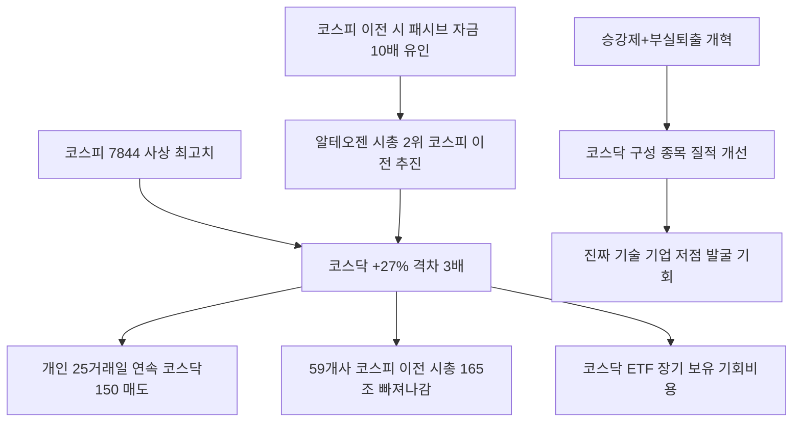

# 증시/코스닥 分析: 코스닥 침체 — 알테오젠 이전·개인 이탈·코스닥 승강제·부실 퇴출 개혁
## 투자 신호 + 사회적 영향 평가

---

## 📌 기사 기본 정보

- **날짜**: 2026-05-14
- **출처**: 중앙일보 (장서윤 기자, 'Cover Story')
- **카테고리**: 경제 > 증시·코스닥
- **핵심 주제**: 코스피 사상 최고치(7,844) vs 코스닥 +27.17% 격차 3배 이상 심화. 시총 2위 알테오젠의 코스피 이전 추진으로 코스닥 우량기업 이탈 가속화. 개인 투자자 25거래일 연속 KODEX 코스닥150 매도·코스피200 매수. 정부의 코스닥 승강제+부실 퇴출 개혁 병행 추진

**메타데이터**
- 주요 사건: 코스피 YTD +86.13% vs 코스닥 +27.17%(격차 3배 이상), 알테오젠 코스피 이전 추진 충격, 코스닥 우량기업 총 59개사 코스피 이전(시총 165.9조 원 = 코스닥 전체의 25%), 개인 KODEX 코스닥150 25거래일 연속 매도(7,524억 원), KODEX 200 4,488억 순매수, 승강제 도입 추진
- 핵심 원인: AI 반도체 독주로 코스피 대형주 쏠림, 코스피 이전 시 패시브 자금 10배 차이, 코스닥 20년 구조적 소외
- 주요 주체: 알테오젠(이전 추진), 코스닥 협회(잔류 호소), 개인 투자자(코스닥 이탈), 금융당국(승강제·부실 퇴출 추진)
- 키워드: 코스닥 이탈, 알테오젠, 코스피 이전, 패시브 자금 10배, 승강제, 부실 퇴출, 벤처 생태계

---

## 🔍 기사를 통한 투자 신호 추출

### 1단계: 핵심 사건 분해

**What (무엇이 일어났는가?)**
- 코스피가 사상 최고치를 경신하는 사이 코스닥은 격차가 3배 이상으로 벌어지며 20년째 구조적 소외를 겪고 있습니다. 시총 2위 알테오젠의 코스피 이전 추진에 코스닥 협회가 공동 호소문을 낼 정도로 상징적 충격이 컸습니다. 개인 투자자들도 25거래일 연속 코스닥 ETF를 매도하고 코스피 ETF를 매수하며 이탈을 가속화했습니다.

**When (언제 일어났는가?)**
- 2026-05-14 (코스피 7,844 사상 최고치 경신, 코스닥 구조적 소외 심화 시점)

**Why (왜 일어났는가?)**
- 코스피 이전 시 유입되는 패시브 자금이 코스닥보다 10배 이상 커지는 구조적 유인 때문에 우량 기업들이 계속 코스닥을 떠납니다.
- AI 반도체 랠리가 코스피 대형주에 집중되면서 코스닥의 상대적 매력이 급감했습니다.

**Who (누가 주도하는가?)**
- 이탈 주체: 알테오젠 등 코스닥 우량기업(코스피 이전)
- 이탈 동반: 개인 투자자(KODEX 코스닥150 연속 매도)
- 개혁 주체: 금융당국(승강제·부실 퇴출 개혁 추진)

---

### 2단계: 투자 신호 해석

#### A. **긍정적 신호 (Bullish)**

**① 코스닥 승강제 + 부실 퇴출 개혁 — 시장 정화 후 재평가 기회**
- **신호**: 금융당국의 코스닥 승강제(1부·2부 구분) + 부실 퇴출 강화로 코스닥 구성 종목의 질적 개선
- **의미**: 시장 정화 효과가 본격화되면 코스닥 내 진짜 기술력 보유 기업들이 부각되는 재평가 기회가 생길 수 있음. 다만 시기는 불확실
- **투자 기회**: 코스닥 내 실적 기반 소부장(소재·부품·장비)·바이오·AI 응용 기업 중장기 발굴

**② 반도체→비반도체 로테이션 시 코스닥 바이오·소부장 복귀 시나리오**
- **신호**: 외국인이 반도체에서 로봇·전력인프라로 이동하는 흐름
- **의미**: 다음 단계로 AI 응용 소프트웨어·바이오 헬스케어로 자금이 이동하면 코스닥 내 해당 기업들이 순차적으로 주목받을 가능성
- **투자 기회**: 코스닥 AI 응용 소프트웨어·바이오 기업 장기 분산 매집

---

#### B. **위험 신호 (Bearish)**

**① 우량기업 이탈 가속화 → 코스닥 시총 구조적 축소**
- **신호**: 59개사 이전 완료, 이전 기업 시총 165.9조 원(코스닥 전체의 25%) 빠져나감
- **의미**: 우량 기업이 코스닥을 성장 발판으로 쓰고 코스피로 옮겨가는 구조가 반복되면, 코스닥은 영원히 '임시 시장'에 머물게 됨. 패시브 자금 유입도 구조적으로 제한
- **투자 리스크**: 코스닥 지수 ETF(KODEX 코스닥150) 장기 보유자의 기회비용 손실

**② 개인 투자자 25거래일 연속 이탈 — 코스닥 유동성 급감**
- **신호**: KODEX 코스닥150 25거래일 연속 매도(7,524억 원)
- **의미**: 기업과 개인이 동시에 코스닥을 떠나는 이중 이탈이 지속되면 코스닥 유동성이 구조적으로 감소하여 소형주 투자 환경이 악화됨
- **투자 리스크**: 코스닥 소형·중형주의 매도 출구 부재, 스프레드 확대

---

### 3단계: 섹터별 투자 기회 매트릭스

#### ⚠️ **중간 기대도 + 높은 리스크**

**코스닥 ETF (구조적 소외 장기화 vs 개혁 기대감 공존)**
- 코스닥의 구조적 소외는 20년 이상 지속돼 온 문제로 단기 해소가 어렵습니다. 승강제 도입과 부실 퇴출 개혁이 가시화되는 시점에 코스닥 내 우량 기업을 선별 매수하는 것이 가장 합리적입니다.
- **투자 추천도**: ⭐⭐ (개별 종목 선별 접근)

---

## 💰 구체적 투자 신호 변환

### 신호 1: 코스닥 이중 이탈 속 역발상 — 진짜 기술 기업 저점 발굴

**투자 해석**: 코스닥의 구조적 소외와 이중 이탈(기업+개인)이 지속되는 환경에서 역발상 접근이 필요합니다. 용대인 IBK투자증권 리서치부문장이 지적한 "코스닥에는 반도체 소부장·바이오·2차전지 기업이 포진"한다는 사실에 주목해야 합니다. 시장이 코스닥 전체를 외면할 때 실질 기술력을 보유한 기업들의 저점 발굴이 가능합니다. 단, 코스닥 ETF 전체 매수보다는 개별 기업 선별이 더 효율적입니다.

---

## 🌍 사회적 영향 평가

### A. 긍정적 사회 영향
- **벤처·스타트업 자금 조달 창구 유지**: 코스닥 개혁이 성공하면 혁신 기업들이 성장 자금을 조달하는 플랫폼으로서의 기능이 회복됩니다.

### B. 부정적 사회 영향
- **벤처 생태계 위축**: 코스닥 구조적 소외가 지속되면 스타트업이 성장 자금을 조달하는 경로가 막혀 혁신 기업 생태계 전체가 위축됩니다.

---

## 🎯 결론: 당신의 투자 전략 수립

- **즉시 실행**: KODEX 코스닥150 ETF 비중 최소화. 코스닥 내 실적 기반 소부장·바이오·AI 응용 기업 중장기 개별 선별 리스트 작성
- **3개월 후**: 코스닥 승강제 도입 일정 및 알테오젠 이전 상장 결과 확인. 부실 퇴출 개혁 이후 코스닥 구성 종목의 질적 변화 모니터링

---

## 📝 Obsidian 연결 구조

