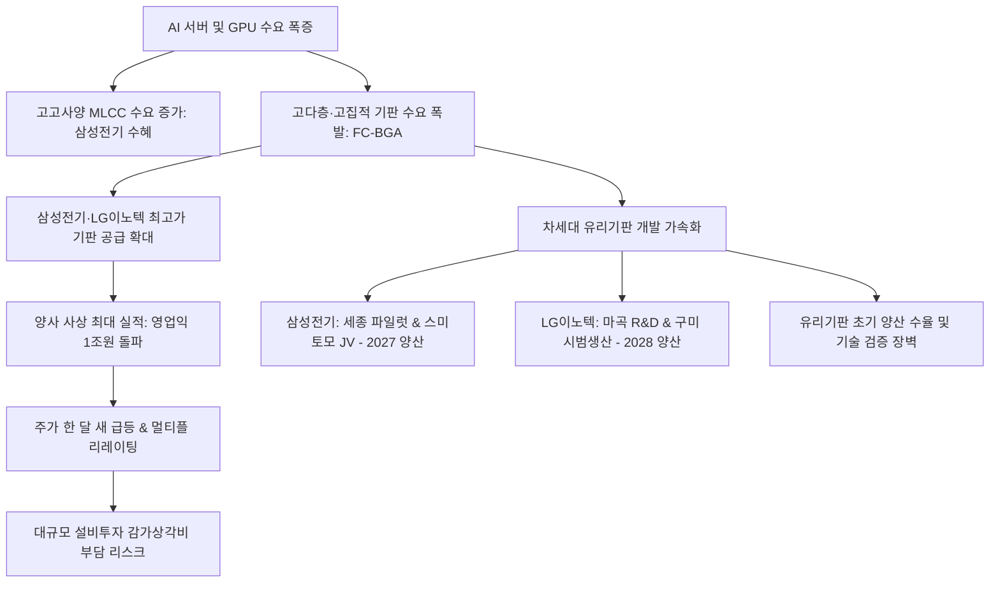

# 산업/증시 분석: 삼성전기·LG이노텍 AI 서버용 패키지 기판 수요 폭증 및 유리기판 개발 분석
## 투자 신호 + 사회적 영향 평가

---

## 📌 기사 기본 정보

- **날짜**: 2026-05-27
- **출처**: 연합뉴스 및 증권업계 종합 자료 분석
- **카테고리**: 경제 > 산업 > 증시
- **핵심 주제**: AI 시대의 '숨은 승자'로 부상 중인 삼성전기와 LG이노텍의 실적 및 주가 분석. 고성능 GPU와 AI 서버 구동에 필수적인 차세대 패키징 기판(FC-BGA) 수요 폭증으로 올해 나란히 사상 최대 실적을 기록할 전망. 또한 차세대 기판 기술인 '꿈의 기판' 유리기판의 개발이 탄력을 받으며 장기 성장동력 확보. 양사는 ECTC 2026(세계 최대 반도체 패키징 학회)에 참여하여 차세대 기술을 선보이고 글로벌 고객사 확보에 총력을 기울이고 있음.

**메타데이터**
- 주요 사건: 삼성전기·LG이노텍 AI 기판(FC-BGA) 수요 폭증으로 한 달 새 주가 급등 및 사상 최대 영업이익 전망 (삼성전기 영업익 전망 1조 5,340억 원, LG이노텍 영업익 전망 1조 1,115억 원)
- 핵심 원인: AI 서버와 고성능 GPU 연산을 지원할 고다층·고집적 기판(FC-BGA)의 기술적 공급 병목 현상, 고용량 MLCC 수요의 비약적 증가, 휨 현상을 극복한 차세대 유리기판 양산 준비 가속화
- 주요 주체: 삼성전기, LG이노텍, 엔비디아(수요처), 스미토모화학그룹(삼성전기 파트너)
- 키워드: #AI기판 #FC_BGA #유리기판 #MLCC #삼성전기 #LG이노텍 #ECTC2026 #AI인프라 #반도체패키징

---

## 🔍 기사를 통한 투자 신호 추출

### 1단계: 핵심 사건 분해

**What (무엇이 일어났는가?)**
- AI 서버 및 고성능 GPU 수요 증가로 이를 물리적으로 연결하는 필수 부품인 플립칩 볼그리드어레이(FC-BGA)의 수요가 폭발적으로 증가함.
- 이에 따라 기판 공급력을 갖춘 삼성전기와 LG이노텍이 AI 핵심 인프라 파트너로 재평가되며 주가가 한 달 새 약 2배 가까이 급등함.
- 올해 두 기업 모두 사상 최대 수준의 영업이익을 기록할 것으로 전망됨 (삼성전기 1조 5,340억 원(YoY +261%), LG이노텍 1조 1,115억 원(4년 만에 1조 원 고지 복귀)).
- 미래 기술의 게임 체인저인 '유리기판'의 양산 타임라인(삼성전기 2027년, LG이노텍 2028년)이 구체화됨.

**When (언제 일어났는가?)**
- 2026-05-27 (ECTC 2026 학회 참가 시점 및 1분기 실적 발표 이후의 2분기 가이던스 확인 시점)

**Why (왜 일어났는가?)**
- 고성능 AI 칩은 회로선 폭이 미세하고 촘촘하지만 메인보드는 회선 폭이 넓어, 둘 사이의 신호 전달을 매개해 줄 고다층·고집적 기판(FC-BGA) 기술력이 필수적임. 그러나 불량률 없이 안정적으로 양산 가능한 업체가 글로벌 시장에서 소수에 불과하기 때문에 단가와 마진이 극대화됨.
- 또한 AI 서버와 고성능 GPU의 발열 및 전력 소모를 안정화하기 위해 스마트폰 대비 수십 배 이상의 고사양 적층세라믹커패시터(MLCC) 탑재가 강제되어, 적층 구조와 유전체 미세화 기술을 보유한 국내 부품사의 가치가 부각됨.

**Who (누가 주도하는가?)**
- 글로벌 빅테크(엔비디아, AMD 등 GPU 공급사 및 하이퍼스케일러)가 기판 공급망 선점을 경쟁적으로 시도 중이며, 주가는 외국인과 기관의 강력한 수급 유입에 의해 견인됨.

---

### 2단계: 투자 신호 해석

#### A. **긍정적 신호 (Bullish)**

**① 단순 IT 부품 공급사에서 글로벌 AI 인프라 핵심 파트너로의 재평가(Re-rating)**
- **신호**: 주가의 급등과 대규모 이익 전망치 상향 (삼성전기 1조 5.3천억, LG이노텍 1조 1.1천억)
- **의미**: 기존의 스마트폰·PC 시장 정체 리스크를 AI 인프라(서버, 데이터센터, 휴머노이드 로봇) 수혜로 완벽하게 극복함. 고부가가치 부품의 장기 공급선 지위 확보는 과거 부품사의 고질적인 저평가 요인(낮은 PER 배수)을 극복하고 멀티플 상승을 이끄는 핵심 요인임.
- **투자 기회**: [[삼성전기]], [[LG이노텍]]의 기판 및 MLCC 사업 영역 지배력 강화.

**② 게임 체인저 기술인 '유리기판' 상용화 타임라인 구체화**
- **신호**: 삼성전기(세종 파일럿 라인 가동, 스미토모와 JV 설립, 2027년 양산), LG이노텍(마곡 R&D·구미 공장 개발 시범 생산, 2028년 양산)
- **의미**: 유리기판은 기존 유기소재 기판 대비 미세 회로 구현이 용이하고 신호 손실을 20~30% 절감하며 휨 현상이 적어 고사양 패키징의 궁극적 솔루션임. 양산 로드맵의 선제적 구체화는 2~3년 뒤의 차세대 AI 칩 설계 표준을 선점했다는 신호임.
- **투자 기회**: 유리기판 밸류체인 소속 대장주.

---

#### B. **위험 신호 (Bearish)**

**① 단기 급등에 따른 피로감 및 밸류에이션 리스크 (기사 내 수치 오류 확인)**
- **신호**: 기사 텍스트 내 주가 표기 오류("삼성전기 163만원, LG이노텍 104만4000원") 및 한 달 새 2배 급등 언급.
- **의미**: 실제 주가는 삼성전기 약 163,000원, LG이노텍 약 204,400원 수준(혹은 표기 오독에 의한 수치)으로 추정되나, 단기간 내 2배 가까운 급등은 실적 개선 기대를 상당 부분 선반영했음을 시사함. AI 인프라 투자의 단기 속도 조절이나 수주 연기 시 주가 변동성이 극대화될 수 있음.
- **투자 리스크**: 선반영된 밸류에이션 부담에 따른 단기 조정 가능성.

**② 대규모 설비투자(CAPEX) 경쟁에 따른 현금 흐름 압박**
- **신호**: 파일럿 라인 구축 및 글로벌 합작법인(JV) 설립, 대규모 설비 투자 지속
- **의미**: 고성능 FC-BGA 및 유리기판 생산 라인은 조 단위 투자가 수반되는 장치 산업의 특성을 지님. 경쟁사(이비덴, 신코덴키 등 일본계 및 대만계 기판사)와의 치킨게임 발생 시 감가상각비 부담으로 인해 단기 수익성이 훼손될 리스크가 상존함.

---

### 3단계: 섹터별 투자 기회 매트릭스

#### ✅ **높은 기대도 + 중간 리스크**

**독점적 기술 장벽을 확보한 대형 반도체 패키징 기판 및 부품 제조사**
- AI 서버 구동을 위한 전력 제어(MLCC)와 데이터 전송(FC-BGA/유리기판) 핵심 기술을 내재화한 부품사는 하이퍼스케일러들의 투자 수요에 직접 연동됩니다. 특히, 진입 장벽이 높은 유리기판의 조기 상용화 로드맵을 가진 상위 벤더는 중장기 독점 마진을 향유할 가능성이 매우 높습니다.
- **투자 추천도**: ⭐⭐⭐⭐☆ (별 4.5개)

---

## 💰 구체적 투자 신호 변환

### 신호 1: AI 서버 패키징 병목 해소의 열쇠 — 고성능 기판의 구조적 우위 유지
- **투자 해석**: 대형 GPU와 고다층 기판 사이의 공급 병목은 AI 성장 사이클의 구조적 현상입니다. 삼성전기와 LG이노텍은 단순 IT 하드웨어 기업에서 글로벌 빅테크의 AI 인프라 핵심 공급망 파트너로 체질을 완전히 전환했습니다. 특히 MLCC와 FC-BGA 사업을 동시에 보유한 삼성전기의 경우 포트폴리오 다각화 측면에서 더 유리하며, LG이노텍은 기판 사업의 급성장으로 기존 광학솔루션(카메라 모듈)에 쏠려 있던 단일 사업 리스크를 극적으로 해소하고 있습니다. 단기 급등에 따른 차익 매물 소화 과정을 거쳐, 분할 매수 관점에서의 접근이 매우 유효합니다.

---

## 🌍 사회적 영향 평가

### A. 긍정적 사회 영향
- **IT 부품 산업의 첨단 제조 르네상스**: 저부가 제조 위주의 국내 기판 산업이 글로벌 최고 수준의 초정밀 반도체 서브스트레이트 산업으로 진화하며 고급 R&D 및 정밀 제조 관련 청년 일자리를 다수 창출합니다.
- **글로벌 공급망 다변화 및 국가 경쟁력 제고**: 특정 국가에 편중되어 있던 고성능 반도체 패키징 공급망 리스크를 분산하고, 대한민국이 AI 하드웨어 생태계의 중추적 연결고리 역할을 공고히 다지게 됩니다.

### B. 부정적 사회 영향
- **자원 집중 및 중소 부품 협력사의 양극화**: 대기업의 CAPEX 집중에 따라 유전체, 유리 원재료 등 핵심 공급망 내 상위 협력사들만 혜택을 보고, 기존 일반 가전용 부품을 제조하는 영세 협력업체들은 수급 단절과 경영난에 직면하는 낙수효과 양극화가 심화될 수 있습니다.

---

## 🎯 결론: 당신의 투자 전략 수립

- **즉시 실행**: MLCC와 기판 사업 포트폴리오를 보유하여 하드웨어 병목에 전방위 수혜를 받는 [[삼성전기]]의 비중 확대를 검토하고, 체질 개선 효과가 뚜렷한 [[LG이노텍]]의 기판 사업 매출 추이를 분기 실적으로 밀착 추적합니다.
- **3개월 후**: 양사의 '유리기판' 시제품 테스트 피드백 및 파일럿 라인의 생산 수율 데이터(Yield Rate)를 검증하고, 스미토모화학 등 글로벌 파트너십의 양산 준비 단계를 재평가하여 포트폴리오 내 비중을 조정합니다.

---

## 📝 Obsidian 연결 구조

