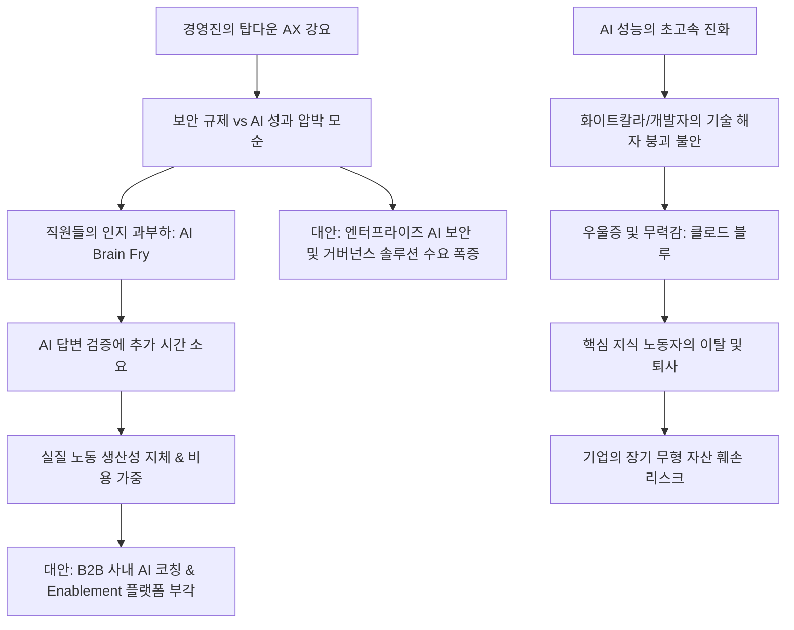

# 테크/산업 분석: AI 과부하(AI Brain Fry)와 클로드 블루(Claude Blue) 및 기업 AX 전환의 그늘 분석
## 투자 신호 + 사회적 영향 평가

---

## 📌 기사 기본 정보

- **날짜**: 2026-05-30 (추정)
- **출처**: 중앙일보 (직장인 커뮤니티 블라인드 설문조사 - 5,284명 참여 분석)
- **카테고리**: 경제 > 테크 > 산업
- **핵심 주제**: 급격한 AI 기술 도입 및 기업들의 무리한 AI 전환(AX) 압박으로 인한 직장인들의 정신적 피로감('AI 과부하', AI Brain Fry)과 심리적 우울증('클로드 블루', Claude Blue) 현상 분석. 설문 조사 결과, 'AI 답변 검증에 시간이 더 걸림(31.6%)', 'AI에 대체될 것 같은 불안감(25.3%)', '생산성 향상 압박(23.6%)' 등이 직장인들이 현타를 느끼는 주요 요인으로 지목됨. 단순 도구 도입을 넘어 조직의 AI 성숙도를 질적으로 관리하는 'AI 활성화(Enablement)'의 중요성 대두.

**메타데이터**
- 주요 사건: 직장인들의 'AI 과부하(AI Brain Fry)' 증상 호소 증가 및 '클로드 블루(Claude Blue)' 정신 피로 현상 확산
- 핵심 원인: 보안 규제와 성과(AX 아이디어) 요구 간의 모순, 프롬프트 엔지니어링 및 툴 학습 피로, AI 에이전트 무차별 생성에 따른 클라우드 토큰 소모 비용 증가, 인간 대체 불안감
- 주요 주체: 국내 대기업 및 IT 스타트업 임직원, 글로벌 빅테크(메타, 아마존 등)
- 키워드: #AI과부하 #클로드블루 #AX전환 #B2BSaaS #AI활성화 #블라인드설문 #정신건강 #AI생산성딜레마

---

## 🔍 기사를 통한 투자 신호 추출

### 1단계: 핵심 사건 분해

**What (무엇이 일어났는가?)**
- 급격한 AI 발전 속도와 대비되는 직장인들의 인지적 한계 및 부작용이 수면 위로 올라옴. 직장인들은 AI로 인해 멀티태스킹이 과도화되고, AI 답변을 교차 검증(Fact-check)하는 데 더 많은 시간을 소모하는 '생산성 패러독스'를 겪고 있음.
- 업무 전반에 무리하게 AI 평가지표(KPI)를 적용한 결과, 불필요한 AI 에이전트 생성과 토큰 남용으로 비용이 급증하는 부작용이 나타남.
- 이에 대안으로 우아한형제들(배달의민족), 마이리얼트립 등 선두 기업들은 구성원을 상향 평준화시키는 사내 'AI 코치/AI 활성화(Enablement)' 제도를 선제적으로 구축하고 있음.

**When (언제 일어났는가?)**
- 2026-05-30 (AI 기술의 급격한 실무 도입이 시작된 지 약 1~2년이 지나 조직적 지체와 인간 부적응 부작용이 통계적으로 입증된 시기)

**Why (왜 일어났는가?)**
- 경영진은 비용 절감과 생산성 혁신을 위해 '1인 1AX' 같은 탑다운(Top-down) 방식의 압박을 가하지만, 실무진은 보안 문제로 사용 제약을 받거나 프롬프트 고도화 및 끝없는 신규 툴 공부에 인지 에너지를 소진하기 때문임.
- 고숙련 지식 노동자(개발자 등)의 경우 AI 성능 향상으로 인해 자신들의 고유한 기술적 우위(해자)가 상실되는 것에 대한 실존적 불안(클로드 블루)이 가중됨.

**Who (누가 주도하는가?)**
- 탑다운 AX 압박을 주도하는 대기업 경영진 및 인사 평가 부서, 실무에서 심리적 피로와 우울을 겪고 있는 화이트칼라/IT 노동자 계층.

---

### 2단계: 투자 신호 해석

#### A. **긍정적 신호 (Bullish)**

**① AI 인프라 및 API 소비량의 구조적 하한선 지지**
- **신호**: 직원들이 평가(고과)를 잘 받기 위해 불필요한 에이전트를 생성하거나 퇴근 시간에도 AI에 백그라운드 작업을 실행시키는 등 토큰 소비 가속화.
- **의미**: 기업 내부의 탑다운 압박 및 직원들의 불안감은 역설적으로 AI 인프라(LLM API 공급사, 클라우드 제공업체)의 트래픽과 매출을 강력하게 지지하는 기반이 됨. 비효율적이더라도 기업 내부의 AI API 소비량은 계속 우상향할 것임.
- **투자 기회**: [[OpenAI]], [[Microsoft]], [[Anthropic]] 밸류체인 및 클라우드 3사(AWS, Azure, GCP).

**② B2B AI 활성화(Enablement) 및 생산성 효율화 SaaS 솔루션 시장의 개막**
- **신호**: 우아한형제들의 'AI 활성화 프로그램', 마이리얼트립의 'AI 챔피언 제도' 도입 등 기업 조직의 AX 내실화 요구 증대.
- **의미**: 단순히 AI 툴을 쥐여주는 단계를 넘어, 조직의 인지 피로를 줄여주고 안전한 보안 환경에서 프롬프트를 템플릿화하는 협업 SaaS 및 B2B AI 교육 솔루션의 성장이 가속화될 것임.
- **투자 기회**: 기업용 AI 거버넌스 및 보안 프레임워크 제공 SaaS 기업, 사내 AI 비서 템플릿 표준을 구축하는 비즈니스 생산성 소프트웨어 대장주.

---

#### B. **위험 신호 (Bearish)**

**① 기업의 실질 AI 생산성 향상 지연과 비용 스프레드 악화 (AI 패러독스)**
- **신호**: AI 답변 교차 검증에 시간 소모(31.6%), 프롬프트 수정으로 시간 낭비(21.6%), 무의미한 AI 토큰 소모 증가.
- **의미**: 기업들이 비싼 AI 구독료와 API 사용료를 내면서도 정작 임직원의 업무 효율은 개선되지 않고 검증 비용만 두 배로 드는 단계입니다. 이는 AI 도입 기업들의 단기 영업이익률을 훼손하는 요인으로 작용하며, AX 도입 실패에 따른 무형 자산 상각 리스크를 유발합니다.
- **투자 리스크**: 조직적 역량(AI Literacy) 없이 맹목적으로 무리한 AX 투자를 단행하는 제조업 및 구경제 대기업군.

**② 지식 노동자의 이탈 및 핵심 인적 자원 훼손**
- **신호**: 핵심 개발자·과장급 인력의 AI 과부하로 인한 휴직 및 퇴사 속출.
- **의미**: AI 툴 남용으로 인한 중추적 인력의 이탈은 기업의 장기 소프트웨어 자산 유지보수 및 핵심 비즈니스 로직 관리에 치명적인 리스크입니다. 직원의 정신건강 및 AI 리스크 관리가 미흡한 테크 기업들은 핵심 역량이 내부에서부터 붕괴될 위험이 있습니다.

---

### 3단계: 섹터별 투자 기회 매트릭스

#### ✅ **높은 기대도 + 낮은 리스크**

**기업용 보안 AI 솔루션 및 사내 AI 거버넌스 관리 플랫폼**
- 실무진의 가장 큰 고충인 '보안 규제와 실무 AI 활용 간의 괴리'를 메워주는 프라이빗 LLM 인프라 및 사내 AI 데이터 유출 방지(DLP) 솔루션 기업들의 가치는 비약적으로 커질 것입니다. 무조건적인 개방이 아닌, '통제된 AI 환경'을 구축해 주는 보안 테크 섹터가 가장 확실한 수혜를 입을 것입니다.
- **투자 추천도**: ⭐⭐⭐⭐⭐

---

## 💰 구체적 투자 신호 변환

### 신호 1: AX 과도기의 병목 현상 — 맹목적 도입에서 '조직 성숙도' 관리 기업으로의 차별화
- **투자 해석**: 대다수 기업이 AI 기술의 물리적 구매(구독)를 완료했으나, 직원들의 정신적 번아웃(AI Brain Fry)과 실질 생산성 지체라는 내부 병목에 직면했습니다. 이 과도기에는 단순 AI 기술을 파는 기업보다, AI 기술을 조직에 부드럽게 안착시키고 보안 통제 속에서 생산성을 정량화해 주는 B2B 관리형 테크 솔루션이 시장의 주도권을 잡게 됩니다. 더불어, 탑다운 방식의 무리한 강요 대신 배달의민족처럼 사내 'AI 코칭' 구조를 세워 인프라 효율성을 높이는 선도적 기업들의 내재가치를 고평가해야 합니다.

---

## 🌍 사회적 영향 평가

### A. 긍정적 사회 영향
- **노동의 질적 재배치 및 상향 평준화**: 체계적인 AI 활성화(Enablement)를 통해 반복적인 검증 노력을 줄이고, 전 직원의 IT 리터러시를 상향 평준화시켜 고부가가치 의사결정에 집중할 수 있는 노동 환경을 구축합니다.
- **사내 복지 및 직원 정신건강 관리 시스템의 현대화**: 'AI 과부하'와 '클로드 블루' 등 신종 직업병에 대처하기 위해 기업들이 심리 상담 및 디지털 디톡스 프로그램을 인사 정책에 공식 편입하게 유도합니다.

### B. 부정적 사회 영향
- **디지털 피로 기반의 신종 정신 질환 확산**: 끊임없이 변하는 테크 툴을 습득해야 한다는 강박과 대체 불안감으로 인해 직장 내 우울증 및 무력감이 만성화되어 사회적 의료 비용을 증가시킵니다.
- **화이트칼라 노동 해자의 붕괴 및 고용 불안**: 고숙련 노동자의 경험 가치가 AI의 대량 생산 지식에 묻히면서 임금 삭감 압박과 구조조정 불안감이 직장 전반에 팽배해집니다.

---

## 🎯 결론: 당신의 투자 전략 수립

* **즉시 실행**: 무분별한 AI 툴 도입 부작용을 통제하고 엔터프라이즈급 보안을 제공하는 B2B 거버넌스 보안 솔루션 대장주 및 사내 생산성 표준 플랫폼([[Microsoft]], [[Salesforce]] 등)의 포트폴리오를 공고히 유지합니다.
* **3개월 후**: 국내 주요 지식 기반 서비스 기업들 중 무리한 KPI 강제로 조직 피로도를 높이는 기업(비용 대비 효율 저하 우려)과 내실 있는 AI Enablement 교육 구조를 정착시키는 선도 기업([[우아한형제들]] 등 비상장/상장 지배회사)을 선별하여 투자 가중치를 리밸런싱합니다.

---

## 📝 Obsidian 연결 구조

